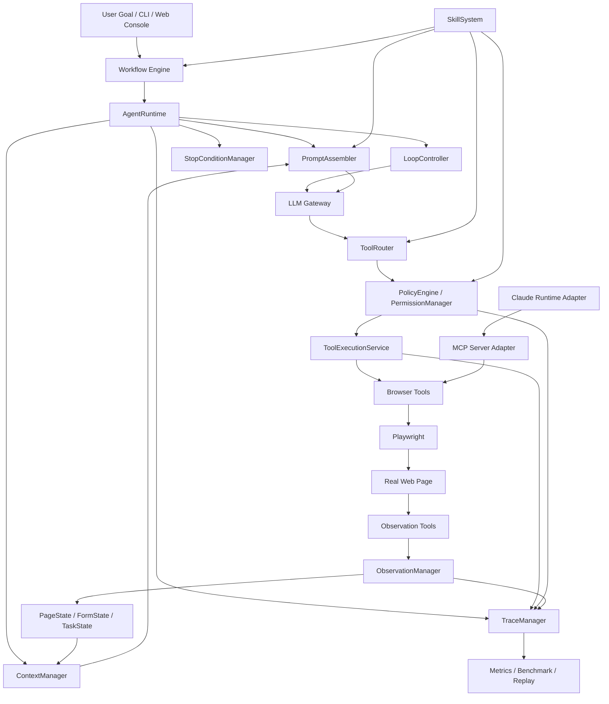
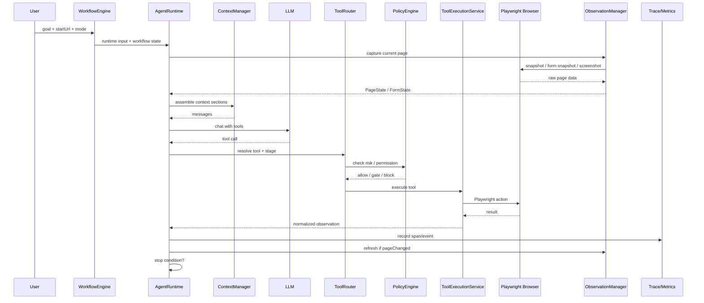
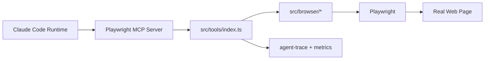
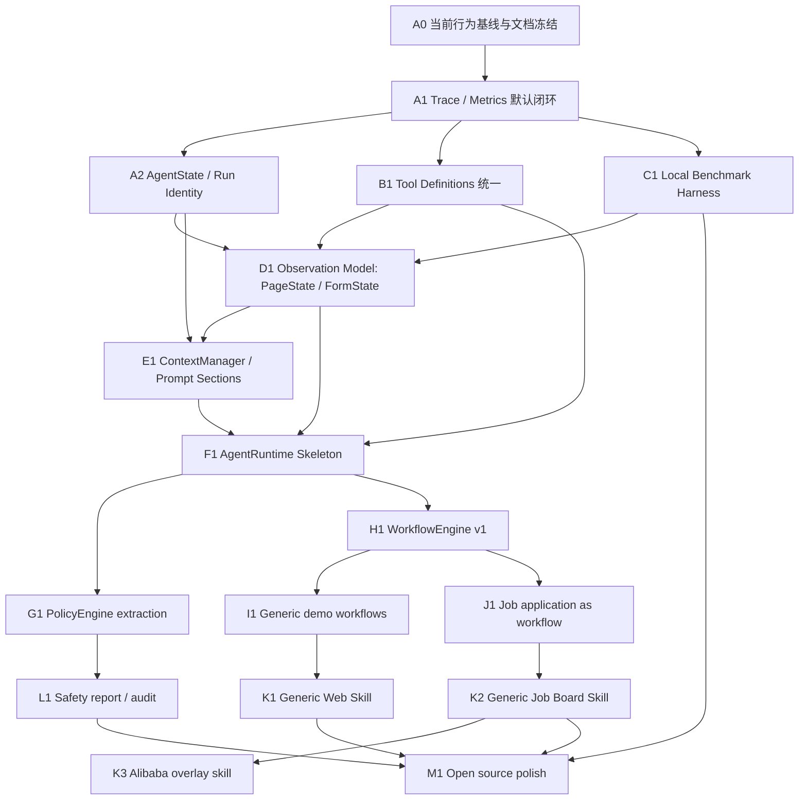

# Web Agent Platform Master Plan

日期：2026-06-26

## 0. 计划定位

本文是 `multi-functional-agent` 从“求职投递浏览器 Agent”演进为“通用本地 Web Agent 开源平台”的总设计方案。

本阶段明确不把 Server / Worker / Queue / 多用户部署作为主线。开源项目优先展示的是：

- 本地可运行的 Web Agent runtime。
- 可复用的浏览器工具和观察层。
- 可审计的风险控制与 human gate。
- 可复盘的 trace / metrics / benchmark。
- 求职投递作为 flagship workflow，而不是项目唯一定位。

目标一句话：

> 构建一个以 Playwright 为浏览器执行引擎、以自研 AgentRuntime 为核心、以 Workflow / Skill / Policy / Trace 为扩展面的通用 Web Agent 平台。

### 0.1 当前落地状态快照

截至 2026-06-26：

- `packages/web-buddy` 已确认为项目主线：自研 Web Agent 核心、Playwright browser tools、MCP server、Web UI、本地 local runtime。
- `packages/claude-code` 是恢复版 Claude Code runtime，只作为可选外部 runtime adapter。
- Plan0 已完成：项目命名和主线整理，明确 `packages/web-buddy` 是自研 Web Agent 主线，`packages/claude-code` 是外部 runtime adapter / 对照。
- Plan1 已完成：run identity、legacy trace、agent-trace、metrics.json、agent-state.json、Web UI metrics、benchmark-simple 基线。
- Plan2 已完成：Tool Catalog、local adapter、MCP adapter、PageState、FormState、ObservationManager、tool category metrics、benchmark-simple observation assertions。
- Plan3 已完成：ContextManager、Prompt Sections、recentActions、prompt budget、ContextSnapshot，从 ObservationProvider 内存态读取 PageState/FormState，不读取 trace artifacts。
- Phase 4A 已完成：AgentRuntime facade、PromptAssembler、StopConditionManager，`AgentRuntime.run()` 仍兼容性委托 `runAgentLoop`。
- Phase 4B 已完成：context selection metrics、freshness metadata、minimal TaskState、complex local benchmark。
- Phase 4C 已完成：ToolExecutionBoundary、PolicyDecision helper、freshness-aware high-risk cue、agent-loop 最小接入，`runAgentLoop` / `ToolRegistry` 对外接口保持兼容。
- Phase 4D 已完成：WorkflowState v1、WorkflowTransition helper、`WORKFLOW_STATE` prompt section、workflow-aware PolicyDecision、agent-loop workflow working set、AgentRuntime workflow-aware result。`Apply / 投递` 已可结合 workflow phase 区分 apply entry 与 final submit。
- Phase 5 已完成第一版：PolicyDecision helper 已升级为兼容式 `PolicyEngine` facade，已补充 policy audit event、policy metrics aggregation、safety report v1 helper 和 `test:mvp` 验证入口。
- Phase 5B 已完成第一版：新增 read-only `demo-research` / `benchmark:research`，补充显式 `report:safety` 入口，README / Quickstart 已改为通用 local auditable Web Agent runtime 定位，并新增 `docs/safety-model.md`。
- 当前下一阶段可以继续打磨 MVP Packaging 的 Web UI 入口和 examples 索引；Phase 6 WorkflowEngine / SkillSystem 仍暂缓，等开源 MVP 展示路径稳定后再启动。
- Trace / metrics / artifacts 是旁路观测输出，不是主流程状态数据库。Runtime / ContextManager / PromptAssembler / policy / tool execution / workflow state 都不得读取 trace artifacts 作为运行时上下文。

---

## 1. 当前代码观察

### 1.1 现有两条执行路径

当前项目不是单一路径，而是两条路径并存。

```text
Path A: local self-owned runtime
CLI / Web UI
  -> sdk/orchestrator.ts
  -> runtime/local/agent-loop.ts
  -> runtime/local/tool-registry.ts
  -> browser/* tools
  -> Playwright
  -> real web page
```

```text
Path B: Claude Code runtime adapter
scripts/adapters/claude-code/alibaba-apply.mjs
  -> recovered Claude Code runtime / claude-code
  -> MCP stdio server
  -> src/tools/index.ts
  -> browser/* tools
  -> Playwright
  -> real web page
```

结论：

- `Path A` 应成为项目长期核心，因为通用 Web Agent 平台的上下文、观察、策略、工作流和评估都需要在自己 runtime 内可控。
- `Path B` 应保留为 adapter / benchmark / capability comparison，不应成为项目主心骨。
- MCP server 仍然非常重要，因为它证明浏览器能力可以被外部 agent runtime 复用。

### 1.2 当前优势

- `browser/*` 已经形成真实网页执行层，底层 Playwright 能力清楚。
- `runtime/local/tool-registry.ts` 已有 schema-driven tool registry，可转 LLM function calling。
- `src/tools/index.ts` 的 MCP 工具比本地 loop 更丰富，已经包含 `browser_form_snapshot`、`browser_upload_file`、`browser_fill_by_label`、`browser_select_by_text`、`browser_click_text`。
- `snapshot/ref-resolver/risk` 已经有 ref-based 操作和 L0-L4 风险基础。
- `sdk/human.ts`、`sdk/trace.ts`、`agent-trace/`、`metrics/` 已经有 human gate、trace、metrics 的雏形。
- `sdk/orchestrator.ts` 已经有 workflow 意识，支持 `raw`、`fill`、`match`、`alibaba-apply`、`demo-form`、`auto-apply`。
- `docs/web-agent-runtime-v1.0.2-implementation-plan.md` 已经把 metrics、AgentState、ContextBudget、benchmark 的链路想清楚了一部分。
- `src/tools/catalog.ts` 已经成为 Tool Catalog v1；local runtime 和 MCP server 通过 thin adapter 共享定义层工具 contract。
- `src/observation/` 已经有 PageState / FormState / ObservationManager v1。
- `src/context/` 已经有 ContextManager、Prompt Sections、budget、context metrics，且读取 ObservationProvider 内存态而不是 trace artifacts。
- `src/task/task-state.ts` 已经提供 minimal TaskState，并进入 prompt section。
- `src/agent/` 已经有 AgentRuntime facade、PromptAssembler、StopConditionManager。
- `src/tools/tool-execution.ts` 已经有轻量 ToolExecutionBoundary，agent-loop 工具执行调用点已通过该边界委托 ToolRegistry。
- `src/policy/agent-policy.ts` 已经成为兼容 facade，`src/policy/policy-engine.ts` 提供 PolicyEngine v1，覆盖 gate kind、final submit、raw auto-confirm、stale freshness cue、workflow-aware apply entry / final submit 区分，并输出稳定 `policyCode` / `ruleId` / audit tags。
- `src/policy/policy-audit.ts` / `src/policy/safety-report.ts` 已经提供第一版 policy audit event 和 safety report 旁路分析。
- `src/workflow/` 已经有 WorkflowState v1 和 WorkflowTransition helper；agent-loop 会维护 workflow working set，并在 login/captcha/final submit/agent_done 等节点更新状态。
- `benchmark-simple` / `benchmark-complex` 已经断言 metrics、agent-state、PageState/FormState schema、context metrics 和复杂表单填写路径。

### 1.3 当前主要约束

- `runtime/local/agent-loop.ts` 同时承担 prompt、context、LLM call、tool execution、gate、trace、observation refresh、stop condition。
- `sdk/orchestrator.ts` 仍偏 job-application oriented，mode 分支会随着场景增加而变重。
- Tool Catalog 已完成定义层统一，ToolExecutionBoundary 已完成 local runtime 的轻量执行边界；但完整 ToolExecutionService、local/MCP 统一执行调度、队列、重试、streaming 仍未做。
- 已有 `PageState` / `FormState` / `TaskState` / `WorkflowState`，但 WorkflowState 仍是 runtime working set，不是可恢复 WorkflowEngine。
- ContextManager / PromptAssembler 已完成第一版，`WORKFLOW_STATE` 已进入 prompt；后续需要通过 policy audit / benchmark 继续证明 prompt 和 gate 没有退化。
- PolicyEngine / policy audit / policy metrics / safety report 已完成第一版；下一步重点不是继续扩展 policy DSL，而是把这些能力打包进清晰的 MVP 文档、demo 和验证入口。
- Skill 目前更像站点逻辑散落在 SDK 中，Alibaba 还不是可插拔 skill。
- Metrics / trace / agent-state 已成为基础闭环；后续重点是用 benchmark 防止行为退化。

---

## 2. 北极星架构

### 2.1 平台目标形态

```text
multi-functional-agent
= Local Web Agent Platform
+ Self-owned AgentRuntime
+ Playwright Browser Runtime
+ Browser Action / Observation Tools
+ Observation Model
+ Context Manager
+ Workflow Engine
+ Web Skill System
+ Policy / Human Gate
+ Trace / Metrics / Benchmark
+ Optional MCP / Claude runtime adapter
```

### 2.2 总体架构图



### 2.3 核心设计原则

1. Playwright 是底层浏览器执行引擎，不直接暴露给模型。
2. Browser tools 是模型可调用的安全接口。
3. Observation 是网页事实采集与结构化，Context 是给模型的精选输入。
4. Workflow 管确定性流程，LLM 管不确定判断。
5. Policy 必须在工具执行前生效，不能只靠 prompt 约束。
6. Skill 是站点/场景策略增强，不是脆弱脚本。
7. Trace / metrics 是所有优化的前置条件。
8. Claude runtime 是可选 adapter，不是核心 runtime。
9. Trace artifacts 是旁路镜像，不是运行时状态源；ContextManager 只能读取 ObservationManager / ObservationProvider 的内存态。

---

## 3. 目标能力分层

### 3.1 Browser Runtime Layer

职责：

- 管理浏览器 session。
- 打开、点击、输入、选择、上传、等待、截图。
- 封装 Playwright 细节。
- 提供错误恢复建议，例如 stale ref 后建议 snapshot。

当前基础：

- `src/browser/*`
- `src/session/manager.ts`
- `src/snapshot/*`

演进重点：

- 统一本地 ToolRegistry 和 MCP 工具能力。
- 明确 action tools 与 observation tools。
- 建立工具分类、风险、元数据、可见阶段。

### 3.2 Observation Layer

职责：

- 从真实网页采集事实。
- 输出结构化页面状态。
- 以内存态服务 LLM / Policy / Context。
- 以 best-effort artifact 服务 Trace / Benchmark / Web UI / Replay。

第一版模型：

```ts
interface PageState {
  schemaVersion: 'page-state/v1'
  url: string
  title: string
  pageType: 'unknown' | 'login' | 'list' | 'detail' | 'form' | 'confirmation' | 'captcha'
  interactiveCount: number
  formCount: number
  linkCount: number
  buttonCount: number
  inputCount: number
  textSummary: string
  updatedAt: string
}

interface FormState {
  schemaVersion: 'form-state/v1'
  url: string
  fields: FormFieldState[]
  missingRequired: FormFieldState[]
  filledFields: FormFieldState[]
  submitCandidates: SubmitCandidate[]
  uploadHints?: UploadHint[]
  visibleErrors?: string[]
  updatedAt: string
}
```

### 3.3 Context Layer

职责：

- 组装 LLM messages。
- 管理 token/字符预算。
- 压缩旧 observation。
- 保留当前任务目标、安全规则、任务阶段、当前 PageState/FormState、最近动作。

关键边界：

```text
ObservationManager: 网页现在是什么样
ContextManager: 哪些信息应该进入下一轮模型输入
Trace artifacts: 事后验证、Web UI、debug、replay 的旁路输出
```

关键边界：

```text
ContextManager 不读取 output/traces/.../page-state-latest.json
ContextManager 不读取 output/traces/.../form-state-latest.json
ContextManager 读取 ObservationProvider.getPageState/getFormState
```

### 3.4 AgentRuntime Layer

职责：

- 控制 agent loop。
- 连接 LLM、context、tools、policy、observation、trace、stop condition。
- 不关心具体业务网站。

目标拆分：

```text
src/agent/
  runtime.ts
  loop-controller.ts
  prompt-assembler.ts
  context-manager.ts
  stop-condition.ts
  types.ts
```

### 3.5 Tool Platform Layer

职责：

- 注册工具。
- 路由工具。
- 执行工具。
- 校验参数。
- 归一化结果。
- 执行前接 policy，执行后接 trace / observation refresh。

工具分类：

```text
Observation Tools:
  browser_snapshot
  browser_form_snapshot
  browser_screenshot
  browser_extract_links
  browser_extract_table
  browser_find_text
  browser_page_summary

Action Tools:
  browser_open
  browser_click
  browser_click_text
  browser_type
  browser_select
  browser_fill_by_label
  browser_select_by_text
  browser_upload_file
  browser_wait
```

### 3.6 Policy Layer

职责：

- L0-L4 风险分类。
- 操作前权限判断。
- Human gate。
- 安全审计。
- 站点/任务/用户策略组合。

第一版不需要复杂规则引擎，先把当前 gate 从 loop 中抽出即可。

### 3.7 Workflow Layer

职责：

- 把任务拆成确定性阶段。
- 管理 step 输入/输出/失败/恢复点。
- 把 job application 降级成一个 workflow，而不是 runtime 本身。

目标 workflow：

```text
generic-form-fill.workflow
web-research.workflow
job-application.workflow
demo-form.workflow
```

### 3.8 Skill Layer

职责：

- 提供站点/场景策略增强。
- 不写死 fragile selectors。
- 给 workflow、prompt、policy、extractor 提供增量信息。

三层 skill 策略：

```text
Generic Web Skill
  -> 通用按钮、输入框、链接、弹窗、导航、表格。

Generic Job Board Skill
  -> 职位列表、职位详情、JD 抽取、申请入口、提交前停止。

Site Overlay Skill
  -> Alibaba / Greenhouse / Lever 等高价值站点特殊经验。
```

### 3.9 Trace / Metrics / Benchmark Layer

职责：

- 每次运行有 trace。
- 每次运行有 metrics。
- 有本地 benchmark 页面。
- 支持回归比较。

当前已有基础：

- `src/agent-trace/`
- `src/metrics/`
- `scripts/metrics-test.mjs`
- `scripts/trace-inputs-test.mjs`

目标：

```text
run
  -> trace session
  -> metrics.json
  -> agent-state.json
  -> benchmark report
```

---

## 4. 完整运行链路

### 4.1 Local Runtime 主链路



### 4.2 Claude Runtime Adapter 链路



定位：

- 保留该链路用于对照和展示 MCP 能力。
- 不再把平台主抽象绑定到 Claude runtime。
- 未来自研 runtime 和 MCP server 应尽量共享同一套 tool definitions。

---

## 5. 总实施依赖图

### 5.1 全局依赖关系



### 5.2 串行主路径

必须基本串行推进的主路径：

```text
Trace/Metrics
  -> Run Identity / AgentState
  -> Tool unification / Observation Model
  -> ContextManager
  -> AgentRuntime skeleton
  -> Policy extraction
  -> WorkflowEngine
  -> Generic demos
  -> Skill system
```

原因：

- 没有 metrics，无法判断后续改动是否退化。
- 没有 AgentState 和 Observation Model，ContextManager 只能裁剪字符串。
- 没有统一工具定义，AgentRuntime 会继续落后于 MCP 路径。
- 没有 ContextManager，AgentRuntime 抽象会只是换文件名。
- 没有 WorkflowEngine，Skill 没有稳定挂载点。

### 5.3 可并行工作

```text
可并行 1:
  Trace/Metrics 默认写入
  Web UI metrics 展示
  metrics tests 补齐

可并行 2:
  Tool definitions 统一设计
  PageState/FormState schema 设计
  benchmark mock pages

可并行 3:
  Generic form-fill demo
  Web research demo
  README / docs 定位改写

可并行 4:
  Generic Job Board Skill
  Alibaba overlay skill
  policy rule fixtures
```

---

## 6. 阶段路线图

## Phase 0: Baseline Freeze

目标：

> 明确当前行为、入口和目标定位，避免后续边做边漂。

要做：

- 保留现有 `raw`、`fill`、`demo-form`、`alibaba-apply`、`alibaba:apply:raw`。
- 给当前两条路径补一页说明：local runtime vs Claude runtime adapter。
- 标注求职是 flagship workflow，不是平台边界。
- 记录当前可运行脚本和已知风险。

验收：

- 文档能解释当前项目“不是只做求职”的新定位。
- 后续改动有明确不退化对象。

并行性：

- 可与 Phase 1 的 metrics 补齐并行。

---

## Phase 1: Trace / Metrics / Benchmark Foundation

目标：

> 先建立可观测闭环，让后续架构优化可度量。

要做：

- 完成 `runId` / `sessionId` / `traceDir` / `runDir` 约定。
- 每次 local runtime 和 Claude runtime 运行都生成 `metrics.json`。
- Web console 能展示核心 metrics。
- 增加 `debug` / `fast` / `benchmark` profile。
- 建立最小 mock benchmark。
- 输出 `agent-state.json` 第一版。

产物：

```text
packages/web-buddy/src/metrics/
packages/web-buddy/src/state/
packages/web-buddy/benchmarks/
output/traces/<sessionId>/metrics.json
output/traces/<sessionId>/agent-state.json
```

验收：

- `npm run build` 通过。
- `npm run test:metrics` 通过。
- local runtime 和 Claude runtime 都能被 metrics 聚合。
- 至少一个本地 benchmark 能输出 metrics。

串行依赖：

- 这是后续所有阶段的前置。

并行任务：

- Web UI metrics 展示可以和 benchmark mock page 并行。
- AgentState schema 可以和 profile 参数并行。

---

## Phase 2: Tool Unification / Observation Model v1（已完成于 Plan2）

目标：

> 让自研 local runtime 和 MCP server 共享同一套工具定义与能力边界，并让每次网页观察生成 PageState / FormState。

### Phase 2 范围澄清：定义层统一 vs 执行层统一

这里的 Tool Unification 要分成两层：

```text
定义层工具统一
  = 一份 Tool Catalog / Tool Contract
  = 统一 name、schema、category、risk、metadata、trace/metrics 语义
  = local runtime 和 MCP server 通过 adapter 暴露同一组工具定义

执行层工具统一
  = 单一 ToolExecutionService
  = 统一 policy gate、trace span、result normalization、streaming、permission dispatcher
  = local runtime 和 MCP server 的工具执行路径也被收进同一执行服务
```

Phase 2 已完成的是**定义层工具统一**：

- 建立统一 Tool Catalog。
- 让 local runtime 从 catalog 读取工具定义。
- 让 MCP server 保持原工具名和兼容入口，但 metadata / category / risk 对齐 catalog。
- local runtime 补齐关键 MCP 工具能力，尤其是表单观察和按文本/label 操作类工具；`browser_upload_file` 仍保持 MCP-only，避免扩大 local runtime 敏感能力边界。
- metrics / trace 能使用同一套 tool category。
- 建立 PageState / FormState / ObservationManager v1。
- `browser_snapshot` / `browser_form_snapshot` 刷新内存态 observation，并 best-effort 写 trace artifacts。
- benchmark-simple 验证最终 PageState/FormState 和 filled fields。

Phase 2 不应该强行完成完整**执行层工具统一**。不要在这个阶段重写：

- `runtime/local/tool-registry.ts` 的整个执行模型。
- `src/tools/index.ts` 的 MCP server 对外行为。
- 统一 streaming / permission / trace dispatcher。
- 单一 `ToolExecutionService` 的全量调度。

执行层统一更适合放在 ContextManager 稳定之后、AgentRuntime facade 之前。也就是说：

```text
Phase 2:
  一份 contract，两个 adapter
  Tool Catalog + metadata parity + local/MCP 能力对齐
  Observation Model v1
  PageState / FormState 稳定后进入 ContextManager

AgentRuntime facade 前:
  再做 ToolExecutionService / 执行层统一
```

这样可以避免 Phase 2 变成工具系统大重构，同时又能消除 local runtime 和 MCP server 的定义漂移。

已解决：

- 新增 `src/tools/catalog.ts`。
- 新增 `src/tools/local-adapter.ts`。
- 新增 `src/tools/mcp-adapter.ts`。
- `runtime/local/tool-registry.ts` 成为 catalog-backed facade。
- `src/tools/index.ts` 保持 MCP 兼容导出。
- 新增 `src/observation/*`。
- `benchmark-simple` 已经断言 observation artifacts。

仍不做：

- 单一 ToolExecutionService。
- local/MCP 执行调度重写。
- Skill / Memory / 多 Agent。
- 真实网站适配。

当前结构：

```text
src/tools/
  catalog.ts
  mcp-adapter.ts
  local-adapter.ts
src/observation/
  observation-manager.ts
  page-state.ts
  form-state.ts
  page-type-detector.ts
  form-state-builder.ts
```

验收状态：

- `npm run test:tool-catalog` 通过。
- `npm run test:observation` 通过。
- `npm run test:metrics` 通过。
- `npm run test:trace-inputs` 通过。
- `npm run test:agent-loop` 通过。
- `npm run benchmark:simple` 通过。

串行依赖：

- 依赖 Phase 1 的 trace/metrics，已满足。

后续依赖：

- ContextManager / Prompt Sections 读取 ObservationManager 内存态 PageState/FormState。
- trace artifacts 仅供 benchmark/Web UI/replay/debug 读取。

---

## Phase 3: ContextManager / Prompt Sections（已完成于 Plan3）

目标：

> 所有进入模型的内容经过 section 化和预算控制，并从 ObservationManager / ObservationProvider 内存态读取 PageState/FormState。

已完成：

- 新增 `ObservationProvider` 接口。
- 新增 `ContextManager`。
- 新增 `PromptSection`。
- 新增字符预算和 section selection。
- agent-loop 内维护 recentActions 内存数组。
- 默认 prompt 不再混杂完整 resume、snapshot、history。
- 将上下文拆成稳定 prompt sections。
- 工具 observation 回填后维护 recentActions 摘要。
- 保留 pageView fallback。
- 保留 `runAgentLoop` 兼容入口。

后续 Phase 4B 已补充：

- `TASK_STATE` section。
- PageState / FormState freshness cue。
- context selection metrics。
- tight budget priority tests。

严格禁止：

```text
ContextManager -> readFileSync(output/traces/.../page-state-latest.json)
ContextManager -> readFileSync(output/traces/.../form-state-latest.json)
```

验收状态：

- `npm run test:context` 通过。
- `npm run test:prompt-sections` 通过。
- `npm run test:metrics` 通过。
- `npm run benchmark:simple` 通过。
- `npm run benchmark:complex` 通过。
- ContextManager / PromptAssembler 不读取 trace artifacts。

---

## Phase 4A: AgentRuntime Skeleton（已完成于 Plan4）

目标：

> 把当前 `runAgentLoop` 包装成可演进 AgentRuntime，但保持兼容。

已完成：

- 新增 `AgentRuntime` facade。
- 抽出 `PromptAssembler`。
- 抽出 `StopConditionManager`。
- 保留 `runAgentLoop` 作为兼容入口。
- `AgentRuntime.run()` 第一版仍内部委托 `runAgentLoop`。

目标结构：

```text
src/agent/
  agent-runtime.ts
  prompt-assembler.ts
  stop-condition.ts
  types.ts
```

验收状态：

- 旧 API `runAgentLoop` 仍可用。
- `AgentRuntime.run()` 可跑通 mock LLM 流程。
- PromptAssembler / StopConditionManager 有独立边界。
- `npm run test:agent-loop` 通过。
- `npm run test:agent-runtime` 通过。

---

## Phase 4B: Context Metrics / Freshness / TaskState（已完成于 Plan5）

目标：

> 让 ContextManager / Prompt Sections 的筛选行为可度量，让模型知道 PageState / FormState 是否新鲜，并加入最小 TaskState。

已完成：

- `ContextSnapshot.freshness`。
- Prompt 中渲染 page/form freshness cue。
- `TaskState` 和 `TASK_STATE` prompt section。
- context selection metrics 进入 trace event。
- metrics aggregator 汇总 context metrics。
- benchmark-complex 本地复杂表单基线。

目标结构：

```text
src/context/
  metrics.ts
src/task/
  task-state.ts
```

验收状态：

- `npm run test:context` 通过。
- `npm run test:prompt-sections` 通过。
- `npm run test:metrics` 通过。
- `npm run benchmark:complex` 通过。
- 旧 trace 缺失 context metrics 时默认安全。

---

## Phase 4C: Tool Execution Boundary / Policy Skeleton（已完成于 Plan6）

目标：

> 在不重写 runtime 主循环的前提下，新增轻量 ToolExecutionBoundary 和轻量 PolicyDecision helper，让工具执行和策略判断开始有稳定挂载点。

已完成：

- 新增 `src/tools/tool-execution.ts`。
- 新增 `src/policy/agent-policy.ts`。
- agent-loop 中工具执行改为通过 `ToolExecutionBoundary.execute()` 委托 `ToolRegistry.run()`。
- final submit / high-risk / raw auto-confirm 等可纯函数化判断进入 PolicyDecision helper。
- high-risk / critical action 可表达 `requiresFreshContext`，stale freshness 只作为 cue / metadata，不自动刷新、不硬阻断。
- 新增 `test:tool-execution` 和 `test:policy`。

目标结构：

```text
src/tools/
  tool-execution.ts
src/policy/
  agent-policy.ts
```

验收状态：

- `npm run test:tool-execution` 通过。
- `npm run test:policy` 通过。
- `npm run test:agent-runtime` 通过。
- `npm run test:agent-loop` 通过。
- `runAgentLoop` 对外接口未变。
- `ToolRegistry` 对外接口未变。
- local adapter / MCP adapter 未重写。
- Runtime / ContextManager / PromptAssembler / policy / tool execution 不读取 trace artifacts。

---

## Phase 4D: Workflow State / Runtime Controller Skeleton（已完成于 Plan7）

目标：

> 引入最小 WorkflowState，让 runtime 能表达当前流程位置；让 PolicyDecision 能结合 workflow phase 区分 apply_entry 和 final_submit；让 AgentRuntime 开始返回 workflow-aware runtime result，但仍委托 `runAgentLoop`。

为什么现在做：

```text
button text = "Apply"
```

不能直接等于：

```text
final_submit
```

它可能是：

```text
apply_entry
login_required
captcha_required
upload_resume
save_draft
final_submit
```

Phase 4D 要把这些流程语义从模糊按钮文本判断中分离出来。

已完成：

- 新增 `WorkflowState`，作为 runtime working set，不做完整 workflow engine。
- 新增 `WorkflowTransition` helper，根据 URL、PageState、FormState、tool result、policy decision、gate kind、agent_done blocked 等有限信号推断 phase。
- 将 `WorkflowState` 接入 ContextSnapshot / Prompt Sections，新增 `WORKFLOW_STATE` section。
- 让 PolicyDecision helper 接收 workflow phase，优先用 workflow 语义区分 apply entry 和 final submit。
- agent-loop 中维护 workflow state，并在 tool result / policy decision / gate / agent_done 后更新。
- AgentRuntime result 带出 workflow state，但 `AgentRuntime.run()` 仍兼容委托 `runAgentLoop`。

建议第一版阶段：

```ts
export type WorkflowPhase =
  | 'observing'
  | 'selecting_job'
  | 'job_detail'
  | 'entering_application'
  | 'login_required'
  | 'captcha_required'
  | 'editing_resume'
  | 'filling_application'
  | 'reviewing'
  | 'ready_for_final_submit'
  | 'done'
  | 'blocked'
```

目标结构：

```text
src/workflow/
  workflow-state.ts
  workflow-transition.ts
```

明确不做：

- 完整 WorkflowEngine。
- 多 Agent。
- Skill / Memory。
- 真实网站专用 adapter。
- 自动登录。
- 验证码处理。
- 真实最终提交。
- 重写 `runAgentLoop`。
- 重写 `ToolRegistry`。
- 修改 `packages/claude-code`。

验收状态：

- `runAgentLoop` 对外接口不变。
- `ToolRegistry` 对外接口不变。
- `AgentRuntime.run()` 仍兼容旧 mock LLM 流程。
- WorkflowState 不读取 trace artifacts。
- ContextManager / PromptAssembler 不读取 trace artifacts。
- 登录页可被表达为 `login_required`。
- captcha 页可被表达为 `captcha_required`。
- final submit 仍受 `final_submit` gate 保护。
- benchmark simple / complex 继续通过。
- 新增 `npm run test:workflow`。
- 新增 `npm run test:agent-runtime-workflow`。
- 完整验证已通过：`build`、context、prompt-sections、metrics、tool-execution、policy、workflow、agent-runtime、agent-runtime-workflow、agent-loop、benchmark simple/complex、tool-catalog、observation。
- 边界检查无命中：runtime / context / prompt / policy / workflow 不读取 trace artifacts。

详细执行记录：

- 见 `PLAN/plan7.md`。

---

## Phase 5: Policy Engine v1 / Policy Audit Skeleton（已完成第一版）

目标：

> 在 PolicyDecision helper 和 WorkflowState 稳定后，形成更完整但仍轻量的 policy boundary：统一 gate reason、保留兼容 facade、记录 policy audit/metrics，并生成第一版 safety report。

阶段定位：

```text
PolicyDecision helper
  -> PolicyEngine v1 skeleton
  -> Policy audit events
  -> Safety report v1
```

第一性边界：

- Policy 决定工具动作是否 allow / gate / block / auto_confirm。
- WorkflowState 只提供当前流程位置，不替代 policy。
- Policy 不执行工具。
- Policy 不读取 trace artifacts。
- Safety report / benchmark / Web UI 可以读取 trace/metrics 作为旁路分析。
- 不引入完整 DSL。
- 不重写 `runAgentLoop` 主循环。
- 不改变 `ToolRegistry` 对外接口。
- 不改变 local adapter / MCP adapter。

要做：

- 新增轻量 `PolicyEngine` / `PolicyAudit` 类型，但保留 `decideToolPolicy()` 作为兼容 facade。
- 统一 policy input：tool name、args、risk、safetyMode、currentUrl、refLabel、freshness、workflowState、page/form hints。
- 统一 policy output：action、riskLevel、gateKind、reason、requiresFreshContext、workflowPhase、ruleId / policyCode。
- 将 login / captcha / upload_resume / save_resume / final_submit / high_risk_action 的 reason 规范化。
- 将 policy decision 记录到 agent trace event 或 tool span metadata。
- metrics aggregation 增加 policy gate count、gate kind count、blocked reason count。
- 新增 safety report v1 脚本，从 metrics/trace 旁路输出生成安全摘要。
- 扩展 policy tests，覆盖 workflow-aware apply entry、final submit、login/captcha handoff、raw auto-confirm、stale freshness cue、upload/save 等 gate kind。
- agent-loop 只做最小接入：调用 policy boundary，记录 audit metadata，保持主循环形状。

建议文件范围：

```text
packages/web-buddy/src/policy/
  agent-policy.ts
  policy-engine.ts
  policy-audit.ts

packages/web-buddy/src/metrics/
  aggregate.ts
  schema.ts

packages/web-buddy/scripts/
  policy-engine-test.mjs
  safety-report-test.mjs
```

验收目标：

- `decideToolPolicy()` 旧调用仍可用。
- `PolicyEngine.evaluate()` 或等价接口可被 agent-loop 调用。
- final submit gate 语义不回退。
- job_detail / entering_application 下 Apply 入口仍不是 `final_submit`。
- reviewing / ready_for_final_submit 下 Submit / Confirm 仍是 `final_submit`。
- login_required / captcha_required 不自动越过，能产生 human handoff / blocked cue。
- policy audit 写入 trace/metrics，但 runtime/policy 不读取 trace artifacts。
- benchmark simple / complex 继续通过。
- `packages/claude-code` 不改。

验收状态：

- 已新增 `PolicyEngine` / `PolicyAuditEvent` / `SafetyReport` 第一版，并保留 `decideToolPolicy()` 兼容入口。
- agent-loop 已在工具执行前生成 policy decision，并写出 `policy_decision` trace event；tool span metadata 已包含 policy metadata。
- metrics 已聚合 policy decision / action / gate kind / policy code / blocked reason。
- `test:mvp` 已成为当前 MVP 回归入口，并通过 context、prompt、metrics、tool execution、policy、workflow、agent runtime、agent loop、benchmark simple/complex、tool catalog、observation、safety report 验证。
- 边界检查显示 runtime / context / workflow / tools / policy engine 不读取 trace artifacts；`safety-report.ts` 作为旁路 report 读取 trace/metrics。

串行依赖：

- 依赖 Phase 4C 的 PolicyDecision helper。
- 依赖 Phase 4D 的 WorkflowState，否则 policy 仍会过度依赖按钮文本。

推荐验证：

```bash
cd packages/web-buddy
npm run build
npm run test:policy
npm run test:workflow
npm run test:agent-runtime-workflow
npm run test:agent-loop
npm run test:metrics
npm run benchmark:simple
npm run benchmark:complex
```

---

## Phase 5B: MVP Packaging（已完成第一版）

目标：

> 把已经完成的 state-aware context、policy boundary、trace/metrics/safety report 包装成新用户能理解、能运行、能验证的开源 MVP。

阶段定位：

```text
Phase 5 internal capability
  -> MVP-facing demo / docs / safety model / verification
```

已完成第一版：

- 新增 `demo-research`，使用本地 fixture，避免依赖真实招聘站。
- README / Quickstart 已重写为通用本地 Web Agent runtime 定位，求职投递作为 flagship workflow / example。
- 新增 Safety Model 文档，解释 risk level、PolicyEngine、HumanGate、final submit、login/captcha handoff、audit/metrics/safety report 的边界。
- `test:mvp` 已纳入 `benchmark:research`，成为当前 MVP 验证入口。
- 文档已明确 `demo-form`、`demo-research`、`job-application` 三类展示入口。

验收目标：

- 新用户能在 10 分钟内跑通无模型 key 的本地 demo，并看到 trace / metrics / safety report。
- 文档第一屏不再只强调阿里/求职。
- `demo-research` 不触发高风险动作，能展示 observation tools、context、trace、metrics。
- Safety Model 能清楚说明为什么不会自动登录、处理验证码或最终提交。
- `npm run test:mvp` 继续通过。

详细计划：

- 见 `PLAN/plan9.md`。

---

## Phase 6: Workflow Engine v1（后续）

目标：

> 在 WorkflowState / transition helper 可测后，再从 mode 分支演进为本地可恢复 workflow。

要做：

- 新增 `WorkflowDefinition`。
- 新增 `WorkflowEngine`。
- 新增 `TaskStateStore` 或 WorkflowStateStore 本地文件版。
- 将 `demo-form`、`raw`、`fill` 迁移为 workflow preset。
- 将 `alibaba-apply` 保留但逐步拆 step。

目标结构：

```text
src/workflows/
  workflow-engine.ts
  workflow-definition.ts
  task-state-store.ts
  steps/
  presets/
    raw.workflow.ts
    generic-form-fill.workflow.ts
    web-research.workflow.ts
    job-application.workflow.ts
```

验收：

- 新增 workflow 不需要修改 AgentRuntime。
- `orchestrator.ts` 逐步变薄。
- workflow state 能写入 `agent-state.json` 或 workflow store。
- step budget 用尽时能输出可续跑摘要。

串行依赖：

- 依赖 Phase 4D 的 WorkflowState / transition helper。

---

## Phase 7: Generic Demos

目标：

> 开源项目展示“通用 Web Agent”，而不只展示“求职投递”。

必须 demo：

```text
demo-form:
  本地表单填写，展示 FormState、Policy、提交前停止。

demo-research:
  本地或公开网页信息查找，展示只读 observation tools、链接/文本/表格抽取、摘要报告。

demo-job:
  求职投递 flagship workflow，展示复杂真实任务。
```

要做：

- 新增 non-job demo。
- README 改成通用 Web Agent 平台定位。
- 求职投递放到 examples / workflows 语境下。
- 每个 demo 输出 trace + metrics。

验收：

- 新用户不需要真实招聘网站也能看到平台能力。
- demo-research 不触发高风险动作。
- demo-form 展示 human gate 和 trace。

串行依赖：

- demo-form 依赖 Observation/Policy。
- demo-research 依赖 Observation Tools。

并行任务：

- 文档、mock pages、CLI scripts 可并行。

---

## Phase 8: Skill System v1

目标：

> 将通用策略和少数站点经验沉淀为 skill，而不是写进 orchestrator。

要做：

- 新增 `SkillDefinition`。
- 新增 `SkillRegistry`。
- 新增 `SkillDetector`。
- 新增 `SkillContext`。
- 做三个第一批 skill：

```text
generic-web
generic-job-board
alibaba-career-overlay
```

Skill 第一版只贡献：

- detect。
- prompt hints。
- page type hints。
- extraction hints。
- policy hints。
- workflow hints。

不做：

- 大量固定 selector。
- 站点脚本化流程。
- 一站一套重逻辑。

目标结构：

```text
src/skills/
  skill-definition.ts
  skill-registry.ts
  skill-detector.ts
  builtin/
    generic-web/
    generic-job-board/
    alibaba-career/
```

验收：

- skill 未命中时 fallback 到 generic runtime。
- Alibaba 逻辑开始从 SDK 迁移到 overlay skill。
- generic-job-board 能覆盖大多数招聘网站的共性。

串行依赖：

- 依赖 WorkflowEngine 和 ContextManager。

并行任务：

- generic-web skill 和 generic-job-board skill 可并行。

---

## Phase 9: Open Source Polish

目标：

> 让项目看起来像一个清晰、可信、可扩展的开源 Web Agent 平台。

要做：

- README 重写：通用 Web Agent 平台定位。
- 架构图更新。
- CLI 命令重命名或补 alias，降低 job-only 感。
- 提供 examples：

```text
examples/form-fill
examples/web-research
examples/job-application
```

- 提供 benchmark 说明。
- 提供安全模型说明。
- 提供 “Claude runtime adapter vs local runtime” 说明。

验收：

- 新用户能在 10 分钟内跑通一个本地 demo。
- 文档第一屏不再只强调阿里/求职。
- 架构图能说明 runtime、tools、observation、context、policy、workflow、skill 的边界。

---

## 7. 推荐目录演进

第一阶段不建议立刻拆 package。先在 `packages/web-buddy/src` 内建立平台目录，等结构稳定再考虑 package 化。

```text
packages/web-buddy/src/
  agent/
    runtime.ts
    loop-controller.ts
    prompt-assembler.ts
    stop-condition.ts
    types.ts
  context/
    context-manager.ts
    budget.ts
    prompt-sections.ts
  observation/
    observation-manager.ts
    page-state.ts
    form-state.ts
    page-type-detector.ts
  tools/
    catalog.ts
    registry.ts
    execution-service.ts
    result-normalizer.ts
    mcp-adapter.ts
    local-adapter.ts
    browser/
  policy/
    agent-policy.ts
    policy-engine.ts
    permission-manager.ts
    risk-classifier.ts
    audit.ts
  workflow/
    workflow-state.ts
    workflow-transition.ts
  workflows/
    workflow-engine.ts
    workflow-definition.ts
    task-state-store.ts
    presets/
    steps/
  skills/
    skill-definition.ts
    skill-registry.ts
    skill-detector.ts
    builtin/
  state/
    agent-state.ts
    store.ts
  metrics/
  agent-trace/
  browser/
  snapshot/
  session/
  sdk/
```

迁移原则：

- 不先搬文件，先加 facade。
- 不一次性改所有调用点。
- 原 CLI/Web UI/MCP server 先保持兼容。
- 每个阶段都能 build/test。

---

## 8. 开源展示优先级

### 8.1 应优先展示

- 本地浏览器真实操作。
- Ref-based 安全操作。
- Action tools 和 observation tools 分离。
- PageState / FormState。
- Context budget。
- Policy gate。
- Trace / screenshots / metrics。
- Benchmark。
- 多 workflow demo。

### 8.2 暂不优先展示

- 多用户。
- 远程任务队列。
- Server/Worker 部署。
- 完整长期记忆。
- 大规模多 Agent。
- 大量站点级 skill。
- 复杂云端 dashboard。

### 8.3 Claude Runtime 的定位

保留：

- `alibaba:apply` 作为 Claude runtime adapter 示例。
- MCP server 作为外部 agent 可复用接口。
- Claude runtime 与 local runtime 的 benchmark 对照。

不做：

- 不把 Claude runtime 作为默认核心 runtime。
- 不把平台能力绑定到 Claude Code 的上下文管理或停止条件。

---

## 9. 关键里程碑

### Milestone 1: Measurable Runs

完成标志：

- 每次运行有 `metrics.json`。
- Web UI 可见 metrics。
- trace 输入路径统一。
- benchmark mock page 可跑。

### Milestone 2: Unified Tools

完成标志：

- local runtime 和 MCP server 共享 tool catalog。
- local runtime 具备 MCP 路径已有的核心表单工具。
- 工具有分类、风险、trace metadata。

### Milestone 3: State-Aware Agent

完成标志：

- PageState/FormState 生成。
- ContextManager 使用状态摘要而非纯 snapshot 拼接。
- Agent 能知道已填/未填字段。
- TaskState / freshness / recentActions 进入 prompt。

状态：

- 已完成。

### Milestone 4: Self-Owned Runtime

完成标志：

- AgentRuntime skeleton 包装当前 loop。
- PromptAssembler、ContextManager、ToolExecutionBoundary、PolicyDecision helper、StopConditionManager 从 loop 中抽出第一版边界。
- Claude runtime 变成 adapter，而非主路径。

状态：

- 已完成第一版。
- 已补充 WorkflowState / Runtime Controller Skeleton。
- 仍未完成完整 WorkflowEngine。

### Milestone 5: Workflow-Based Platform

完成标志：

- WorkflowState 能表达 apply_entry、login_required、captcha_required、ready_for_final_submit。
- PolicyDecision 能结合 workflow phase 区分 Apply 入口和最终提交。
- `demo-form`、`web-research`、`job-application` 都是 workflow。
- 新增 workflow 不需要改 AgentRuntime。
- job application 不再定义项目边界。

状态：

- WorkflowState / transition helper 已完成第一版。
- PolicyEngine v1 / policy audit / policy metrics / safety report 已完成第一版。
- MVP Packaging 第一版已完成；后续继续打磨 Web UI 入口和 examples 索引，完整 WorkflowEngine 仍放在后续 Phase 6。

### Milestone 6: Skill-Enhanced Platform

完成标志：

- generic-web skill。
- generic-job-board skill。
- alibaba overlay skill。
- skill 是增强和 fallback，不是写死站点脚本。

---

## 10. 风险与控制

| 风险 | 影响 | 控制方式 |
| --- | --- | --- |
| 过早大重构 | 原有 demo 退化 | facade 优先，旧 API 保留 |
| Skill 做成站点脚本 | 维护成本高 | skill 只沉淀策略/提示/抽取器/fallback |
| Context 过度压缩 | 模型缺关键信息 | metrics 记录 context bytes，benchmark 验证 |
| ContextManager 读取 trace artifacts | trace 变成状态数据库，旁路输出反向影响主流程 | ContextManager 只依赖 ObservationProvider 内存态；benchmark/Web UI 才读 artifacts |
| 工具统一破坏 MCP 兼容 | Claude adapter 退化 | MCP contract 测试 |
| Policy 太严格 | 任务无法推进 | debug report 显示 risk reason，可配置策略 |
| Benchmark 太晚 | 优化不可评估 | Phase 1 就做最小 benchmark |
| 求职场景绑架平台 | 项目定位变窄 | README 和 demos 同步调整为 generic web-agent |

---

## 11. 第一批建议任务包

如果按本总计划开始落地，建议第一批任务包为：

```text
Batch 1: Run observability（已完成）
  - metrics default write
  - agent-state skeleton
  - benchmark mock page
  - Web UI metrics display

Batch 2: Tool unification design（已完成）
  - tool catalog schema
  - MCP adapter
  - local adapter
  - category/risk metadata

Batch 3: Observation model（已完成）
  - PageState schema
  - FormState schema
  - ObservationManager
  - benchmark-simple final state artifact assertions

Batch 4: Context manager（已完成）
  - prompt sections
  - budget manager
  - recent actions summary
  - resume summary sections
  - hard boundary: no trace artifact reads in runtime context

Batch 5: AgentRuntime facade / context metrics / policy boundary（已完成第一版）
  - AgentRuntime.run
  - runAgentLoop compatibility wrapper
  - StopConditionManager
  - PromptAssembler
  - context selection metrics
  - freshness metadata
  - minimal TaskState
  - ToolExecutionBoundary
  - PolicyDecision helper

Batch 6: Workflow state / runtime controller skeleton（已完成）
  - WorkflowState
  - WorkflowTransition helper
  - WORKFLOW_STATE prompt section
  - workflow-aware PolicyDecision
  - agent-loop workflow state update
  - AgentRuntime result exposes workflow state

Batch 7: Policy Engine v1 / policy audit（已完成第一版）
  - PolicyEngine v1 skeleton
  - keep decideToolPolicy compatibility facade
  - policy audit event/schema
  - policy metrics aggregation
  - standardized gate reason for login/captcha/upload/save/final-submit/high-risk
  - safety report v1
  - policy regression fixtures

Batch 8: MVP Packaging（已完成第一版）
  - demo-research
  - README / Quickstart generic Web Agent rewrite
  - Safety Model document
  - examples/demo positioning
  - test:mvp as official verification entry
  - iteration log / plan status sync
```

第一批不建议直接做：

- 大规模 Skill。
- Memory。
- 多 Agent。
- Server/Worker。

---

## 12. 总结

项目接下来的正确方向不是继续堆更多招聘网站，也不是简单复制 `box-allinone` 的完整产品形态，而是：

```text
先把本地 Web Agent runtime 做成可观测、可控、可扩展的核心；
再用 workflow 展示多场景；
再用 skill 沉淀通用和少数高价值站点经验；
最后用 trace/metrics/benchmark 形成持续优化闭环。
```

最终形态：

```text
Generic Local Web Agent Platform
  with Playwright execution
  with state-aware observation
  with controlled context
  with safe tool execution
  with workflow and skill extension
  with traceable and measurable runs
```
