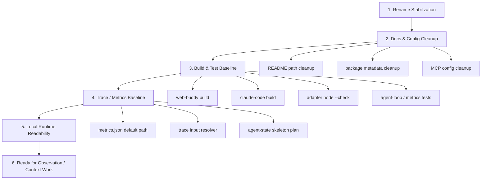

# Current Stage Plan and Agent Prompt

日期：2026-06-24

## 1. 当前阶段定位

当前阶段名称：

```text
Web Buddy Local Runtime Foundation
```

当前阶段不是继续扩展更多招聘网站，也不是马上做完整 Skill / Memory / 多 Agent，而是先把项目主线稳定成：

```text
packages/web-buddy
  = 自研 Web Agent 核心
  + Playwright browser tools
  + MCP server
  + Web UI
  + local runtime

packages/claude-code
  = 恢复版 Claude Code runtime
  + 可选外部 runtime adapter
```

本阶段目标：

> 让开源项目的目录、运行路径、指标、测试和文档都清楚地表达：`web-buddy` 是我们的通用 Web Agent 平台核心，`claude-code` 只是外部 runtime 对照路径。

---

## 2. 本阶段要解决的问题

### 2.1 命名和目录认知问题

已完成基础改名：

```text
packages/playwright-mcp -> packages/web-buddy
packages/web-buddy     -> packages/claude-code
```

但还需要继续收尾：

- 确保 README、docs、PLAN、config 中没有误导性旧路径。
- 确保 `packages/web-buddy` 内部说明清楚 local runtime、MCP tools、browser tools 的关系。
- 确保 `packages/claude-code` 的 README 和 package metadata 不再叫 Web Buddy。

### 2.2 local runtime 和 Claude adapter 边界问题

现在应该清楚表达：

```text
自研 local runtime:
packages/web-buddy/src/runtime/local/

Claude Code adapter:
packages/web-buddy/scripts/adapters/claude-code/

恢复版 Claude runtime:
packages/claude-code/
```

本阶段要避免用户继续困惑：

- 哪个是我们的 agent loop？
- 哪个是 Claude Code runtime？
- 哪个是 MCP server？
- 哪个是真正底层 Playwright 工具？

### 2.3 可观测闭环问题

当前已有：

- `packages/web-buddy/src/agent-trace/`
- `packages/web-buddy/src/metrics/`
- `packages/web-buddy/scripts/metrics-test.mjs`
- `packages/web-buddy/scripts/trace-inputs-test.mjs`

但本阶段需要把它变成默认开发闭环：

```text
run
  -> trace
  -> metrics.json
  -> agent-state skeleton
  -> benchmark / tests
```

### 2.4 下一步架构抽象前置问题

下一阶段要做 Observation / Context / AgentRuntime，但当前必须先保证：

- 目录干净。
- 测试能跑。
- trace/metrics 可用。
- local runtime 与 Claude adapter 不混淆。
- README 第一屏定位正确。

---

## 3. 本阶段范围

### 3.1 必做

1. 完成 rename 后的路径和文档收尾。
2. 确认 `packages/web-buddy` 是核心包。
3. 确认 `packages/claude-code` 是外部 runtime 包。
4. 保持旧兼容入口：

```text
packages/web-buddy/scripts/claude-runtime-alibaba.mjs
packages/web-buddy/src/core/*
```

5. 确认这些命令通过：

```bash
cd packages/web-buddy
npm run build
npm run test:metrics
npm run test:agent-loop
node --check scripts/claude-runtime-alibaba.mjs
node --check scripts/adapters/claude-code/alibaba-apply.mjs

cd ../claude-code
npm run build
```

6. 补充/修正文档：

```text
README.md
packages/web-buddy/README.md
packages/claude-code/README.md
docs/full-experience-guide.md
PLAN/web-agent-platform-master-plan.md
```

### 3.2 应做

1. 在 `packages/web-buddy/README.md` 中增加一节：

```text
Runtime Paths
- Local runtime
- MCP server
- Claude Code adapter
```

2. 在 `packages/web-buddy/src/runtime/local/README.md` 中保留当前 local runtime 链路说明。
3. 在 `packages/web-buddy/scripts/adapters/claude-code/README.md` 中说明它只是 adapter。
4. 在 `packages/claude-code/README.md` 中说明它不是项目主线。

### 3.3 暂不做

当前阶段不要做：

- 大规模 AgentRuntime 重构。
- Tool catalog 统一重构。
- Skill system。
- Memory system。
- Server / Worker / Queue。
- 多 Agent。
- 新增大量网站适配。

---

## 4. 实施链路



---

## 5. 串行与并行

### 5.1 必须串行

```text
rename paths
  -> fix package scripts
  -> fix adapter constants
  -> build web-buddy
  -> build claude-code
  -> run tests
```

原因：

- 路径没稳定前，测试失败无法判断是逻辑问题还是路径问题。
- adapter 常量没修正前，Claude 路径会找错 runtime 包。

### 5.2 可以并行

```text
docs cleanup
README cleanup
PLAN cleanup
config cleanup
```

```text
metrics docs
runtime path docs
adapter docs
```

---

## 6. 验收标准

本阶段完成的标准：

- `packages/` 下只保留：

```text
packages/web-buddy
packages/claude-code
```

- 根 README 能明确说明：

```text
web-buddy = 自研 Web Agent 核心
claude-code = 恢复版 Claude Code runtime
```

- 新用户能快速找到：

```text
packages/web-buddy/src/runtime/local/agent-loop.ts
packages/web-buddy/src/browser/
packages/web-buddy/src/tools/
packages/web-buddy/scripts/adapters/claude-code/
packages/claude-code/
```

- 构建和测试通过：

```text
web-buddy build PASS
claude-code build PASS
metrics-test PASS
agent-loop-test PASS
adapter node --check PASS
```

- 没有当前文档继续指导用户进入 `packages/playwright-mcp`。

---

## 7. 给后续 Agent 的具体 Prompt

下面这段可以直接复制给后续执行的 agent。

```text
你现在在 /Users/sunqiankai/开源项目/multi-functional-agent。

项目当前阶段是 Web Buddy Local Runtime Foundation。

当前命名约定：
- packages/web-buddy 是项目主线：自研 Web Agent 核心、Playwright browser tools、MCP server、Web UI、本地 local runtime。
- packages/claude-code 是恢复版 Claude Code runtime，只作为可选外部 runtime adapter。

当前目标：
完成改名后的结构稳定和文档收尾，不做大规模架构重构。

请严格遵守：
1. 不要把 packages/claude-code 当成项目主线去改。
2. 不要大规模重构 runtime/local、tools、browser、sdk 的逻辑。
3. 保留兼容入口：
   - packages/web-buddy/src/core/*
   - packages/web-buddy/scripts/claude-runtime-alibaba.mjs
4. 优先做路径、命名、文档、package metadata、测试验证。
5. 不要删除用户已有未提交改动。

你需要完成：

一、检查路径和命名
- 搜索 packages/playwright-mcp、@multi-functional-agent/playwright-mcp、WEB_BUDDY_ROOT、web-buddy-glm。
- 当前文档和配置里不能再指向 packages/playwright-mcp。
- 如果是 Claude Code 源码内部自己的 claude-code 字符串，不要改。
- 如果是历史日志 docs/agent-iteration-log.md，可以保留历史上下文，除非它会误导当前使用路径。

二、检查 package metadata
- packages/web-buddy/package.json:
  - name 应为 @multi-functional-agent/web-buddy
  - description 应表达 Web Agent runtime + Playwright tools + MCP server
  - scripts 里引用外部 runtime 时应使用 ../claude-code
- packages/claude-code/package.json:
  - name 应为 @multi-functional-agent/claude-code
  - bin 应使用 claude-code / claude-code-glm

三、检查 adapter
- packages/web-buddy/scripts/adapters/claude-code/alibaba-apply.mjs 应指向:
  - CLAUDE_CODE_ROOT = packages/claude-code
  - Browser MCP = packages/web-buddy/dist/server.js
- packages/web-buddy/scripts/claude-runtime-alibaba.mjs 应继续作为兼容 wrapper。

四、检查文档
- README.md 应明确：
  - packages/web-buddy = 自研 Web Agent 核心
  - packages/claude-code = 恢复版 Claude Code runtime
- packages/web-buddy/README.md 应说明 Runtime Paths：
  - local runtime
  - MCP server
  - Claude Code adapter
- packages/claude-code/README.md 应说明它是 recovered Claude Code runtime，不是 Web Buddy 主线。
- docs/full-experience-guide.md 中安装和运行路径应使用 packages/web-buddy 和 packages/claude-code。
- configs/mcp.playwright.example.json 应指向 packages/web-buddy/dist/server.js。

五、运行验证
在 packages/web-buddy 下运行：
  npm run build
  npm run test:metrics
  node --check scripts/claude-runtime-alibaba.mjs
  node --check scripts/adapters/claude-code/alibaba-apply.mjs

如果环境允许 Playwright 启动 Chromium，再运行：
  npm run test:agent-loop

在 packages/claude-code 下运行：
  npm run build

六、输出结果
最终回复要包含：
- 改了哪些路径/命名。
- 保留了哪些兼容入口。
- 运行了哪些验证命令以及结果。
- 如果某个测试因为沙箱/Chromium 权限失败，要明确说明不是代码路径问题，并给出重跑方式。

不要做：
- 不要引入 Skill system。
- 不要引入 Memory system。
- 不要改成 Server/Worker/Queue。
- 不要重写 AgentRuntime。
- 不要清理 unrelated dirty git changes。
```

---

## 8. 下一阶段入口

当前阶段完成后，下一阶段才进入：

```text
Trace / Metrics / AgentState baseline
  -> Tool Unification
  -> PageState / FormState
  -> ContextManager
  -> AgentRuntime facade
```

不要跳过当前阶段直接做大重构。

