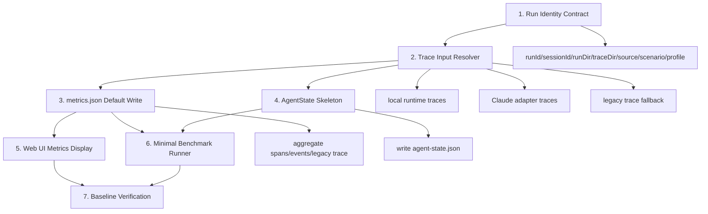

# Next Stage Plan and Agent Prompt: Trace / Metrics / AgentState Baseline

日期：2026-06-24

## 1. 阶段定位

阶段名称：

```text
Trace / Metrics / AgentState Baseline
```

上一阶段已经完成项目命名和主线整理：

```text
packages/web-buddy   = 自研 Web Agent 核心
packages/claude-code = 恢复版 Claude Code runtime
```

下一阶段不要急着做 AgentRuntime 大重构、Skill、Memory 或多 Agent，而是先建立稳定的运行观测地基。

阶段目标：

> 把每一次 Web Agent 运行变成可识别、可记录、可统计、可复盘、可回归比较的数据单元。

也就是从：

```text
能跑 demo，有 trace
```

升级为：

```text
每次运行都有 run identity、trace、metrics.json、agent-state.json，并能在 CLI/Web UI/benchmark 中复用。
```

---

## 2. 为什么这个阶段优先

后面要做：

- Tool unification
- PageState / FormState
- ContextManager
- AgentRuntime facade
- Workflow Engine
- Skill System

这些都会改变 agent 行为。如果没有稳定 metrics，就无法判断：

- 改动后是否更快？
- 工具调用是否减少？
- snapshot 是否减少？
- 表单完成率是否提高？
- 失败率是否下降？
- 是否更容易触发 gate？
- local runtime 和 Claude adapter 谁表现更好？

所以这个阶段是后续所有架构优化的度量地基。

---

## 3. 本阶段核心产物

### 3.1 Run Identity Contract

所有运行路径都应有统一身份：

```text
runId
sessionId
runDir
traceDir
source
scenario
profile
```

适用路径：

```text
local runtime
Claude adapter
Web UI runtime
CLI demo
benchmark
```

建议语义：

| 字段 | 含义 | 示例 |
| --- | --- | --- |
| `runId` | 一次完整任务运行 ID | `runtime-2026-06-24T10-20-30Z` |
| `sessionId` | trace session ID | `local_runtime-...` |
| `runDir` | 本次运行输出目录 | `output/<runId>/` |
| `traceDir` | trace session 目录 | `output/traces/<sessionId>/` |
| `source` | 运行来源 | `local-runtime` / `claude-adapter` / `web-ui` / `benchmark` |
| `scenario` | 场景 | `demo-form` / `fill` / `raw` / `alibaba-apply` |
| `profile` | 运行模式 | `debug` / `fast` / `benchmark` |

### 3.2 metrics.json

输出位置：

```text
output/traces/<sessionId>/metrics.json
```

第一版字段：

```json
{
  "schemaVersion": "run-metrics/v1",
  "runId": "string",
  "sessionId": "string",
  "source": "local-runtime",
  "scenario": "demo-form",
  "profile": "debug",
  "status": "completed",
  "durationMs": 0,
  "llmCalls": 0,
  "toolCalls": 0,
  "mcpToolCalls": 0,
  "browserSnapshots": 0,
  "browserClicks": 0,
  "browserTypes": 0,
  "browserWaits": 0,
  "screenshots": 0,
  "manualHandoffs": 0,
  "promptBytes": 0,
  "observationBytes": 0,
  "failureCategory": "unknown",
  "warnings": []
}
```

当前已有基础：

```text
packages/web-buddy/src/metrics/
packages/web-buddy/scripts/metrics-test.mjs
packages/web-buddy/scripts/trace-inputs-test.mjs
```

本阶段重点不是重写 metrics，而是把它接成默认产物。

### 3.3 agent-state.json

输出位置：

```text
output/traces/<sessionId>/agent-state.json
```

第一版结构：

```json
{
  "schemaVersion": "agent-state/v1",
  "runId": "string",
  "sessionId": "string",
  "source": "local-runtime",
  "scenario": "demo-form",
  "profile": "debug",
  "goal": "string",
  "stage": "init",
  "currentUrl": "string",
  "lastAction": {},
  "lastFailure": {
    "category": "unknown",
    "message": "string",
    "recoverable": true
  },
  "finalStatus": "incomplete",
  "updatedAt": "2026-06-24T00:00:00.000Z"
}
```

第一版只做 skeleton，不做复杂状态机。

### 3.4 Web UI metrics 展示

Web 控制台至少展示：

```text
status
duration
LLM calls
tool calls
MCP tool calls
browser snapshots
clicks
types
waits
screenshots
manual handoffs
failure category
traceDir
```

第一版可以只读已有 `metrics.json`，没有 metrics 时显示空状态。

### 3.5 Minimal Benchmark

新增一个本地 mock benchmark，不依赖真实网站：

```text
packages/web-buddy/benchmarks/mock-pages/simple-apply.html
packages/web-buddy/scripts/benchmark-simple.mjs
```

输出：

```text
output/benchmarks/<timestamp>/
  metrics.json
  agent-state.json
  report.json
```

目标不是复杂，而是建立最小回归闭环。

### 3.6 当前实现备注

本阶段实现后的默认输出位置：

```text
output/traces/<sessionId>/metrics.json
output/traces/<sessionId>/agent-state.json
```

`run-manifest.json` 同目录保存统一 run identity：

```text
runId / sessionId / runDir / traceDir / source / scenario / profile
```

local runtime、CLI demo、Web UI runtime、benchmark、Claude adapter 都映射到同一组字段。
其中 local runtime/CLI/Web/benchmark 使用 `run_<runId>` trace session，Claude adapter
使用 `claude_<runId>` trace session。旧 trace 没有 manifest 时，resolver 会 fallback 到
`session.json`、legacy trace、summary 和 runtime logs，而不是直接失败。

最小 benchmark 运行方式：

```bash
cd packages/web-buddy
npm run build
node ./scripts/benchmark-simple.mjs
```

报告输出：

```text
output/benchmarks/<timestamp>/report.json
```

metrics 聚合器同时读取 local runtime 生成的 agent trace / legacy trace，以及 Claude
adapter 生成的 `output/claude-runtime/<runId>/` logs 和 `output/traces/claude_<runId>/`
trace files。

---

## 4. 实施链路



---

## 5. 串行与并行

### 5.1 必须串行

```text
Run Identity Contract
  -> Trace Input Resolver
  -> metrics.json default write
  -> verification tests
```

原因：

- 没有统一 run identity，metrics、agent-state、benchmark 无法对齐。
- 没有 trace resolver，Web UI 和 benchmark 都不知道读哪个目录。
- 没有默认 metrics 写入，后续优化无法比较。

### 5.2 可以并行

在 Run Identity Contract 稳定后，可以并行：

```text
AgentState schema
Web UI metrics card
benchmark mock page
metrics docs
```

---

## 6. 不做什么

当前阶段不要做：

- 不要抽完整 AgentRuntime。
- 不要重写 ToolRegistry。
- 不要做 Skill System。
- 不要做 Memory。
- 不要做多 Agent。
- 不要做 Server / Worker / Queue。
- 不要新增大量真实网站适配。
- 不要为了 benchmark 接入复杂外部网站。

---

## 7. 验收标准

必须满足：

```text
cd packages/web-buddy
npm run build
npm run test:metrics
npm run test:trace-inputs
npm run test:agent-loop
```

并且：

- 每次 `demo-form` 或 local runtime 运行能生成 `metrics.json`。
- 每次运行能生成 `agent-state.json`。
- Web UI 能显示 metrics 基本字段。
- Claude adapter 路径仍可被 metrics resolver 聚合。
- 至少一个本地 benchmark 能跑通并输出 report。
- 文档说明 metrics / agent-state 输出位置。

建议满足：

- metrics 记录 `profile`。
- metrics 记录 `promptBytes` / `observationBytes`。
- metrics 记录 `failureCategory`。
- agent-state 能记录 finalStatus。

暂不要求：

- 精确 token 成本。
- 完整 cost 估算。
- 完整失败归因。
- 完整 trace replay viewer。
- 复杂 benchmark dataset。

---

## 8. 给后续 Agent 的具体 Prompt

下面这段可以直接复制给后续执行的 agent。

```text
你现在在 /Users/sunqiankai/开源项目/multi-functional-agent。

当前阶段是 Trace / Metrics / AgentState Baseline。

项目命名约定：
- packages/web-buddy 是项目主线：自研 Web Agent 核心、Playwright browser tools、MCP server、Web UI、本地 local runtime。
- packages/claude-code 是恢复版 Claude Code runtime，只作为可选外部 runtime adapter。

当前目标：
建立统一运行观测基线。每次 Web Agent 运行都应该能生成统一的 run identity、trace、metrics.json、agent-state.json，并能被 Web UI 和 benchmark 读取。

请严格遵守：
1. 不要做 AgentRuntime 大重构。
2. 不要做 Skill / Memory / 多 Agent。
3. 不要重写工具系统。
4. 不要新增真实网站适配。
5. 不要破坏已有命令和兼容入口。
6. 不要改 packages/claude-code 内部逻辑，除非只是修路径或 package metadata。
7. 不要删除用户已有未提交改动。

你需要完成：

一、检查当前基础
- 阅读 packages/web-buddy/src/metrics/schema.ts
- 阅读 packages/web-buddy/src/metrics/aggregate.ts
- 阅读 packages/web-buddy/src/metrics/trace-inputs.ts
- 阅读 packages/web-buddy/src/metrics/writer.ts
- 阅读 packages/web-buddy/src/agent-trace/index.ts
- 阅读 packages/web-buddy/src/sdk/trace.ts
- 阅读 packages/web-buddy/src/sdk/orchestrator.ts
- 阅读 packages/web-buddy/src/web/server.ts
- 阅读 packages/web-buddy/scripts/metrics-test.mjs
- 阅读 packages/web-buddy/scripts/trace-inputs-test.mjs

二、统一 Run Identity Contract
- 确认并补齐这些字段：
  - runId
  - sessionId
  - runDir
  - traceDir
  - source
  - scenario
  - profile
- local runtime、Claude adapter、Web UI、CLI demo 都应能映射到这套字段。
- 如果旧 trace 缺少 manifest，resolver 必须 fallback，不要直接失败。

三、完善 metrics.json 默认写入
- 确认每次 local runtime 结束时写出 metrics.json。
- 确认 Claude adapter 结束时写出 metrics.json。
- 输出位置优先为 output/traces/<sessionId>/metrics.json。
- metrics 缺少字段时使用安全默认值，不要让主流程失败。
- metrics 至少包含：
  - status
  - durationMs
  - llmCalls
  - toolCalls
  - mcpToolCalls
  - browserSnapshots
  - browserClicks
  - browserTypes
  - browserWaits
  - screenshots
  - manualHandoffs
  - promptBytes
  - failureCategory
  - warnings

四、新增 AgentState skeleton
- 新增 packages/web-buddy/src/state/agent-state.ts
- 新增 packages/web-buddy/src/state/store.ts
- 每次运行写出 output/traces/<sessionId>/agent-state.json
- 第一版字段：
  - schemaVersion
  - runId
  - sessionId
  - source
  - scenario
  - profile
  - goal
  - stage
  - currentUrl
  - lastAction
  - lastFailure
  - finalStatus
  - updatedAt
- 写入失败不能影响主流程。

五、Web UI metrics 展示
- 在 packages/web-buddy/src/web/server.ts 中确认/新增读取 metrics 的接口或复用 trace 接口。
- 前端至少展示：
  - status
  - duration
  - llmCalls
  - toolCalls
  - snapshots
  - clicks
  - waits
  - screenshots
  - manualHandoffs
  - failureCategory
- 没有 metrics 时显示空状态，不报错。

六、最小 benchmark
- 新增本地 mock 页面：
  packages/web-buddy/benchmarks/mock-pages/simple-apply.html
- 新增 runner：
  packages/web-buddy/scripts/benchmark-simple.mjs
- runner 输出：
  output/benchmarks/<timestamp>/report.json
- 第一版 benchmark 只需要能跑 demo-form 或 simple apply，不需要真实网站。

七、测试验证
在 packages/web-buddy 下运行：
  npm run build
  npm run test:metrics
  npm run test:trace-inputs
  npm run test:agent-loop

如果 Playwright/Chromium 因沙箱权限失败，要说明是环境权限问题，并在允许时重跑。

如新增 benchmark script，也要运行：
  node ./scripts/benchmark-simple.mjs

八、文档更新
- 更新 PLAN 或 docs，说明：
  - metrics.json 输出位置
  - agent-state.json 输出位置
  - benchmark 运行方式
  - local runtime 和 Claude adapter 都能被 metrics 聚合

最终回复需要包含：
- 改了哪些模块。
- 新增了哪些文件。
- 运行了哪些命令。
- 哪些通过，哪些没跑或失败。
- 下一阶段建议是否可以进入 Tool Unification / Observation Model。
```

---

## 9. 下一阶段入口

本阶段完成后，下一阶段才进入：

```text
Tool Unification
  -> Observation Model: PageState / FormState
  -> ContextManager
  -> AgentRuntime facade
```

判断是否可以进入下一阶段：

- metrics 稳定生成。
- agent-state 稳定生成。
- benchmark 能跑。
- Web UI 可见 metrics。
- local runtime 和 Claude adapter 都可被 trace resolver 识别。
