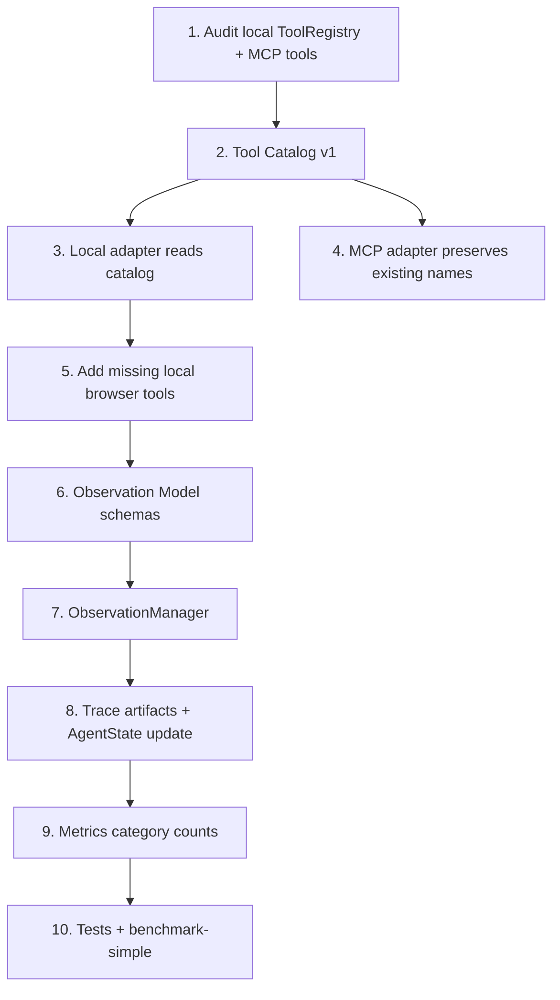

# Next Stage Plan and Agent Prompt: Tool Unification / Observation Model

日期：2026-06-24

## 1. 阶段定位

阶段名称：

```text
Tool Unification / Observation Model
```

上一阶段已经完成：

```text
run identity
trace
metrics.json
agent-state.json
minimal benchmark
Web UI metrics display
```

下一阶段不要急着做 AgentRuntime 大重构、Skill、Memory、多 Agent 或真实网站适配，而是把 Web Agent 的两个底座继续补稳：

```text
统一工具目录
结构化网页观察模型
```

阶段目标：

> 让 local runtime 和 MCP server 对浏览器工具的理解一致，并让 Agent 从“读 snapshot 文本”升级为“拥有 PageState / FormState 结构化观察”。

也就是从：

```text
local runtime 一套工具
MCP server 一套工具
agent 主要消费 snapshot string
```

升级为：

```text
统一 tool catalog
local/MCP 通过 adapter 暴露同一组工具语义
每次观察生成 PageState / FormState
trace / metrics / benchmark 可读取观察结果
```

---

## 2. 为什么这个阶段优先

后续要做：

- ContextManager
- AgentRuntime facade
- Workflow Engine
- Skill System
- 更复杂 benchmark

这些都依赖两件事：

- 工具边界稳定：哪些是 observation tools，哪些是 action tools，哪些需要 human gate。
- 观察模型稳定：当前页面是什么类型、有哪些表单字段、哪些已填写、哪些缺失、哪些按钮可能提交。

如果没有 Tool Unification，local runtime 和 Claude adapter 的能力会继续分叉。
如果没有 Observation Model，ContextManager 只能裁剪字符串，无法做结构化压缩、恢复、回放和评估。

---

## 3. 本阶段严格边界

必须遵守：

1. 不做 AgentRuntime 大重构。
2. 不做 Skill / Memory / 多 Agent。
3. 不重写整个工具系统，只做 catalog + adapter 的薄统一。
4. 不新增真实网站适配。
5. 不破坏已有 MCP 工具名、CLI 命令、Web UI 入口和兼容 wrapper。
6. 不改 `packages/claude-code` 内部逻辑。
7. 不删除用户已有未提交改动。
8. 继续保持 trace / metrics / agent-state 写入失败不影响主流程。

---

## 4. 范围澄清：定义层统一 vs 执行层统一

本阶段的 Tool Unification 要刻意分层。

```text
定义层工具统一
  = 一份 Tool Catalog / Tool Contract
  = 统一 name、schema、category、risk、metadata、trace/metrics 语义
  = local runtime 和 MCP server 通过 adapter 暴露同一组工具定义

执行层工具统一
  = 单一 ToolExecutionService
  = 统一 policy gate、trace span、result normalization、streaming、permission dispatcher
  = local runtime 和 MCP server 的工具执行路径也被收进同一执行服务
```

Plan2 要完成的是**定义层工具统一**：

- 建立统一 Tool Catalog。
- 让 local runtime 从 catalog 读取工具定义。
- 让 MCP server 保持原工具名和兼容入口，但 metadata / category / risk 对齐 catalog。
- local runtime 补齐关键 MCP 工具能力，尤其是表单观察和按文本/label 操作类工具。
- metrics / trace 能使用同一套 tool category。

Plan2 不做完整**执行层工具统一**。不要在这个阶段重写：

- `runtime/local/tool-registry.ts` 的整个执行模型。
- `src/tools/index.ts` 的 MCP server 对外行为。
- 统一 streaming / permission / trace dispatcher。
- 单一 `ToolExecutionService` 的全量调度。

执行层统一更适合放在 Observation Model 稳定之后、AgentRuntime facade 之前：

```text
Plan2:
  一份 contract，两个 adapter
  Tool Catalog + metadata parity + local/MCP 能力对齐

Plan3:
  ContextManager / Prompt Sections
  使用 tool category 和 PageState/FormState 做上下文预算

AgentRuntime facade 前:
  再做 ToolExecutionService / 执行层统一
```

这能避免 Plan2 变成工具系统大重构，同时消除 local runtime 和 MCP server 的定义漂移。

---

## 5. 当前基础

重点阅读：

```text
packages/web-buddy/src/runtime/local/tool-registry.ts
packages/web-buddy/src/tools/index.ts
packages/web-buddy/src/browser/*.ts
packages/web-buddy/src/snapshot/builder.ts
packages/web-buddy/src/snapshot/ref-resolver.ts
packages/web-buddy/src/snapshot/risk.ts
packages/web-buddy/src/runtime/local/agent-loop.ts
packages/web-buddy/src/runtime/local/page-view.ts
packages/web-buddy/src/sdk/trace.ts
packages/web-buddy/src/agent-trace/index.ts
packages/web-buddy/src/metrics/*
packages/web-buddy/scripts/benchmark-simple.mjs
```

已有能力：

- local runtime 已有 `ToolRegistry`，能转 OpenAI function tools。
- MCP server 已有更多浏览器工具，例如：
  - `browser_form_snapshot`
  - `browser_upload_file`
  - `browser_fill_by_label`
  - `browser_select_by_text`
  - `browser_click_text`
- browser tools 已有 ref、snapshot、risk、人类 gate 基础。
- trace / metrics / agent-state baseline 已经存在。
- benchmark-simple 可以作为本阶段回归目标。

---

## 6. 核心产物

### 6.1 Tool Catalog v1

新增统一工具定义，建议文件：

```text
packages/web-buddy/src/tools/catalog.ts
packages/web-buddy/src/tools/types.ts
packages/web-buddy/src/tools/local-adapter.ts
packages/web-buddy/src/tools/mcp-adapter.ts
packages/web-buddy/src/tools/result-normalizer.ts
```

第一版 `ToolDef` 至少包含：

```ts
export type ToolCategory = 'observation' | 'action' | 'human' | 'eval'
export type ToolRuntime = 'local' | 'mcp'

export interface UnifiedToolDef {
  name: string
  mcpName?: string
  description: string
  category: ToolCategory
  risk: 'L0' | 'L1' | 'L2' | 'L3' | 'L4'
  parameters: Record<string, unknown>
  local?: {
    enabled: boolean
    run?: unknown
  }
  mcp?: {
    enabled: boolean
  }
  metadata?: Record<string, unknown>
}
```

第一版不要求完美抽象，但要求：

- local runtime 和 MCP server 能从 catalog 读取工具名称、schema、category、risk。
- 不删除现有工具入口。
- MCP 工具名保持兼容。
- local runtime 工具能力不弱于当前 local 版本，并优先补齐 MCP 已有的表单观察/填写类工具。

### 6.2 Local Runtime 工具补齐

本阶段优先让 local runtime 能使用这些工具语义：

```text
browser_snapshot
browser_form_snapshot
browser_click
browser_click_text
browser_type
browser_fill_by_label
browser_select
browser_select_by_text
browser_wait
browser_screenshot
agent_done
```

不要求一次性支持 upload 的完整真实站点流程；`browser_upload_file` 可以先进入 catalog，local adapter 可保持受 gate 保护或标记为后续补齐。

### 6.3 Tool Category / Metrics

工具 trace span 或 legacy trace 中应能区分：

```text
observation
action
human
eval
```

metrics 第一版可以新增安全默认字段：

```text
observationToolCalls
actionToolCalls
humanToolCalls
evalToolCalls
```

缺少这些字段时默认为 0，不影响旧 metrics。

### 6.4 Observation Model v1

新增：

```text
packages/web-buddy/src/observation/page-state.ts
packages/web-buddy/src/observation/form-state.ts
packages/web-buddy/src/observation/page-type-detector.ts
packages/web-buddy/src/observation/form-state-builder.ts
packages/web-buddy/src/observation/observation-manager.ts
```

第一版 `PageState`：

```ts
export type PageType =
  | 'unknown'
  | 'login'
  | 'list'
  | 'detail'
  | 'form'
  | 'confirmation'
  | 'captcha'

export interface PageState {
  schemaVersion: 'page-state/v1'
  url?: string
  title?: string
  pageType: PageType
  interactiveCount: number
  formCount: number
  linkCount: number
  buttonCount: number
  inputCount: number
  textSummary?: string
  updatedAt: string
}
```

第一版 `FormState`：

```ts
export interface FormFieldState {
  ref?: string
  label: string
  name?: string
  type?: string
  required: boolean
  filled: boolean
  valuePreview?: string
  risk?: string
}

export interface FormState {
  schemaVersion: 'form-state/v1'
  url?: string
  fields: FormFieldState[]
  missingRequired: string[]
  filledFields: string[]
  submitCandidates: Array<{ ref?: string; label: string; risk?: string }>
  updatedAt: string
}
```

### 6.5 Trace Artifacts

每次 observation refresh 后，尽量写入：

```text
output/traces/<sessionId>/artifacts/page-state-*.json
output/traces/<sessionId>/artifacts/form-state-*.json
```

也可以在第一版只写最新快照：

```text
output/traces/<sessionId>/artifacts/page-state-latest.json
output/traces/<sessionId>/artifacts/form-state-latest.json
```

写入失败不能影响主流程。

### 6.6 AgentState 衔接

`agent-state.json` 可以补充：

```text
stage
currentUrl
lastAction
lastFailure
```

本阶段不做复杂状态机，只在 observation refresh / tool execution / finalize 时保持字段更准确。

---

## 7. 实施链路



---

## 8. 验收标准

必须满足：

- `npm run build` 通过。
- `npm run test:metrics` 通过。
- `npm run test:trace-inputs` 通过。
- `npm run test:agent-loop` 通过。
- `node ./scripts/benchmark-simple.mjs` 通过。
- local runtime 仍能跑 `demo-form`。
- benchmark-simple 能产出 metrics 和 agent-state。
- benchmark-simple trace artifacts 中能看到 PageState / FormState。
- Web UI / CLI / MCP server 现有入口不被破坏。

建议新增测试：

```text
packages/web-buddy/scripts/tool-catalog-test.mjs
packages/web-buddy/scripts/observation-test.mjs
```

并可新增 npm scripts：

```text
npm run test:tool-catalog
npm run test:observation
```

---

## 9. 风险和控制

| 风险 | 控制 |
| --- | --- |
| 工具统一变成大重构 | 第一版只做 catalog + adapter，不重写 browser tool 实现 |
| MCP 兼容入口被破坏 | 保留现有工具名和 `src/tools/index.ts` 导出行为 |
| local runtime prompt 被过度改写 | 只把新增工具 schema 暴露给模型，prompt 轻改 |
| Observation Model 过度复杂 | 第一版只基于 snapshot/form snapshot 做启发式状态 |
| metrics schema 破坏旧数据 | 新字段全用安全默认值 |
| benchmark 不稳定 | 只使用本地 mock 页面，不接真实网站 |

---

## 10. 下一轮 Agent Prompt

```text
你现在在 /Users/sunqiankai/开源项目/multi-functional-agent。

当前阶段是 Tool Unification / Observation Model。

项目命名约定：
- packages/web-buddy 是项目主线：自研 Web Agent 核心、Playwright browser tools、MCP server、Web UI、本地 local runtime。
- packages/claude-code 是恢复版 Claude Code runtime，只作为可选外部 runtime adapter。

上一阶段已经完成：
- 每次运行有统一 run identity。
- 每次 local runtime / Claude adapter 运行能写出 trace、metrics.json、agent-state.json。
- Web UI 能读取并展示 metrics。
- benchmark-simple 能跑本地 mock 页面并输出 report.json。

当前目标：
建立 Tool Unification / Observation Model v1。
local runtime 和 MCP server 应尽量共享同一套工具定义与能力边界；每次网页观察应能生成 PageState / FormState，并写入 trace artifacts，供 Web UI / benchmark / replay / debug 使用。

勘误边界：

- 后续 ContextManager 不应从 trace artifacts 读取运行时上下文。
- ContextManager 应读取 ObservationManager / ObservationProvider 的内存态 PageState / FormState。
- trace artifacts 是旁路镜像，不是主流程状态数据库。

请严格遵守：
1. 不要做 AgentRuntime 大重构。
2. 不要做 Skill / Memory / 多 Agent。
3. 不要重写整个工具系统，只做 catalog + adapter 的薄统一。
4. 不要新增真实网站适配。
5. 不要破坏已有 MCP 工具名、CLI 命令、Web UI 入口和兼容 wrapper。
6. 不要改 packages/claude-code 内部逻辑。
7. 不要删除用户已有未提交改动。
8. 写 trace / metrics / observation artifact / agent-state 失败不能影响主流程。
9. 本阶段只做定义层工具统一：一份 Tool Catalog / Tool Contract，两个 adapter。
10. 不做完整执行层工具统一；不要引入单一 ToolExecutionService 或重写 local/MCP 的执行调度。

你需要完成：

一、检查当前基础
- 阅读 packages/web-buddy/src/runtime/local/tool-registry.ts
- 阅读 packages/web-buddy/src/tools/index.ts
- 阅读 packages/web-buddy/src/browser/open.ts
- 阅读 packages/web-buddy/src/browser/snapshot.ts
- 阅读 packages/web-buddy/src/browser/form-snapshot.ts
- 阅读 packages/web-buddy/src/browser/click.ts
- 阅读 packages/web-buddy/src/browser/click-text.ts
- 阅读 packages/web-buddy/src/browser/type.ts
- 阅读 packages/web-buddy/src/browser/fill-by-label.ts
- 阅读 packages/web-buddy/src/browser/select.ts
- 阅读 packages/web-buddy/src/browser/select-by-text.ts
- 阅读 packages/web-buddy/src/browser/wait.ts
- 阅读 packages/web-buddy/src/browser/screenshot.ts
- 阅读 packages/web-buddy/src/snapshot/builder.ts
- 阅读 packages/web-buddy/src/snapshot/ref-resolver.ts
- 阅读 packages/web-buddy/src/snapshot/risk.ts
- 阅读 packages/web-buddy/src/runtime/local/agent-loop.ts
- 阅读 packages/web-buddy/src/runtime/local/page-view.ts
- 阅读 packages/web-buddy/src/sdk/trace.ts
- 阅读 packages/web-buddy/src/agent-trace/index.ts
- 阅读 packages/web-buddy/scripts/benchmark-simple.mjs

二、建立 Tool Catalog v1
- 新增 packages/web-buddy/src/tools/types.ts
- 新增或更新 packages/web-buddy/src/tools/catalog.ts
- 为浏览器工具定义统一 ToolDef：
  - name
  - mcpName（如需要）
  - description
  - category: observation / action / human / eval
  - risk
  - parameters
  - local enabled
  - mcp enabled
  - metadata
- 不要删除现有 MCP 工具名。
- 不要改变 MCP server 对外兼容行为。

三、让 local runtime 使用统一 catalog
- 新增 packages/web-buddy/src/tools/local-adapter.ts
- 让 runtime/local/tool-registry.ts 尽量从 catalog 生成 local tools。
- 保留 ToolRegistry 对外接口，避免大改 agent-loop。
- local runtime 至少继续支持：
  - browser_open
  - browser_snapshot
  - browser_click
  - browser_type
  - browser_select
  - browser_wait
  - browser_screenshot
  - agent_done
- 尽量补齐：
  - browser_form_snapshot
  - browser_click_text
  - browser_fill_by_label
  - browser_select_by_text
- 高风险工具仍必须走现有 gate / risk 逻辑。

四、保持 MCP server 兼容
- 如需要，新增 packages/web-buddy/src/tools/mcp-adapter.ts
- MCP server 仍应导出原有工具名。
- Claude adapter allowed tools 不应被破坏。

五、新增 Observation Model v1
- 新增 packages/web-buddy/src/observation/page-state.ts
- 新增 packages/web-buddy/src/observation/form-state.ts
- 新增 packages/web-buddy/src/observation/page-type-detector.ts
- 新增 packages/web-buddy/src/observation/form-state-builder.ts
- 新增 packages/web-buddy/src/observation/observation-manager.ts
- PageState 至少包含：
  - schemaVersion
  - url
  - title
  - pageType
  - interactiveCount
  - formCount
  - linkCount
  - buttonCount
  - inputCount
  - textSummary
  - updatedAt
- FormState 至少包含：
  - schemaVersion
  - url
  - fields
  - missingRequired
  - filledFields
  - submitCandidates
  - updatedAt
- pageType 第一版支持：
  - unknown
  - login
  - list
  - detail
  - form
  - confirmation
  - captcha

六、写入 trace artifacts
- 每次 observation refresh 后，尽量写：
  - output/traces/<sessionId>/artifacts/page-state-latest.json
  - output/traces/<sessionId>/artifacts/form-state-latest.json
- 或写入带序号文件也可以，但必须有 latest 方便 Web UI/benchmark 读取。
- 写入失败不能影响主流程。

七、补充 metrics / trace metadata
- 工具调用 trace 或 legacy trace 中尽量带 category。
- metrics 可新增安全默认字段：
  - observationToolCalls
  - actionToolCalls
  - humanToolCalls
  - evalToolCalls
- 缺字段时默认 0，不让旧 trace 失败。

八、测试和 benchmark
- 新增最小测试：
  - packages/web-buddy/scripts/tool-catalog-test.mjs
  - packages/web-buddy/scripts/observation-test.mjs
- 如新增 npm script，更新 package.json。
- 在 packages/web-buddy 下运行：
  npm run build
  npm run test:metrics
  npm run test:trace-inputs
  npm run test:agent-loop
  node ./scripts/benchmark-simple.mjs
- 如果新增测试脚本，也运行：
  node ./scripts/tool-catalog-test.mjs
  node ./scripts/observation-test.mjs

九、文档更新
- 更新 PLAN 或 README，说明：
  - Tool Catalog 的位置和用途。
  - local runtime 与 MCP server 的工具统一关系。
  - PageState / FormState artifact 输出位置。
  - benchmark 如何验证 Observation Model。

最终回复需要包含：
- 改了哪些模块。
- 新增了哪些文件。
- 运行了哪些命令。
- 哪些通过，哪些没跑或失败。
- 下一阶段建议是否可以进入 ContextManager / Prompt Sections。
```

---

## 11. 下一阶段预期

如果本阶段完成，可以进入：

```text
ContextManager / Prompt Sections
```

进入条件：

- local runtime 和 MCP server 的工具目录已经不会明显分叉。
- PageState / FormState 已能在 demo-form 和 benchmark-simple 中稳定生成。
- trace artifacts 和 metrics 可以证明 observation refresh、action tool、human gate 的基本统计没有退化。
