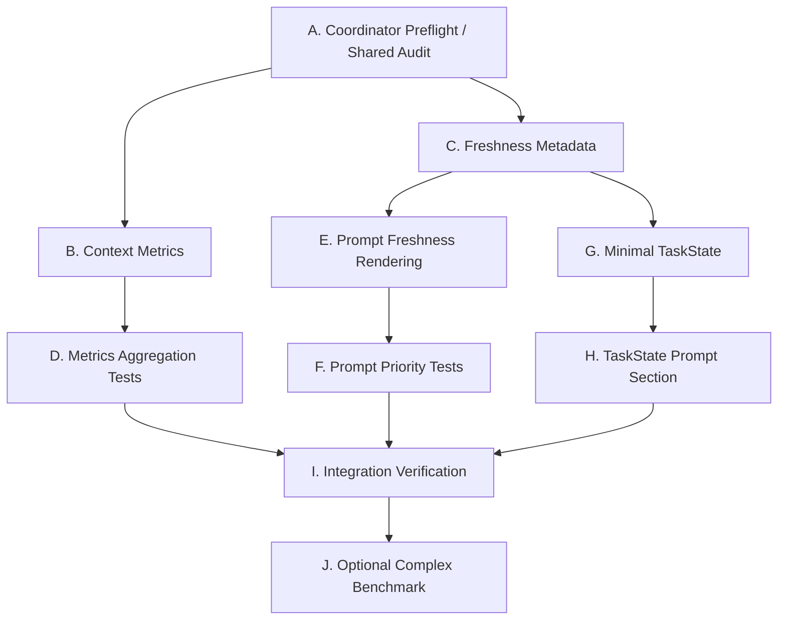

# Next Stage Plan and Agent Prompts: Context Metrics / Freshness / TaskState

日期：2026-06-25

## 1. 阶段定位

阶段名称：

```text
Context Selection Metrics / Freshness Metadata / Minimal TaskState / Phase 4B
```

上一阶段已经完成：

```text
Plan1: run identity / trace / metrics / agent-state / benchmark-simple
Plan2: Tool Catalog / local adapter / MCP adapter / PageState / FormState / ObservationManager
Plan3: ContextManager / Prompt Sections / recentActions / prompt budget / trace artifact 解耦
Phase 4A: AgentRuntime facade / PromptAssembler / StopConditionManager
```

当前代码状态：

- `packages/web-buddy` 是自研 Web Agent 主线包。
- `packages/claude-code` 是恢复版 Claude Code runtime，只作为 adapter / 对照。
- 当前 local runtime 实际执行入口仍是 `packages/web-buddy/src/runtime/local/agent-loop.ts` 的 `runAgentLoop`。
- `AgentRuntime.run()` 已经作为 facade 存在，但第一版仍内部调用 `runAgentLoop`。
- `ContextManager` 读取 `ObservationProvider` 内存态 `PageState` / `FormState`，不读取 trace artifacts。
- `PromptAssembler` 已经承接 agent-loop 的 prompt helper。
- `RunMetrics` 目前主要覆盖 trace、LLM、tool、browser action、handoff、文件大小等指标，还没有 context selection 指标。
- `ContextSnapshot` 目前包含 `page`、`form`、`resumeSummary`、`recentActions`、`safetyNotes`、`blockers`、`extraContext`，还没有 freshness metadata。
- 当前有 `agent-state.json` 作为 trace 输出，但没有 runtime working set 里的最小 `TaskState`。

本阶段目标：

> 在不重写 runtime 主循环的前提下，让 ContextManager / Prompt Sections 的筛选行为可度量，让模型知道 PageState / FormState 是否新鲜，并加入最小 TaskState，为后续 Workflow / Policy / ToolExecutionService 做准备。

一句话：

```text
先让上下文选择可测、可解释、可防回归。
再让 runtime working set 多一个轻量 TaskState。
不要进入完整 workflow engine。
```

---

## 2. 为什么 Phase 4B 先做这些

`PLAN/context-selection-report.md` 的结论是：

```text
Raw world
  -> structured observation
  -> source boundary
  -> relevance scoring
  -> section budget
  -> causal invariant preservation
  -> prompt rendering
  -> refresh / verify
  -> trace as side-effect evidence
```

当前已经做到：

- structured observation：`PageState` / `FormState`
- source boundary：`ContextManager -> ObservationProvider memory`
- section budget：`PromptSectionBudgetOptions`
- causal chain：`recentActions`
- trace as side-effect：trace artifacts 只作为 Web UI / benchmark / debug / replay 输出

还缺：

- context selection 的 metrics。
- PageState / FormState freshness。
- tight budget 下关键 section 的优先级测试。
- 任务阶段感，也就是最小 TaskState。

如果不先做这些，后面抽 `ToolExecutionService` 或 `PolicyEngine` 时，很难判断回归来自工具执行、状态过期、prompt 截断，还是任务阶段判断错误。

---

## 3. 严格边界

必须遵守：

1. 不重写 `runAgentLoop` 主循环。
2. 不改变 `runAgentLoop` 对外接口。
3. 不改变 `ToolRegistry` 对外接口。
4. 不重写 local adapter / MCP adapter。
5. 不引入完整 `ToolExecutionService`。
6. 不抽完整 `PolicyEngine`。
7. 不做 Skill / Memory / 多 Agent。
8. 不做真实网站适配。
9. 不改 `packages/claude-code` 内部逻辑。
10. 不破坏现有 CLI / Web UI / MCP 工具名。
11. Runtime / ContextManager / PromptAssembler 不允许读取 trace artifacts。
12. trace artifacts 只能作为 Web UI / benchmark / debug / replay / metrics aggregation 的旁路输出。

允许：

1. 新增 context metrics 类型、事件和聚合逻辑。
2. 扩展 `RunMetrics`，缺失字段必须默认 0 或空对象，兼容旧 trace。
3. 扩展 `ContextSnapshot` internal schema，加入 freshness metadata。
4. 扩展 Prompt Sections，把 freshness cue 渲染给模型。
5. 新增最小 `TaskState` 类型和 `TaskState` prompt section。
6. 新增本地 benchmark mock 页面，但不做真实网站适配。
7. 新增测试脚本或扩展现有测试。

---

## 4. Phase 4B 范围

### 4.1 Context Selection Metrics

新增或扩展指标：

```text
contextBuilds
contextChars
contextTruncations
recentActionsIncluded
pageStateAgeMs
formStateAgeMs
promptSectionChars by section id
```

建议落点：

- `packages/web-buddy/src/context/metrics.ts`
- `packages/web-buddy/src/context/prompt-sections.ts`
- `packages/web-buddy/src/agent/prompt-assembler.ts`
- `packages/web-buddy/src/metrics/schema.ts`
- `packages/web-buddy/src/metrics/aggregate.ts`
- `packages/web-buddy/scripts/metrics-test.mjs`

第一版实现建议：

1. `buildPromptSections()` 返回仍保持 `PromptSection[]`，不破坏调用方。
2. 新增 helper，例如：

```ts
export function measurePromptSections(sections: PromptSection[]): PromptSectionMetrics
```

3. `PromptAssembler` 在 build/render context 时通过 active trace event 记录 `context_selection`。
4. `aggregateMetrics()` 从 `events.jsonl` 汇总 context metrics。
5. 旧 trace 没有这些 event 时，metrics 字段默认 0 或 `{}`。

注意：

- metrics aggregation 读 trace 是允许的，因为它是 run 后旁路分析。
- Runtime / ContextManager / PromptAssembler 不能为了构建上下文去读 trace artifacts。

### 4.2 Freshness Metadata

扩展 `ContextSnapshot`：

```ts
export interface ContextFreshness {
  pageStateUpdatedAt?: string
  formStateUpdatedAt?: string
  pageStateAgeMs?: number
  formStateAgeMs?: number
  pageStateStale: boolean
  formStateStale: boolean
  staleAfterMs: number
}
```

扩展 `ContextSnapshot`：

```ts
freshness: ContextFreshness
```

第一版 stale 阈值建议：

```text
DEFAULT_STALE_AFTER_MS = 30_000
```

Prompt 渲染建议：

- `CURRENT_PAGE_STATE` 加：

```text
freshness: ageMs=1234 stale=false updatedAt=...
```

- `CURRENT_FORM_STATE` 加：

```text
freshness: ageMs=1234 stale=false updatedAt=...
```

行为边界：

- 第一版只把 freshness 进入 prompt 和 metrics。
- 不改变 `runAgentLoop` 内部 stop 行为。
- 不新增复杂自动刷新策略。
- 可以在 `NEXT_ACTION_RULES` 增加轻提示：状态 stale 或 refs 可能过期时调用 `browser_snapshot` / `browser_form_snapshot`。

### 4.3 Prompt Section Priority Tests

补充测试，证明 tight budget 下关键内容不会被低价值文本挤掉。

建议新增：

```text
packages/web-buddy/scripts/prompt-priority-test.mjs
```

或扩展：

```text
packages/web-buddy/scripts/prompt-sections-test.mjs
```

必须覆盖：

1. blockers 在 tight budget 下仍可见。
2. `missingRequired` 比 `textSummary` 更优先保留。
3. blocked/high-risk recent actions 比普通 wait/snapshot 更优先保留。
4. section chars / truncation metrics 可测。

如果第一版 prompt renderer 还做不到这些，优先做最小规则：

- `SAFETY_RULES` 和 blockers 不进入 shrink 前几位。
- `CURRENT_FORM_STATE` 中 `missingRequired` 渲染在 `filledFields` 和 `submitCandidates` 前后都可以，但 tight budget 下必须留住 label。
- `RECENT_ACTIONS` 可以先排序：blocked/error/warn 优先于 ok；高风险优先于低风险；再按时间保留最近。

### 4.4 Minimal TaskState

新增：

```text
packages/web-buddy/src/task/task-state.ts
```

建议字段：

```ts
export type TaskPhase = 'observing' | 'filling' | 'reviewing' | 'blocked' | 'done'

export interface TaskState {
  schemaVersion: 'task-state/v1'
  goal: string
  phase: TaskPhase
  knownBlockers: string[]
  completionCriteria: string[]
  updatedAt: string
}
```

Context 接入：

- `ContextSnapshotInput` 增加可选 `taskState?: TaskState`。
- `ContextSnapshot` 增加可选 `taskState?: TaskState`。
- Prompt Sections 新增 section：

```text
TASK_STATE
```

推荐顺序：

```text
SYSTEM_ROLE
SAFETY_RULES
TASK
TASK_STATE
RESUME_SUMMARY
CURRENT_PAGE_STATE
CURRENT_FORM_STATE
RECENT_ACTIONS
NEXT_ACTION_RULES
```

第一版 TaskState 来源：

- `PromptAssembler` 如果没有传入 taskState，可用 goal 构造默认 `observing`。
- `agent-loop` 可以暂不维护复杂 state transition。
- 如果要做最小 transition，只做：
  - 初始 `observing`
  - 执行 `browser_type` / `browser_fill_by_label` / `browser_select` 后可视为 `filling`
  - `agent_done(blocked=false)` 后 `done`
  - `agent_done(blocked=true)` 或 gate takeover 后 `blocked`

不要做：

- Workflow engine。
- 多 step DAG。
- 长期任务状态持久化。
- 从 trace artifacts 恢复 TaskState。

### 4.5 Optional: Complex Local Benchmark Page

本阶段可选，不建议和核心 4B 混在一个大 commit。

新增本地 benchmark 页面：

```text
packages/web-buddy/benchmarks/mock-pages/complex-apply.html
```

包含：

- required / optional fields
- select with many options
- upload hints
- validation errors
- multi-step-like section
- confirmation / captcha-like blocker 文本

新增脚本：

```text
packages/web-buddy/scripts/benchmark-complex.mjs
```

目的：

- 验证 FormState / ContextSnapshot / Prompt Sections 在复杂页面仍能保留关键状态。
- 不做真实网站适配。

---

## 5. 串行 / 并行执行图

### 5.1 高层依赖



### 5.2 并行性表

| 任务 | 内容 | 依赖 | 并行/串行 | 备注 |
| --- | --- | --- | --- | --- |
| A | Coordinator preflight / shared audit | 无 | 串行，先做 | 不建议作为隔离子 Agent；若使用子 Agent，必须写共享 handoff 文件 |
| B | Context metrics event/helper | A | 可与 C 并行 | 主要改 `context/*`、`agent/prompt-assembler.ts` |
| C | Freshness metadata | A | 可与 B 并行，但会碰 `context/types.ts` | 如果多人并行，需要文件归属约定 |
| D | Metrics aggregation tests | B | 串行，等 B | 改 `metrics/*` 和 `metrics-test` |
| E | Prompt freshness rendering | C | 串行，等 C | 改 `prompt-sections.ts` |
| F | Prompt priority tests | E | 可与 D 并行 | 如果测试暴露 renderer 不足，再小改 |
| G | Minimal TaskState type | C | 可与 D/F 并行 | 可能碰 `context/types.ts`，注意冲突 |
| H | TaskState prompt section | G | 串行，等 G | 改 prompt section order 和 tests |
| I | Full verification | D/F/H | 串行，最后做 | build + tests + rg 检查 |
| J | Complex local benchmark | I 后建议单独做 | 可选，单独 commit | 避免扩大 Phase 4B 核心改动 |

推荐实际执行波次：

```text
Wave 0 串行:
  A Coordinator preflight / shared audit

Wave 1 可并行:
  B Context metrics
  C Freshness metadata

Wave 2 可并行:
  D Metrics aggregation tests
  E Prompt freshness rendering

Wave 3 可并行:
  F Prompt priority tests
  G Minimal TaskState type

Wave 4 串行:
  H TaskState prompt section
  I Full verification

Wave 5 可选:
  J Complex local benchmark
```

---

## 6. 需要的 Agent 和对应 Prompt

下面的 Agent 是派工角色，不要求一定创建独立线程。若使用多 Agent / 子 Agent，必须遵守各自文件边界，避免并行写同一文件。

重要说明：

```text
Agent 0 不应该作为“只在自己上下文里回答”的隔离子 Agent。
如果它的输出不能传递给后续 Agent，它没有实际价值。
```

Agent 0 的有效用法只有两种：

1. 由主协调 Agent 自己执行 preflight，然后把结论直接写进后续 Agent prompt。
2. 如果必须用子 Agent，要求它写入共享 handoff 文件，例如 `PLAN/phase4b-audit.md`，后续 Agent 必须先读取这个文件。

如果做不到以上任一方式，跳过 Agent 0，直接由主协调 Agent 给 Agent A/B 派发更完整的 prompt。

### Agent 0: Coordinator Preflight / Shared Auditor

并行性：

```text
串行，必须最先执行；不建议作为隔离子 Agent。
```

职责：

- 盘点当前实现和测试。
- 确认 Phase 4A 后没有未提交代码影响 Phase 4B。
- 输出文件级改动建议，不改代码。
- 产生可传递的 handoff 信息。

输出方式：

```text
推荐：主协调 Agent 在当前线程内完成审计，并把结论复制进后续 Agent prompt。
可选：子 Agent 把结论写入 PLAN/phase4b-audit.md。
禁止：子 Agent 只在自己的上下文里口头输出，然后假设其他 Agent 已经知道。
```

建议 Prompt：

```text
你现在在 /Users/sunqiankai/开源项目/multi-functional-agent。

当前阶段准备进入 Phase 4B: Context Selection Metrics / Freshness Metadata / Minimal TaskState。

请只做审计，不要修改代码。

重要：
- 如果你是主协调 Agent，请在当前线程输出审计摘要，供后续派工 prompt 直接引用。
- 如果你是子 Agent，请把审计结果写入 PLAN/phase4b-audit.md，后续 Agent 会读取该文件。
- 不允许只把结论留在子 Agent 私有上下文里。

阅读：
- PLAN/plan5.md
- PLAN/context-selection-report.md
- packages/web-buddy/src/context/types.ts
- packages/web-buddy/src/context/context-manager.ts
- packages/web-buddy/src/context/prompt-sections.ts
- packages/web-buddy/src/agent/prompt-assembler.ts
- packages/web-buddy/src/metrics/schema.ts
- packages/web-buddy/src/metrics/aggregate.ts
- packages/web-buddy/scripts/context-manager-test.mjs
- packages/web-buddy/scripts/prompt-sections-test.mjs
- packages/web-buddy/scripts/metrics-test.mjs

输出：
- 当前已实现能力清单。
- Phase 4B 最小文件改动清单。
- 哪些文件容易并行冲突。
- 是否存在 trace artifact 被 runtime/context/prompt 读取的风险。
- 如果写文件，输出到 PLAN/phase4b-audit.md。

严格禁止：
- 不要修改 packages/claude-code。
- 不要重写 runAgentLoop。
- 不要引入 ToolExecutionService / PolicyEngine / Skill / Memory。
```

### Agent A: Context Metrics Implementer

并行性：

```text
可与 Agent B 并行。
不要与 Agent D 同时改 metrics/aggregate.ts。
```

建议文件范围：

- `packages/web-buddy/src/context/metrics.ts`
- `packages/web-buddy/src/context/prompt-sections.ts`
- `packages/web-buddy/src/agent/prompt-assembler.ts`
- `packages/web-buddy/scripts/prompt-sections-test.mjs`

职责：

- 新增 context selection metrics helper。
- 记录每次 prompt/context 构建的 section chars、总 chars、truncation、recentActions 数量。
- 通过 active trace event 输出 context metrics。
- 不改变 `buildPromptSections()` 现有返回类型，避免破坏调用方。

建议 Prompt：

```text
你现在在 /Users/sunqiankai/开源项目/multi-functional-agent。

任务：实现 Phase 4B 的 Context Selection Metrics 第一版。

共享上下文：
- 先阅读 PLAN/plan5.md。
- 如果存在 PLAN/phase4b-audit.md，必须先阅读它，并按其中的文件边界 / 冲突提示执行。
- 如果不存在 PLAN/phase4b-audit.md，就按 PLAN/plan5.md 继续。

目标：
- 新增轻量 context metrics helper。
- 可统计 contextBuilds、contextChars、contextTruncations、recentActionsIncluded、promptSectionChars。
- PromptAssembler 在构建 / 渲染 context 时记录 context_selection trace event。
- 不改变 runAgentLoop 对外接口。
- 不改变 buildPromptSections() 的现有返回类型。

建议阅读：
- PLAN/plan5.md
- PLAN/phase4b-audit.md（如果存在）
- packages/web-buddy/src/context/types.ts
- packages/web-buddy/src/context/prompt-sections.ts
- packages/web-buddy/src/agent/prompt-assembler.ts
- packages/web-buddy/src/agent-trace/index.ts
- packages/web-buddy/scripts/prompt-sections-test.mjs

边界：
- Runtime / ContextManager / PromptAssembler 不读取 trace artifacts。
- trace event 只是旁路输出。
- 不改 ToolRegistry/local adapter/MCP adapter。
- 不做 TaskState，TaskState 由其他 Agent 处理。

验证：
- npm run build
- npm run test:prompt-sections
- rg -n "page-state-latest|form-state-latest|output/traces|readFileSync|readFile" packages/web-buddy/src/agent packages/web-buddy/src/context packages/web-buddy/src/runtime/local --glob '*.ts'
```

### Agent B: Freshness Metadata Implementer

并行性：

```text
可与 Agent A 并行。
会修改 context/types.ts 和 context-manager.ts，与 TaskState Agent 有潜在冲突。
```

建议文件范围：

- `packages/web-buddy/src/context/types.ts`
- `packages/web-buddy/src/context/context-manager.ts`
- `packages/web-buddy/src/context/prompt-sections.ts`
- `packages/web-buddy/scripts/context-manager-test.mjs`
- `packages/web-buddy/scripts/prompt-sections-test.mjs`

职责：

- 扩展 `ContextSnapshot` freshness metadata。
- 根据 `page.updatedAt` / `form.updatedAt` 计算 ageMs / stale。
- 在 prompt 的 PageState / FormState section 中渲染 freshness cue。
- 测试 ContextManager 仍不读 trace artifacts。

建议 Prompt：

```text
你现在在 /Users/sunqiankai/开源项目/multi-functional-agent。

任务：实现 Phase 4B 的 Freshness Metadata 第一版。

共享上下文：
- 先阅读 PLAN/plan5.md。
- 如果存在 PLAN/phase4b-audit.md，必须先阅读它，并按其中的文件边界 / 冲突提示执行。
- 如果不存在 PLAN/phase4b-audit.md，就按 PLAN/plan5.md 继续。

目标：
- 给 ContextSnapshot 增加 freshness metadata。
- 计算 pageStateAgeMs、formStateAgeMs、pageStateStale、formStateStale。
- 默认 stale 阈值使用 30_000ms，允许 ContextManagerOptions 覆盖。
- Prompt Sections 在 CURRENT_PAGE_STATE / CURRENT_FORM_STATE 中渲染 freshness cue。
- 不改变 runAgentLoop stop 行为，不新增复杂自动刷新策略。

建议阅读：
- PLAN/plan5.md
- PLAN/phase4b-audit.md（如果存在）
- packages/web-buddy/src/context/types.ts
- packages/web-buddy/src/context/context-manager.ts
- packages/web-buddy/src/context/prompt-sections.ts
- packages/web-buddy/scripts/context-manager-test.mjs
- packages/web-buddy/scripts/prompt-sections-test.mjs

边界：
- 不读取 trace artifacts。
- 不调用 browser tools。
- 不改 AgentRuntime facade 行为。
- 不做 TaskState section，除非主 Agent 明确合并阶段。

验证：
- npm run build
- npm run test:context
- npm run test:prompt-sections
- rg -n "page-state-latest|form-state-latest|output/traces|readFileSync|readFile" packages/web-buddy/src/agent packages/web-buddy/src/context packages/web-buddy/src/runtime/local --glob '*.ts'
```

### Agent C: Metrics Aggregator

并行性：

```text
依赖 Agent A 的 trace event shape。
Agent A 完成后串行执行。
```

建议文件范围：

- `packages/web-buddy/src/metrics/schema.ts`
- `packages/web-buddy/src/metrics/aggregate.ts`
- `packages/web-buddy/scripts/metrics-test.mjs`
- 可选：`packages/web-buddy/src/web/public/index.html`

职责：

- 扩展 `RunMetrics` schema。
- 从 `events.jsonl` 聚合 context metrics。
- 缺失 context metrics 的旧 trace 默认 0 或 `{}`。
- 更新 metrics test。
- Web UI 展示可以后置，不作为第一版必须项。

建议 Prompt：

```text
你现在在 /Users/sunqiankai/开源项目/multi-functional-agent。

任务：把 context_selection trace event 聚合到 RunMetrics。

共享上下文：
- 先阅读 PLAN/plan5.md。
- 如果存在 PLAN/phase4b-audit.md，必须先阅读它，并按其中的 event shape / 文件边界执行。
- 如果不存在 PLAN/phase4b-audit.md，就按 PLAN/plan5.md 继续。

目标：
- RunMetrics 增加 contextBuilds、contextChars、contextTruncations、recentActionsIncluded、pageStateAgeMs、formStateAgeMs、promptSectionChars。
- aggregateMetrics() 从 events.jsonl 读取 context_selection event 并汇总。
- 旧 trace 没有这些 event 时 metrics 字段必须默认 0 或空对象。
- 更新 metrics-test 覆盖新字段。

建议阅读：
- PLAN/plan5.md
- PLAN/phase4b-audit.md（如果存在）
- packages/web-buddy/src/metrics/schema.ts
- packages/web-buddy/src/metrics/aggregate.ts
- packages/web-buddy/src/metrics/writer.ts
- packages/web-buddy/scripts/metrics-test.mjs

边界：
- metrics aggregation 可以读取 trace，因为这是旁路分析。
- Runtime / ContextManager / PromptAssembler 不得读取 trace artifacts。
- 不改 runAgentLoop 主循环。

验证：
- npm run build
- npm run test:metrics
- npm run test:agent-runtime
- npm run benchmark:simple
```

### Agent D: Prompt Priority Test Agent

并行性：

```text
可与 Agent C 并行。
建议等 Agent B 的 freshness rendering 完成后开始。
```

建议文件范围：

- `packages/web-buddy/src/context/prompt-sections.ts`
- `packages/web-buddy/scripts/prompt-sections-test.mjs`
- 可选新增 `packages/web-buddy/scripts/prompt-priority-test.mjs`
- `packages/web-buddy/package.json`

职责：

- 增加 tight budget 下的 prompt priority 测试。
- 必要时微调 render order 或 shrink order。
- 不扩大 PromptAssembler / ContextManager 职责。

建议 Prompt：

```text
你现在在 /Users/sunqiankai/开源项目/multi-functional-agent。

任务：为 Prompt Sections 增加 priority / tight budget 测试。

共享上下文：
- 先阅读 PLAN/plan5.md。
- 如果存在 PLAN/phase4b-audit.md，必须先阅读它，并按其中的文件边界 / 冲突提示执行。
- 如果不存在 PLAN/phase4b-audit.md，就按 PLAN/plan5.md 继续。

目标：
- blockers 在 tight budget 下仍保留。
- CURRENT_FORM_STATE 中 missingRequired label 在 tight budget 下仍保留。
- RECENT_ACTIONS 中 blocked/error/high-risk actions 优先于普通 ok/wait/snapshot。
- 如果需要，最小调整 prompt-sections.ts 的渲染顺序或 recentActions 渲染策略。

建议阅读：
- PLAN/plan5.md
- PLAN/phase4b-audit.md（如果存在）
- PLAN/context-selection-report.md
- packages/web-buddy/src/context/prompt-sections.ts
- packages/web-buddy/scripts/prompt-sections-test.mjs

边界：
- 不改 ContextManager 状态来源。
- 不读 trace artifacts。
- 不改 runAgentLoop 主循环。
- 不引入长期 Memory。

验证：
- npm run build
- npm run test:prompt-sections
- 如果新增脚本，更新 package.json 并运行对应 npm script。
```

### Agent E: Minimal TaskState Implementer

并行性：

```text
可与 Agent C/D 并行，但会碰 context/types.ts 和 prompt-sections.ts。
如果 Agent B/D 正在改这些文件，需要串行合并。
```

建议文件范围：

- `packages/web-buddy/src/task/task-state.ts`
- `packages/web-buddy/src/context/types.ts`
- `packages/web-buddy/src/context/context-manager.ts`
- `packages/web-buddy/src/context/prompt-sections.ts`
- `packages/web-buddy/src/agent/prompt-assembler.ts`
- `packages/web-buddy/scripts/context-manager-test.mjs`
- `packages/web-buddy/scripts/prompt-sections-test.mjs`

职责：

- 新增最小 `TaskState` 类型。
- 让 `ContextSnapshot` 可携带 TaskState。
- 增加 `TASK_STATE` prompt section。
- 第一版默认 taskState 可由 goal 生成，不做复杂状态机。

建议 Prompt：

```text
你现在在 /Users/sunqiankai/开源项目/multi-functional-agent。

任务：实现 Minimal TaskState v1。

共享上下文：
- 先阅读 PLAN/plan5.md。
- 如果存在 PLAN/phase4b-audit.md，必须先阅读它，并按其中的文件边界 / 冲突提示执行。
- 如果不存在 PLAN/phase4b-audit.md，就按 PLAN/plan5.md 继续。

目标：
- 新增 packages/web-buddy/src/task/task-state.ts。
- 定义 TaskPhase: observing | filling | reviewing | blocked | done。
- 定义 TaskState schemaVersion task-state/v1。
- ContextSnapshotInput / ContextSnapshot 支持可选 taskState。
- Prompt Sections 新增 TASK_STATE，放在 TASK 后、RESUME_SUMMARY 前。
- PromptAssembler 如果没有 taskState，可以构造默认 observing state。

边界：
- 不做 workflow engine。
- 不做长期持久化。
- 不从 trace artifacts 恢复 TaskState。
- 不重写 runAgentLoop 主循环。
- 不做 Skill / Memory / 多 Agent。

验证：
- npm run build
- npm run test:context
- npm run test:prompt-sections
- npm run test:agent-runtime
```

### Agent F: Verification and Regression Agent

并行性：

```text
串行，最后执行。
```

职责：

- 运行完整验证。
- 做 trace artifact read 边界检查。
- 汇总通过 / 失败 / 未跑。

建议 Prompt：

```text
你现在在 /Users/sunqiankai/开源项目/multi-functional-agent。

任务：Phase 4B 完成后的验证和回归检查。

共享上下文：
- 先阅读 PLAN/plan5.md。
- 如果存在 PLAN/phase4b-audit.md，必须先阅读它，并核对实现是否偏离审计 handoff。
- 如果不存在 PLAN/phase4b-audit.md，就按 PLAN/plan5.md 继续。

运行：
- cd packages/web-buddy && npm run build
- npm run test:context
- npm run test:prompt-sections
- npm run test:agent-runtime
- npm run test:agent-loop
- npm run test:metrics
- npm run benchmark:simple
- npm run test:tool-catalog
- npm run test:observation

同时运行：
rg -n "page-state-latest|form-state-latest|output/traces|readFileSync|readFile" \
  packages/web-buddy/src/agent \
  packages/web-buddy/src/context \
  packages/web-buddy/src/runtime/local \
  --glob '*.ts'

输出：
- 改了哪些模块。
- 新增了哪些文件。
- Context metrics 如何记录和聚合。
- Freshness metadata 如何计算和渲染。
- TaskState 是否进入 ContextSnapshot / Prompt Sections。
- 如何保证 Runtime / ContextManager / PromptAssembler 没有读 trace artifacts。
- 哪些命令通过，哪些失败或没跑。
```

### Agent G: Optional Complex Benchmark Agent

并行性：

```text
可选。建议核心 Phase 4B 完成后单独执行。
```

职责：

- 新增复杂本地 benchmark 页面和脚本。
- 不引入真实网站适配。

建议 Prompt：

```text
你现在在 /Users/sunqiankai/开源项目/multi-functional-agent。

任务：新增复杂本地 benchmark 页面，用于验证 Context / Freshness / TaskState。

共享上下文：
- 先阅读 PLAN/plan5.md。
- 如果存在 PLAN/phase4b-audit.md，必须先阅读它，并按其中的文件边界 / 冲突提示执行。
- 如果不存在 PLAN/phase4b-audit.md，就按 PLAN/plan5.md 继续。

目标：
- 新增 benchmarks/mock-pages/complex-apply.html。
- 页面包含 required/optional fields、select many options、upload hint、visible validation errors、multi-step-like section、captcha-like blocker。
- 新增 scripts/benchmark-complex.mjs。
- benchmark 读取 trace artifacts 作为旁路验证，断言 PageState/FormState/metrics/agent-state 可用。

边界：
- 不做真实网站适配。
- 不改 runAgentLoop 主循环。
- 不让 runtime/context/prompt 读取 trace artifacts。

验证：
- npm run build
- npm run benchmark:complex
- npm run benchmark:simple
```

---

## 7. 推荐提交切分

建议不要把整个 Phase 4B 压成一个大 commit。

### Commit 1

```text
feat(web-buddy): add context metrics and freshness
```

包含：

- context metrics helper
- context_selection trace event
- RunMetrics schema / aggregation
- freshness metadata
- context / prompt / metrics tests

### Commit 2

```text
feat(web-buddy): add minimal task state to context
```

包含：

- `TaskState`
- `TASK_STATE` prompt section
- default task state
- context / prompt / runtime tests

### Commit 3 可选

```text
test(web-buddy): add complex local benchmark
```

包含：

- complex mock page
- benchmark script
- package script

---

## 8. 验收标准

Phase 4B 完成必须满足：

1. `ContextSnapshot` 有 freshness metadata。
2. Prompt 中能看到 PageState / FormState freshness cue。
3. `RunMetrics` 有 context selection metrics，旧 trace 缺失时默认安全。
4. Prompt priority tests 覆盖 blockers、missingRequired、blocked/high-risk recent actions。
5. Minimal TaskState 进入 ContextSnapshot 和 Prompt Sections。
6. `AgentRuntime.run()` 仍能跑通 mock LLM。
7. `runAgentLoop` 旧入口仍可用。
8. Runtime / ContextManager / PromptAssembler 不读取 trace artifacts。
9. 不改 `packages/claude-code` 内部逻辑。

建议验证：

```bash
cd packages/web-buddy
npm run build
npm run test:context
npm run test:prompt-sections
npm run test:agent-runtime
npm run test:agent-loop
npm run test:metrics
npm run benchmark:simple
npm run test:tool-catalog
npm run test:observation
```

边界检查：

```bash
rg -n "page-state-latest|form-state-latest|output/traces|readFileSync|readFile" \
  packages/web-buddy/src/agent \
  packages/web-buddy/src/context \
  packages/web-buddy/src/runtime/local \
  --glob '*.ts'
```

期望：

```text
无命中。
```

如果有命中，必须说明它不是 runtime state read；否则修掉。

---

## 9. 风险和回滚点

| 风险 | 表现 | 缓解 |
| --- | --- | --- |
| Metrics event shape 过早复杂化 | 聚合和测试变脆 | 第一版只计数、字符数、ageMs、section chars |
| Freshness 改变 agent 行为太多 | benchmark 回归 | 第一版只提示，不自动改变 stop/refresh 策略 |
| TaskState 演化成 workflow engine | 改动面失控 | 只做 schema + prompt section + default state |
| Prompt priority 调整破坏旧 prompt | mock LLM 失败 | 跑 agent-runtime / agent-loop / benchmark-simple |
| Runtime 读取 trace artifacts | stale state 进入主流程 | rg 检查 + poisoned artifact 测试 |
| 并行 Agent 文件冲突 | context/types.ts、prompt-sections.ts 冲突 | 按 Wave 分工，最终由主 Agent 串行合并 |

回滚点：

- 如果 context metrics 聚合影响旧 metrics，先保留 trace event，暂时不聚合到 `RunMetrics`。
- 如果 TaskState 影响 prompt 测试，先保留类型，不加入 prompt section。
- 如果 priority tests 需要较多 renderer 重写，先只加测试 TODO/xfail 不合适；更好的做法是缩小测试范围，保证本阶段可落地。

---

## 10. 不做事项

Phase 4B 不做：

- 完整 `ToolExecutionService`。
- 完整 `PolicyEngine`。
- LoopController 深拆。
- Skill / Memory / 多 Agent。
- 真实网站适配。
- Claude Code runtime 内部修改。
- 从 trace artifacts 构建 runtime context。
- 长期任务状态持久化。
- Web UI 大改版。

---

## 11. 下一阶段预期

如果 Phase 4B 完成，可以进入 Phase 4C：

```text
ToolExecutionService / PolicyEngine Extraction
```

Phase 4C 才考虑：

- tool execution result normalization
- permission / policy decision boundary
- high-risk action refresh before execution
- loop controller deeper extraction
- orchestrator 逐步切到 AgentRuntime facade

进入 Phase 4C 的前置条件：

- context selection metrics 可用。
- freshness metadata 可用。
- TaskState 最小模型可用。
- benchmark-simple 继续通过。
- trace artifacts 仍是旁路输出，不是 runtime truth。
