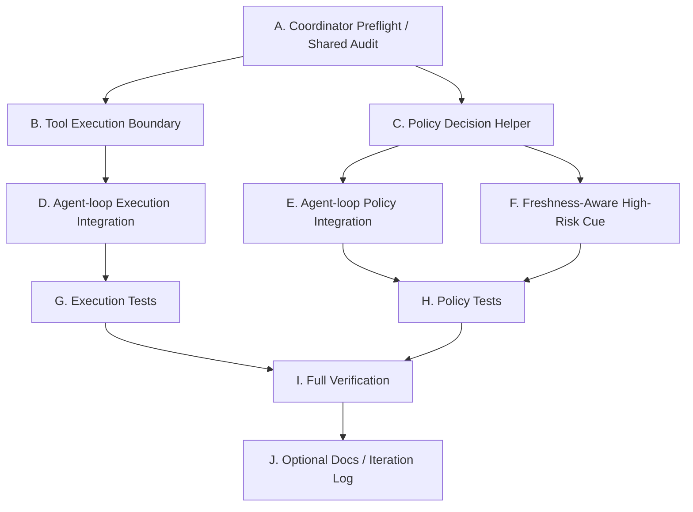

# Next Stage Plan and Agent Prompts: Tool Execution Boundary / Policy Skeleton

日期：2026-06-26

## 1. 阶段定位

阶段名称：

```text
Tool Execution Boundary / Policy Skeleton / Phase 4C
```

上一阶段已经完成：

```text
Plan1: run identity / trace / metrics / agent-state / benchmark-simple
Plan2: Tool Catalog / local adapter / MCP adapter / PageState / FormState / ObservationManager
Plan3: ContextManager / Prompt Sections / recentActions / prompt budget / trace artifact 解耦
Phase 4A: AgentRuntime facade / PromptAssembler / StopConditionManager
Phase 4B: Context metrics / Freshness metadata / Minimal TaskState / complex local benchmark
```

当前代码状态：

- `packages/web-buddy` 是自研 Web Agent 主线包。
- `packages/claude-code` 是恢复版 Claude Code runtime，只作为 adapter / 对照。
- 当前 local runtime 实际执行入口仍是 `packages/web-buddy/src/runtime/local/agent-loop.ts` 的 `runAgentLoop`。
- `AgentRuntime.run()` 已经存在，但第一版仍内部调用 `runAgentLoop`。
- `PromptAssembler` 已经承接 agent-loop 的 prompt helper。
- `ContextManager` / `PromptAssembler` 不读取 trace artifacts。
- `ContextSnapshot` 已经有 freshness metadata。
- `TaskState` 已经以最小 working set 形式进入 prompt section。
- context selection metrics 已经能进入 trace events，并由 metrics aggregator 做旁路统计。
- `ToolRegistry.run()` 仍是 agent-loop 内部直接执行工具的主要边界。
- high-risk / gate / final-submit 等策略判断仍主要散落在 agent-loop 内部。

本阶段目标：

> 在不重写 runtime 主循环的前提下，新增轻量 Tool Execution Boundary 和轻量 Policy Decision helper，让工具执行和策略判断开始有稳定挂载点，为后续 workflow / policy / tool execution service 做准备。

一句话：

```text
先抽边界，不抽引擎。
先保兼容，不改行为。
先让策略可测，再谈策略编排。
```

---

## 2. 为什么 Phase 4C 做这些

Plan5 解决了 runtime 看世界时的三个基础问题：

```text
context 是否被正确选择
state 是否新鲜
task 当前处于什么阶段
```

现在下一个瓶颈在 agent-loop 内部：

```text
LLM chooses tool
  -> agent-loop parses tool call
  -> inline policy checks
  -> ToolRegistry.run()
  -> local/MCP adapter
  -> trace/metrics/recentActions
  -> next prompt
```

这条链路目前能跑，但几个职责还耦合在一起：

- 工具执行调用点和 loop 控制混在一起。
- policy/gate/final-submit 判断缺少独立可测的决策函数。
- high-risk action 与 freshness 的关系还没有明确边界。
- 后续如果直接上完整 `ToolExecutionService` 或 `PolicyEngine`，风险会很高，容易改坏现有 CLI / Web UI / MCP 行为。

Phase 4C 的第一性原理：

```text
Runtime loop 的职责是推进回合。
Tool execution boundary 的职责是稳定调用工具。
Policy helper 的职责是把动作是否允许执行变成可测试的决策。
Trace artifacts 的职责是旁路证据，不是 runtime 的输入。
```

因此本阶段只做轻量边界：

- 不改变主循环形状。
- 不改变工具注册表的公共接口。
- 不改变 adapter。
- 不改变现有工具名。
- 不改变 final-submit 安全行为。

---

## 3. 严格边界

必须遵守：

1. 不重写 `runAgentLoop` 主循环。
2. 不改变 `runAgentLoop` 对外接口。
3. 不改变 `ToolRegistry` 对外接口。
4. 不重写 local adapter / MCP adapter。
5. 不引入完整 `ToolExecutionService`。
6. 不抽完整 `PolicyEngine`。
7. 不做 Skill / Memory / 多 Agent。
8. 不做真实网站适配。
9. 不改 `packages/claude-code` 内部逻辑。
10. 不破坏现有 CLI / Web UI / MCP 工具名。
11. Runtime / ContextManager / PromptAssembler 不允许读取 trace artifacts。
12. trace artifacts 只能作为 Web UI / benchmark / debug / replay / metrics aggregation 的旁路输出。
13. 不改变 final submit / takeover / gate 的用户安全语义。

允许：

1. 新增轻量 tool execution boundary 类型和 wrapper。
2. 新增轻量 policy decision 类型和 helper。
3. 在 agent-loop 中把局部 inline 逻辑替换为 helper 调用。
4. 新增 policy / tool execution regression tests。
5. 对 `RunMetrics` 做兼容式扩展，缺省字段必须安全。
6. 在 high-risk action 前增加 freshness cue 或决策 metadata，但第一版不强制改变行为。

---

## 4. Phase 4C 范围

### 4.1 Tool Execution Boundary v1

建议新增：

```text
packages/web-buddy/src/tools/tool-execution.ts
```

或：

```text
packages/web-buddy/src/runtime/local/tool-execution-service.ts
```

推荐第一版命名：

```text
ToolExecutionBoundary
```

而不是完整：

```text
ToolExecutionService
```

原因：

- `Service` 容易暗示调度、权限、队列、重试、streaming、审计存储等完整职责。
- 当前阶段只需要一个稳定调用边界，内部仍委托 `ToolRegistry.run()`。

建议类型：

```ts
export interface ToolExecutionInput {
  toolName: string
  args: unknown
  ctx: LocalToolContext
  metadata?: {
    step?: number
    riskLevel?: string
    category?: string
    argBrief?: string
  }
}

export interface ToolExecutionResult {
  toolName: string
  args: unknown
  result: LocalToolRunResult
  metadata?: ToolExecutionInput['metadata']
}
```

第一版行为：

1. constructor 接收 `ToolRegistry`。
2. `execute(input)` 内部只调用 `registry.run(input.toolName, input.args, input.ctx)`。
3. 保留 `ToolRegistry` 的公共接口不变。
4. 不自己调用 browser tools。
5. 不读取 trace artifacts。
6. 不做权限判断。
7. 不做重试。
8. 不接管 trace span，除非后续 agent-loop integration 明确只移动很小一段且测试覆盖。

三个例子：

```text
例 1:
agent-loop 原来直接 registry.run("browser_click", args, ctx)
现在改为 toolExecution.execute({ toolName: "browser_click", args, ctx, metadata })
实际工具仍由 ToolRegistry 调用。

例 2:
mock registry 返回 { ok: true, content: "clicked" }
ToolExecutionBoundary 只包装结果，不改 content。

例 3:
unknown tool 的错误仍按 ToolRegistry 现有语义返回或抛出。
Boundary 不新增另一套工具名解析。
```

### 4.2 Policy Decision Helper v1

建议新增：

```text
packages/web-buddy/src/policy/agent-policy.ts
```

或：

```text
packages/web-buddy/src/agent/policy-decision.ts
```

推荐第一版命名：

```text
PolicyDecision
AgentPolicyHelper
```

不要命名为完整：

```text
PolicyEngine
```

建议类型：

```ts
export type PolicyAction = 'allow' | 'gate' | 'block' | 'auto_confirm'

export type PolicyRiskLevel = 'low' | 'medium' | 'high' | 'critical'

export interface PolicyDecision {
  action: PolicyAction
  riskLevel: PolicyRiskLevel
  reason: string
  gateKind?: string
  requiresFreshContext?: boolean
}
```

第一版抽取对象：

- click text / click ref 的 gate kind 推断。
- final submit / confirm / send / publish 类动作的 gate 判断。
- raw mode auto-confirm 规则。
- takeover / blocked 决策中可局部纯函数化的判断。

不要做：

- 完整 policy DSL。
- 用户权限模型。
- 多租户安全策略。
- 外部配置加载。
- 从 trace artifacts 恢复策略状态。

三个例子：

```text
例 1:
button text = "Submit application"
PolicyDecision 返回 gate，riskLevel=critical，gateKind=final_submit。

例 2:
button text = "Add another experience"
PolicyDecision 返回 allow，riskLevel=low。

例 3:
raw auto-confirm 模式下的高风险动作仍走现有语义。
helper 只返回 auto_confirm，不改变 runAgentLoop 的最终处理方式。
```

### 4.3 Freshness-Aware High-Risk Cue v1

Plan5 已经加入 freshness metadata，本阶段可以开始让 policy helper 知道 freshness，但不要强行改变工具执行行为。

建议第一版：

- policy helper 接收可选 freshness summary。
- 对 high-risk / critical 动作返回 `requiresFreshContext: true`。
- 如果 context stale，只在 decision reason / trace metadata / recentActions 中表达。
- 不自动执行 `browser_snapshot`。
- 不阻断 final submit 现有流程，除非原来已有 gate。

可选第二步：

- 只在测试充分后，对 stale high-risk action 给模型一条 tool message cue：

```text
Context appears stale before a high-risk action. Refresh page/form state before proceeding.
```

本阶段不建议：

- 自动插入 snapshot tool call。
- 自动重排 LLM tool call。
- 把 freshness 变成硬性 blocker。

三个例子：

```text
例 1:
formStateStale=false，点击 "Submit"。
policy 返回 gate + requiresFreshContext=true，但不额外提示 stale。

例 2:
formStateStale=true，点击 "Submit"。
policy 返回 gate + requiresFreshContext=true + reason 包含 stale cue。

例 3:
formStateStale=true，点击普通输入框。
policy 返回 allow，不强制刷新。
```

### 4.4 AgentRuntime 兼容性

本阶段不要求让所有入口改走 `AgentRuntime.run()`。

保持：

```text
CLI / Web UI / MCP -> runAgentLoop
AgentRuntime.run() -> runAgentLoop
```

允许：

- `AgentRuntime` 继续作为 facade。
- 新增测试证明 facade 在 ToolExecutionBoundary / PolicyDecision 引入后仍跑通。
- 后续 Phase 4D 再讨论 Runtime Controller / Workflow boundary。

不要：

- 把 orchestrator 全量迁移到 `AgentRuntime`。
- 改 CLI / Web UI / MCP 工具名。
- 在 `AgentRuntime` 内自己执行 browser tools。

### 4.5 Tests and Benchmarks

建议新增：

```text
packages/web-buddy/scripts/tool-execution-test.mjs
packages/web-buddy/scripts/policy-decision-test.mjs
```

更新：

```text
packages/web-buddy/package.json
```

新增 scripts：

```json
{
  "test:tool-execution": "npm run build && node ./scripts/tool-execution-test.mjs",
  "test:policy": "npm run build && node ./scripts/policy-decision-test.mjs"
}
```

必须覆盖：

1. `ToolExecutionBoundary.execute()` 可以调用 mock registry。
2. result 保持 ToolRegistry 结果语义。
3. unknown tool / failed result 不被 wrapper 吞掉。
4. policy helper 对 final submit 返回 gate。
5. policy helper 对普通 click 返回 allow。
6. raw auto-confirm 规则保持兼容。
7. stale freshness 只产生 cue / metadata，不强制改变行为。
8. `runAgentLoop` 旧入口仍可用。
9. `AgentRuntime.run()` 仍可用。
10. runtime/context/prompt/agent 不读取 trace artifacts。

---

## 5. 串行 / 并行执行图

### 5.1 高层依赖



### 5.2 并行性表

| 任务 | 内容 | 依赖 | 并行/串行 | 备注 |
| --- | --- | --- | --- | --- |
| A | Coordinator preflight / shared audit | 无 | 串行，先做 | 若使用子 Agent，必须写共享 handoff 文件 |
| B | Tool Execution Boundary | A | 可与 C 并行 | 不改 ToolRegistry 接口 |
| C | Policy Decision Helper | A | 可与 B 并行 | 不抽完整 PolicyEngine |
| D | agent-loop tool execution 调用点接入 | B | 串行，等 B | 只替换局部 `registry.run` 调用 |
| E | agent-loop policy helper 接入 | C | 串行，等 C | 保持 final-submit 行为 |
| F | freshness-aware high-risk cue | C | 可与 D 并行 | 第一版只做 cue / metadata |
| G | tool execution tests | B/D | 串行或半并行 | 等 API 稳定后写 |
| H | policy tests | C/E/F | 串行或半并行 | 覆盖 gate/allow/auto_confirm |
| I | full verification | G/H | 串行，最后做 | build + tests + benchmark + rg |
| J | docs / iteration log | I 后 | 可选 | 仅记录结果，不影响 runtime |

推荐实际执行波次：

```text
Wave 0 串行:
  A Coordinator preflight / shared audit

Wave 1 可并行:
  B Tool Execution Boundary
  C Policy Decision Helper

Wave 2 可并行:
  D Agent-loop Execution Integration
  E Agent-loop Policy Integration
  F Freshness-Aware High-Risk Cue

Wave 3 可并行:
  G Execution Tests
  H Policy Tests

Wave 4 串行:
  I Full Verification

Wave 5 可选:
  J Docs / iteration log
```

---

## 6. 需要的 Agent 和对应 Prompt

下面的 Agent 是派工角色，不要求一定创建独立线程。若使用多 Agent / 子 Agent，必须遵守各自文件边界，避免并行写同一文件。

重要说明：

```text
Agent 0 不应该作为“只在自己上下文里回答”的隔离子 Agent。
如果它的输出不能传递给后续 Agent，它没有实际价值。
```

Agent 0 的有效用法只有两种：

1. 由主协调 Agent 自己执行 preflight，然后把结论直接写进后续 Agent prompt。
2. 如果必须用子 Agent，要求它写入共享 handoff 文件，例如 `PLAN/phase4c-audit.md`，后续 Agent 必须先读取这个文件。

如果做不到以上任一方式，跳过 Agent 0，直接由主协调 Agent 给 Agent A/B 派发更完整的 prompt。

### Agent 0: Coordinator Preflight / Shared Auditor

并行性：

```text
串行，必须最先执行；不建议作为隔离子 Agent。
```

职责：

- 盘点 Plan5 后当前实现和测试。
- 确认是否有未提交或外部 Agent 改动会影响 Phase 4C。
- 找出 agent-loop 内部可安全抽成 helper 的最小代码段。
- 输出文件级改动建议，不改代码。
- 产生可传递的 handoff 信息。

输出方式：

```text
推荐：主协调 Agent 在当前线程内完成审计，并把结论复制进后续 Agent prompt。
可选：子 Agent 把结论写入 PLAN/phase4c-audit.md。
禁止：子 Agent 只在自己的上下文里口头输出，然后假设其他 Agent 已经知道。
```

建议 Prompt：

```text
你现在在 /Users/sunqiankai/开源项目/multi-functional-agent。

当前阶段准备进入 Phase 4C: Tool Execution Boundary / Policy Skeleton。

请只做审计，不要修改代码。

重要：
- 如果你是主协调 Agent，请在当前线程输出审计摘要，供后续派工 prompt 直接引用。
- 如果你是子 Agent，请把审计结果写入 PLAN/phase4c-audit.md，后续 Agent 会读取该文件。
- 不允许只把结论留在子 Agent 私有上下文里。

阅读：
- PLAN/plan6.md
- PLAN/plan5.md
- PLAN/phase4b-audit.md（如果存在）
- packages/web-buddy/src/runtime/local/agent-loop.ts
- packages/web-buddy/src/runtime/local/tool-registry.ts
- packages/web-buddy/src/tools/local-adapter.ts
- packages/web-buddy/src/agent/agent-runtime.ts
- packages/web-buddy/src/agent/prompt-assembler.ts
- packages/web-buddy/src/context/context-manager.ts
- packages/web-buddy/src/context/prompt-sections.ts
- packages/web-buddy/scripts/agent-loop-test.mjs
- packages/web-buddy/scripts/agent-runtime-test.mjs
- packages/web-buddy/scripts/benchmark-simple.mjs
- packages/web-buddy/scripts/benchmark-complex.mjs（如果存在）

输出：
- 当前已实现能力清单。
- Phase 4C 最小文件改动清单。
- agent-loop 内哪些逻辑可以安全抽 helper，哪些不能动。
- 哪些文件容易并行冲突。
- 是否存在 trace artifact 被 runtime/context/prompt 读取的风险。
- 如果写文件，输出到 PLAN/phase4c-audit.md。

严格禁止：
- 不要修改 packages/claude-code。
- 不要重写 runAgentLoop。
- 不要改变 runAgentLoop 对外接口。
- 不要改变 ToolRegistry 对外接口。
- 不要引入完整 ToolExecutionService / PolicyEngine / Skill / Memory。
```

### Agent A: Tool Execution Boundary Implementer

并行性：

```text
可与 Agent B 并行。
不要与 Agent C 同时改 agent-loop 调用点。
```

建议文件范围：

- `packages/web-buddy/src/tools/tool-execution.ts`
- `packages/web-buddy/src/runtime/local/tool-registry.ts`（只读，除非发现类型导出确实缺失）
- `packages/web-buddy/src/tools/local-adapter.ts`（只读）
- `packages/web-buddy/scripts/tool-execution-test.mjs`
- `packages/web-buddy/package.json`

职责：

- 新增轻量 ToolExecutionBoundary。
- 内部委托 `ToolRegistry.run()`。
- 不改变 ToolRegistry 公共接口。
- 不接管 policy。
- 不调用 browser tools。
- 不读取 trace artifacts。

建议 Prompt：

```text
你现在在 /Users/sunqiankai/开源项目/multi-functional-agent。

任务：实现 Phase 4C 的 Tool Execution Boundary 第一版。

共享上下文：
- 先阅读 PLAN/plan6.md。
- 如果存在 PLAN/phase4c-audit.md，必须先阅读它，并按其中的文件边界 / 冲突提示执行。
- 如果不存在 PLAN/phase4c-audit.md，就按 PLAN/plan6.md 继续。

目标：
- 新增轻量 ToolExecutionBoundary。
- constructor 接收 ToolRegistry。
- execute(input) 内部仍调用 registry.run(toolName, args, ctx)。
- 返回结果保持 ToolRegistry 语义。
- 新增最小测试，证明 success / failure / unknown tool 不被 wrapper 改坏。

建议阅读：
- PLAN/plan6.md
- PLAN/phase4c-audit.md（如果存在）
- packages/web-buddy/src/runtime/local/tool-registry.ts
- packages/web-buddy/src/tools/local-adapter.ts
- packages/web-buddy/src/runtime/local/agent-loop.ts
- packages/web-buddy/scripts/agent-loop-test.mjs

边界：
- 不改变 ToolRegistry 对外接口。
- 不重写 local adapter / MCP adapter。
- 不抽权限、重试、队列、streaming。
- 不读取 trace artifacts。
- 不修改 packages/claude-code。
- 不接入 agent-loop，接入由 Agent C 完成。

验证：
- npm run build
- npm run test:tool-execution
- rg -n "page-state-latest|form-state-latest|output/traces|readFileSync|readFile" packages/web-buddy/src/tools packages/web-buddy/src/runtime/local --glob '*.ts'
```

### Agent B: Policy Decision Helper Implementer

并行性：

```text
可与 Agent A 并行。
不要与 Agent D 同时改 agent-loop policy 调用点。
```

建议文件范围：

- `packages/web-buddy/src/agent/policy-decision.ts`
- 或 `packages/web-buddy/src/policy/agent-policy.ts`
- `packages/web-buddy/scripts/policy-decision-test.mjs`
- `packages/web-buddy/package.json`

职责：

- 新增轻量 PolicyDecision 类型和 helper。
- 抽取 gate/high-risk/final-submit 可纯函数化的判断。
- 支持 freshness-aware cue 的字段，但不强制改变行为。
- 新增最小测试。

建议 Prompt：

```text
你现在在 /Users/sunqiankai/开源项目/multi-functional-agent。

任务：实现 Phase 4C 的 Policy Decision Helper 第一版。

共享上下文：
- 先阅读 PLAN/plan6.md。
- 如果存在 PLAN/phase4c-audit.md，必须先阅读它，并按其中的文件边界 / 冲突提示执行。
- 如果不存在 PLAN/phase4c-audit.md，就按 PLAN/plan6.md 继续。

目标：
- 新增轻量 PolicyDecision / PolicyAction / risk level 类型。
- 把 final submit / dangerous click / raw auto-confirm 等可纯函数化逻辑抽成 helper。
- helper 可以接收可选 freshness summary。
- stale freshness 只影响 reason / requiresFreshContext / metadata，不强制改变工具执行。
- 新增测试覆盖 allow / gate / auto_confirm / stale cue。

建议阅读：
- PLAN/plan6.md
- PLAN/phase4c-audit.md（如果存在）
- packages/web-buddy/src/runtime/local/agent-loop.ts
- packages/web-buddy/src/context/types.ts
- packages/web-buddy/scripts/agent-loop-test.mjs
- packages/web-buddy/scripts/agent-runtime-test.mjs

边界：
- 不抽完整 PolicyEngine。
- 不做策略 DSL。
- 不读取 trace artifacts。
- 不改变 final-submit 安全语义。
- 不接入 agent-loop，接入由 Agent D 完成。
- 不修改 packages/claude-code。

验证：
- npm run build
- npm run test:policy
- rg -n "page-state-latest|form-state-latest|output/traces|readFileSync|readFile" packages/web-buddy/src/agent packages/web-buddy/src/policy packages/web-buddy/src/runtime/local --glob '*.ts'
```

### Agent C: Agent-loop Execution Integration

并行性：

```text
依赖 Agent A。
可与 Agent D/F 并行，但都可能修改 agent-loop，建议由主协调者串行合并。
```

建议文件范围：

- `packages/web-buddy/src/runtime/local/agent-loop.ts`
- `packages/web-buddy/src/tools/tool-execution.ts`
- `packages/web-buddy/scripts/agent-loop-test.mjs`
- `packages/web-buddy/scripts/agent-runtime-test.mjs`

职责：

- 在 agent-loop 内创建或接收 ToolExecutionBoundary。
- 将最小 `registry.run()` 调用点替换为 `toolExecution.execute()`。
- 保持 trace span / recentActions / metrics 行为不变。
- 保持 runAgentLoop 接口不变。

建议 Prompt：

```text
你现在在 /Users/sunqiankai/开源项目/multi-functional-agent。

任务：把 Tool Execution Boundary 最小接入 runAgentLoop。

共享上下文：
- 先阅读 PLAN/plan6.md。
- 必须阅读 PLAN/phase4c-audit.md（如果存在）。
- 必须先确认 Agent A 已经实现 ToolExecutionBoundary。

目标：
- 在 packages/web-buddy/src/runtime/local/agent-loop.ts 中用 ToolExecutionBoundary 包住现有 ToolRegistry.run 调用。
- 不改变 runAgentLoop 对外接口。
- 不改变 ToolRegistry 对外接口。
- 不移动或重写主循环。
- 不接管 trace span，除非只移动极小局部并能证明事件兼容。
- agent-loop-test / agent-runtime-test 继续通过。

建议阅读：
- PLAN/plan6.md
- PLAN/phase4c-audit.md（如果存在）
- packages/web-buddy/src/runtime/local/agent-loop.ts
- packages/web-buddy/src/tools/tool-execution.ts
- packages/web-buddy/scripts/agent-loop-test.mjs
- packages/web-buddy/scripts/agent-runtime-test.mjs

边界：
- 不做 policy helper 接入，除非主协调者明确合并。
- 不改 local adapter / MCP adapter。
- 不读取 trace artifacts。
- 不修改 packages/claude-code。

验证：
- npm run build
- npm run test:agent-loop
- npm run test:agent-runtime
- npm run test:tool-execution
```

### Agent D: Agent-loop Policy Integration

并行性：

```text
依赖 Agent B。
会修改 agent-loop，建议与 Agent C 串行合并。
```

建议文件范围：

- `packages/web-buddy/src/runtime/local/agent-loop.ts`
- `packages/web-buddy/src/agent/policy-decision.ts`
- 或 `packages/web-buddy/src/policy/agent-policy.ts`
- `packages/web-buddy/scripts/policy-decision-test.mjs`
- `packages/web-buddy/scripts/agent-loop-test.mjs`

职责：

- 把 agent-loop 中可安全替换的 gate/high-risk 判断改为 policy helper 调用。
- 不改变 final submit / takeover / blocked 的对外行为。
- 保持现有测试通过。

建议 Prompt：

```text
你现在在 /Users/sunqiankai/开源项目/multi-functional-agent。

任务：把 Policy Decision Helper 最小接入 runAgentLoop。

共享上下文：
- 先阅读 PLAN/plan6.md。
- 必须阅读 PLAN/phase4c-audit.md（如果存在）。
- 必须先确认 Agent B 已经实现 PolicyDecision helper。

目标：
- 在 agent-loop 中只替换可纯函数化的 policy 判断。
- final submit / confirm / dangerous click 的 gate 行为保持不变。
- raw auto-confirm 行为保持不变。
- blocked/takeover 行为保持不变。
- 新增或更新测试证明行为兼容。

建议阅读：
- PLAN/plan6.md
- PLAN/phase4c-audit.md（如果存在）
- packages/web-buddy/src/runtime/local/agent-loop.ts
- packages/web-buddy/src/agent/policy-decision.ts
- packages/web-buddy/src/policy/agent-policy.ts（如果存在）
- packages/web-buddy/scripts/policy-decision-test.mjs
- packages/web-buddy/scripts/agent-loop-test.mjs

边界：
- 不抽完整 PolicyEngine。
- 不改 runAgentLoop 对外接口。
- 不改 ToolRegistry。
- 不读 trace artifacts。
- 不修改 packages/claude-code。

验证：
- npm run build
- npm run test:policy
- npm run test:agent-loop
- npm run test:agent-runtime
```

### Agent E: Freshness-Aware High-Risk Cue

并行性：

```text
依赖 Agent B。
可与 Agent C 并行，但若需要改 agent-loop，建议排在 Agent D 后。
```

建议文件范围：

- `packages/web-buddy/src/agent/policy-decision.ts`
- 或 `packages/web-buddy/src/policy/agent-policy.ts`
- `packages/web-buddy/src/runtime/local/agent-loop.ts`（谨慎）
- `packages/web-buddy/scripts/policy-decision-test.mjs`
- `packages/web-buddy/scripts/agent-loop-test.mjs`

职责：

- 让 policy helper 能表达 high-risk action 对 fresh context 的需求。
- stale freshness 第一版只作为 cue / metadata / reason。
- 不自动刷新页面。
- 不强制阻断工具执行。

建议 Prompt：

```text
你现在在 /Users/sunqiankai/开源项目/multi-functional-agent。

任务：实现 freshness-aware high-risk cue 第一版。

共享上下文：
- 先阅读 PLAN/plan6.md。
- 必须阅读 PLAN/phase4c-audit.md（如果存在）。
- 必须先确认 PolicyDecision helper 已经存在。

目标：
- high-risk / critical action 的 PolicyDecision 返回 requiresFreshContext=true。
- 如果传入 freshness 且 stale=true，decision reason 或 metadata 中表达 stale cue。
- 不自动调用 browser_snapshot。
- 不改变 final-submit gate / takeover 的现有行为。
- 新增测试覆盖 stale/non-stale high-risk action。

建议阅读：
- PLAN/plan6.md
- PLAN/phase4c-audit.md（如果存在）
- packages/web-buddy/src/context/types.ts
- packages/web-buddy/src/agent/policy-decision.ts
- packages/web-buddy/src/policy/agent-policy.ts（如果存在）
- packages/web-buddy/src/runtime/local/agent-loop.ts
- packages/web-buddy/scripts/policy-decision-test.mjs

边界：
- 不读取 trace artifacts。
- 不自动执行 browser tools。
- 不新增 hard blocker。
- 不改 adapter。
- 不修改 packages/claude-code。

验证：
- npm run build
- npm run test:policy
- npm run test:agent-loop
```

### Agent F: Verification / Regression Auditor

并行性：

```text
串行，最后执行。
```

职责：

- 做完整验证。
- 审核是否违反 Plan6 边界。
- 确认 runtime/context/prompt/agent 没有读取 trace artifacts。
- 输出是否可以进入下一阶段。

建议 Prompt：

```text
你现在在 /Users/sunqiankai/开源项目/multi-functional-agent。

任务：审核 Phase 4C 是否符合 PLAN/plan6.md。

请用 code review 姿态，优先找 bug / 风险 / 回归 / 测试缺口。

必须阅读：
- PLAN/plan6.md
- PLAN/phase4c-audit.md（如果存在）
- packages/web-buddy/src/runtime/local/agent-loop.ts
- packages/web-buddy/src/runtime/local/tool-registry.ts
- packages/web-buddy/src/tools/tool-execution.ts（如果存在）
- packages/web-buddy/src/agent/policy-decision.ts（如果存在）
- packages/web-buddy/src/policy/agent-policy.ts（如果存在）
- packages/web-buddy/src/agent/agent-runtime.ts
- packages/web-buddy/package.json

必须运行：
- cd packages/web-buddy && npm run build
- cd packages/web-buddy && npm run test:context
- cd packages/web-buddy && npm run test:prompt-sections
- cd packages/web-buddy && npm run test:metrics
- cd packages/web-buddy && npm run test:tool-execution
- cd packages/web-buddy && npm run test:policy
- cd packages/web-buddy && npm run test:agent-runtime
- cd packages/web-buddy && npm run test:agent-loop
- cd packages/web-buddy && npm run benchmark:simple
- cd packages/web-buddy && npm run benchmark:complex
- cd packages/web-buddy && npm run test:tool-catalog
- cd packages/web-buddy && npm run test:observation

必须运行边界检查：
rg -n "page-state-latest|form-state-latest|output/traces|readFileSync|readFile" \
  packages/web-buddy/src/agent \
  packages/web-buddy/src/context \
  packages/web-buddy/src/runtime/local \
  packages/web-buddy/src/tools \
  packages/web-buddy/src/policy \
  --glob '*.ts'

审核点：
- runAgentLoop 对外接口是否未变。
- ToolRegistry 对外接口是否未变。
- local adapter / MCP adapter 是否未被重写。
- final-submit / gate / takeover 行为是否保持兼容。
- ToolExecutionBoundary 是否只是轻量 wrapper。
- PolicyDecision 是否没有膨胀成 PolicyEngine。
- Runtime / ContextManager / PromptAssembler / policy / tool execution 是否没有读取 trace artifacts。
- packages/claude-code 内部逻辑是否未改。

输出：
- Findings，按严重程度排序，带文件/行号。
- 已通过命令。
- 未运行或失败命令。
- 是否建议进入下一阶段。
```

### Agent G: Docs / Iteration Log

并行性：

```text
可选，建议在 Agent F 通过后执行。
```

职责：

- 更新阶段迭代记录。
- 只记录事实，不扩大技术范围。

建议 Prompt：

```text
你现在在 /Users/sunqiankai/开源项目/multi-functional-agent。

任务：在 Phase 4C 验证通过后，更新迭代记录。

共享上下文：
- 先阅读 PLAN/plan6.md。
- 阅读 Agent F 的审核结论。
- 不要修改 runtime 代码。

目标：
- 在 docs/agent-iteration-log.md 或项目已有迭代记录中追加 Phase 4C 摘要。
- 记录新增文件、行为兼容性、验证命令、剩余风险。
- 不新增不存在的能力描述。

边界：
- 不改 packages/claude-code。
- 不改 runtime 代码。
- 不读写 trace artifacts，除非只是引用 benchmark/report 路径。
```

---

## 7. 验收标准

Phase 4C 完成时，必须满足：

1. 新增轻量 ToolExecutionBoundary。
2. ToolExecutionBoundary 内部仍委托 `ToolRegistry.run()`。
3. `ToolRegistry` 对外接口未改变。
4. `runAgentLoop` 对外接口未改变。
5. local adapter / MCP adapter 未重写。
6. 新增轻量 PolicyDecision helper。
7. PolicyDecision helper 没有演变成完整 PolicyEngine。
8. final submit / gate / takeover / raw auto-confirm 行为兼容。
9. high-risk freshness 第一版只作为 cue / metadata，不自动改写动作。
10. `AgentRuntime.run()` 仍内部调用 `runAgentLoop` 并跑通 mock LLM 流程。
11. Runtime / ContextManager / PromptAssembler / policy / tool execution 不读取 trace artifacts。
12. `packages/claude-code` 内部逻辑未改。

必须通过：

```text
cd packages/web-buddy && npm run build
cd packages/web-buddy && npm run test:context
cd packages/web-buddy && npm run test:prompt-sections
cd packages/web-buddy && npm run test:metrics
cd packages/web-buddy && npm run test:tool-execution
cd packages/web-buddy && npm run test:policy
cd packages/web-buddy && npm run test:agent-runtime
cd packages/web-buddy && npm run test:agent-loop
cd packages/web-buddy && npm run benchmark:simple
cd packages/web-buddy && npm run benchmark:complex
cd packages/web-buddy && npm run test:tool-catalog
cd packages/web-buddy && npm run test:observation
```

边界检查必须无 runtime/context/prompt/policy/tool execution 读取 trace artifact 的结果：

```text
rg -n "page-state-latest|form-state-latest|output/traces|readFileSync|readFile" \
  packages/web-buddy/src/agent \
  packages/web-buddy/src/context \
  packages/web-buddy/src/runtime/local \
  packages/web-buddy/src/tools \
  packages/web-buddy/src/policy \
  --glob '*.ts'
```

说明：

```text
如果 packages/web-buddy/src/policy 目录暂不存在，rg 命令可以去掉该路径或先确认目录创建。
```

---

## 8. 建议提交拆分

建议不要把 Phase 4C 全部压成一个大 commit。

推荐 commit 顺序：

```text
feat(web-buddy): add tool execution boundary
feat(web-buddy): add policy decision helpers
feat(web-buddy): wire execution and policy boundaries into agent loop
test(web-buddy): add execution and policy regression coverage
docs(web-buddy): record phase 4c verification
```

如果 freshness cue 单独实现：

```text
feat(web-buddy): add freshness cue for high-risk policy decisions
```

---

## 9. 下一阶段预告

Phase 4C 完成后，下一阶段可以讨论：

```text
Phase 4D: Runtime Controller / Workflow Boundary / AgentRuntime Adoption
```

可能目标：

- 让 AgentRuntime 开始承接更明确的 controller 职责。
- 将 loop stopping、step accounting、event emission 的一部分整理成更小模块。
- 定义 workflow boundary，但仍不做完整 workflow engine。
- 评估 CLI / Web UI / MCP 是否可以逐步从 `runAgentLoop` 切到 `AgentRuntime.run()`。

进入 Phase 4D 的前提：

- Tool execution boundary 已经可测。
- Policy decision helper 已经可测。
- final-submit 行为没有回归。
- benchmark simple / complex 都稳定通过。
