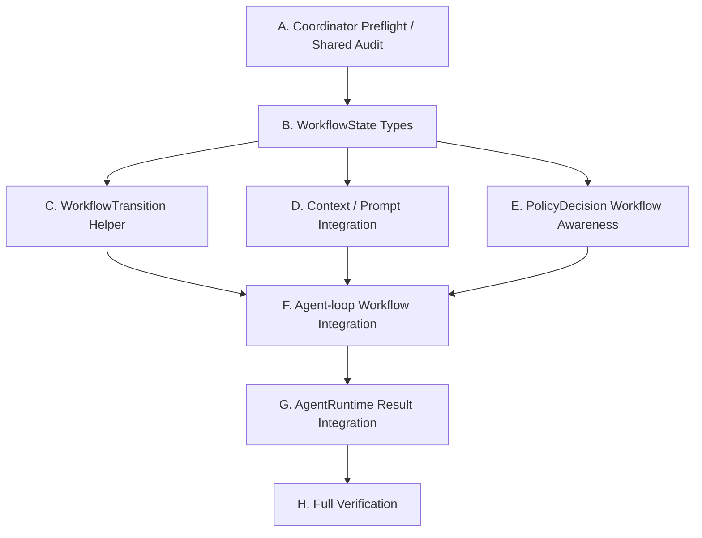

# Next Stage Plan and Agent Prompts: Workflow State / Runtime Controller Skeleton

日期：2026-06-26

## 1. 阶段定位

阶段名称：

```text
Workflow State / Runtime Controller Skeleton / Phase 4D
```

上一阶段已经完成：

```text
Plan1: run identity / trace / metrics / agent-state / benchmark-simple
Plan2: Tool Catalog / local adapter / MCP adapter / PageState / FormState / ObservationManager
Plan3: ContextManager / Prompt Sections / recentActions / prompt budget / trace artifact 解耦
Phase 4A: AgentRuntime facade / PromptAssembler / StopConditionManager
Phase 4B: Context metrics / Freshness metadata / Minimal TaskState / complex local benchmark
Phase 4C: ToolExecutionBoundary / PolicyDecision helper / agent-loop minimal integration
```

当前阶段目标：

> 引入最小 WorkflowState，让 runtime 能表达当前流程位置；让 PolicyDecision 能结合 workflow phase 区分 apply_entry 和 final_submit；让 AgentRuntime 开始返回 workflow-aware runtime result，但仍委托 `runAgentLoop`。

一句话：

```text
Agent 不是只在页面上点按钮。
Agent 是在一个任务流程里推进状态。
```

本阶段最重要的问题：

```text
button text = "Apply"
```

不能直接等于：

```text
final_submit
```

它可能是：

```text
apply_entry
login_required
captcha_required
upload_resume
save_draft
final_submit
```

Phase 4D 的价值，就是把这些流程语义从模糊文本判断里分离出来。

---

## 2. 严格边界

必须遵守：

1. 不重写 `runAgentLoop` 主循环。
2. 不改变 `runAgentLoop` 现有必填输入/输出字段；如确需带出 workflow state，只能做兼容式 optional 字段。
3. 不改变 `ToolRegistry` 对外接口。
4. 不重写 local adapter / MCP adapter。
5. 不引入完整 `WorkflowEngine`。
6. 不引入完整 `PolicyEngine` DSL。
7. 不做 Skill / Memory / 多 Agent。
8. 不做真实网站专用 adapter。
9. 不做自动登录。
10. 不处理验证码，只表达 `captcha_required`。
11. 不做真实最终提交。
12. 不改 `packages/claude-code` 内部逻辑。
13. Runtime / ContextManager / PromptAssembler / WorkflowState / PolicyDecision 不允许读取 trace artifacts。
14. trace artifacts 只能作为 Web UI / benchmark / debug / replay / metrics aggregation 的旁路输出。

允许：

1. 新增最小 `WorkflowState` 类型。
2. 新增纯函数 `WorkflowTransition` helper。
3. 扩展 `ContextSnapshot` 和 Prompt Sections，新增 `WORKFLOW_STATE`。
4. 让 `PolicyDecision` 接收 workflow state / phase。
5. 在 agent-loop 内维护 workflow state working set。
6. 在 AgentRuntime result 中兼容式带出 workflow state。
7. 新增 workflow / transition / runtime workflow tests。

---

## 3. Phase 4D 范围

### 3.1 WorkflowState v1

建议新增：

```text
packages/web-buddy/src/workflow/workflow-state.ts
```

建议类型：

```ts
export type WorkflowPhase =
  | 'observing'
  | 'selecting_job'
  | 'job_detail'
  | 'entering_application'
  | 'login_required'
  | 'captcha_required'
  | 'editing_resume'
  | 'filling_application'
  | 'reviewing'
  | 'ready_for_final_submit'
  | 'done'
  | 'blocked'

export type WorkflowConfidence = 'low' | 'medium' | 'high'

export interface WorkflowState {
  schemaVersion: 'workflow-state/v1'
  phase: WorkflowPhase
  confidence: WorkflowConfidence
  reason: string
  updatedAt: string
  humanHandoffRequired?: boolean
  blocker?: string
  lastTransition?: {
    from: WorkflowPhase
    to: WorkflowPhase
    reason: string
    at: string
  }
}
```

第一版行为：

- 只作为 runtime working set。
- 不持久化到 store。
- 不替代 `TaskState`。
- 不读取 trace artifacts。
- 默认初始 phase 为 `observing`。

语义边界：

```text
TaskState:
  用户目标、任务完成标准、当前任务阶段感。

WorkflowState:
  当前网页/投递流程位置，例如 job_detail、login_required、ready_for_final_submit。
```

### 3.2 WorkflowTransition helper v1

建议新增：

```text
packages/web-buddy/src/workflow/workflow-transition.ts
```

输入信号只允许来自 runtime working set：

```text
当前 URL
PageState
FormState
tool name
tool result
PolicyDecision
gate kind
gate decision
agent_done blocked
```

建议类型：

```ts
export interface WorkflowTransitionInput {
  previous: WorkflowState
  currentUrl?: string
  page?: PageState
  form?: FormState
  toolName?: string
  toolResult?: LocalToolRunResult
  policyDecision?: PolicyDecision
  gateKind?: GateKind
  gateDecision?: GateDecision
  agentDoneBlocked?: boolean
  now?: string
}

export interface WorkflowTransitionResult {
  state: WorkflowState
  changed: boolean
}
```

第一版推荐规则：

```text
URL / title / text summary 命中 login / sso / signin / 登录
-> login_required

PageState.pageType = captcha 或 text summary 命中 captcha / 验证码 / 人机验证
-> captcha_required

当前在 job_detail，点击 Apply / 投递简历 / 立即投递 后未出现最终确认
-> entering_application

出现 FormState 且 missingRequired / fields 较多
-> filling_application

表单字段基本填完，并出现 submitCandidates
-> reviewing

PolicyDecision.gateKind = final_submit
-> ready_for_final_submit

final_submit gate 触发后被阻断
-> blocked

agent_done blocked=false
-> done

agent_done blocked=true
-> blocked
```

注意：

- `WorkflowTransition` 只推断状态，不执行工具。
- 不自动调用 `browser_snapshot`。
- 不自动重排 LLM tool call。
- 低置信度时可以保持原 phase，只更新 reason。

### 3.3 Context / Prompt 接入

修改：

```text
packages/web-buddy/src/context/types.ts
packages/web-buddy/src/context/context-manager.ts
packages/web-buddy/src/context/prompt-sections.ts
packages/web-buddy/src/agent/prompt-assembler.ts
```

目标：

- `ContextSnapshot` 增加可选 `workflowState?: WorkflowState`。
- `ContextSnapshotInput` 增加可选 `workflowState?: WorkflowState`。
- `PromptSectionId` 增加 `WORKFLOW_STATE`。
- Prompt section 顺序调整为：

```text
SYSTEM_ROLE
SAFETY_RULES
TASK
TASK_STATE
WORKFLOW_STATE
RESUME_SUMMARY
CURRENT_PAGE_STATE
CURRENT_FORM_STATE
RECENT_ACTIONS
NEXT_ACTION_RULES
```

`WORKFLOW_STATE` 第一版内容建议：

```text
phase: login_required
confidence: high
humanHandoffRequired: true
reason: Current page appears to be an SSO login page.
blocker: Human login required before continuing.
updatedAt: ...
```

### 3.4 PolicyDecision workflow-aware

修改：

```text
packages/web-buddy/src/policy/agent-policy.ts
```

目标：

- `decideToolPolicy()` 接收可选 `workflowState` 或 `workflowPhase`。
- 用 workflow phase 区分 apply entry 和 final submit。

第一版规则建议：

```text
phase = job_detail / entering_application
button text contains Apply / 投递 / 投递简历 / 立即投递
-> high_risk_action 或 allow/gate high_risk_action
-> 不判 final_submit

phase = reviewing / ready_for_final_submit
button text contains Submit / 确认提交 / 提交申请 / Confirm / Pay
-> final_submit

phase = login_required / captcha_required
-> 不自动执行敏感动作；表达 human handoff / blocked cue
```

保留兼容：

- 没有 workflow state 时，沿用 Phase 4C 的文本/risk/freshness 行为。
- raw auto-confirm 规则保持兼容。
- final submit safety gate 语义不变。

### 3.5 Agent-loop 最小接入

修改：

```text
packages/web-buddy/src/runtime/local/agent-loop.ts
```

目标：

- 初始化 `workflowState = createInitialWorkflowState()`。
- 每次 build context 时传入 workflowState。
- policy decision 时传入 workflowState。
- tool result / gate decision / agent_done 后调用 `transitionWorkflowState()`。
- recentActions 或 blockers 中体现 login/captcha/final_submit handoff cue。
- 保持主循环形状，不移动大块逻辑。

第一版特殊处理：

```text
login_required:
  blocked = true
  done = true
  summary = Human login required before continuing.

captcha_required:
  blocked = true
  done = true
  summary = Human verification required before continuing.
```

注意：

- 不自动登录。
- 不自动处理 captcha。
- 不自动提交最终申请。

### 3.6 AgentRuntime controller shape

修改：

```text
packages/web-buddy/src/agent/types.ts
packages/web-buddy/src/agent/agent-runtime.ts
```

目标：

- `AgentRuntimeResult` 兼容式增加 `workflowState?: WorkflowState`。
- `AgentRuntime.run()` 仍委托 `runAgentLoop`。
- stop reason 判断保持兼容。

不要：

- 把 CLI / Web UI / MCP 全量迁移到 AgentRuntime。
- 让 AgentRuntime 直接执行 browser tools。
- 在 AgentRuntime 内读取 trace artifacts。

---

## 4. 串行 / 并行执行图

### 4.1 高层依赖



### 4.2 推荐波次

```text
Wave 0 串行:
  A Coordinator preflight / shared audit

Wave 1 可并行:
  B WorkflowState types
  C WorkflowTransition helper

Wave 2 可并行:
  D Context / Prompt integration
  E PolicyDecision workflow awareness

Wave 3 串行:
  F Agent-loop workflow integration

Wave 4 串行:
  G AgentRuntime result integration

Wave 5 串行:
  H Full verification / review
```

---

## 5. 建议 Agent 拆分

### Agent A: WorkflowState / Transition Helper

文件范围：

- `packages/web-buddy/src/workflow/workflow-state.ts`
- `packages/web-buddy/src/workflow/workflow-transition.ts`
- `packages/web-buddy/scripts/workflow-state-test.mjs`
- `packages/web-buddy/scripts/workflow-transition-test.mjs`

职责：

- 新增最小 WorkflowState 类型。
- 新增纯函数 transition helper。
- 覆盖 login_required、captcha_required、entering_application、filling_application、ready_for_final_submit、done、blocked。
- 不接入 agent-loop。

### Agent B: Context / Prompt Integration

文件范围：

- `packages/web-buddy/src/context/types.ts`
- `packages/web-buddy/src/context/context-manager.ts`
- `packages/web-buddy/src/context/prompt-sections.ts`
- `packages/web-buddy/src/agent/prompt-assembler.ts`
- `packages/web-buddy/scripts/context-manager-test.mjs`
- `packages/web-buddy/scripts/prompt-sections-test.mjs`

职责：

- ContextSnapshot 接收 workflowState。
- 新增 `WORKFLOW_STATE` section。
- 保持 section 顺序和 budget 行为稳定。
- 不读取 trace artifacts。

### Agent C: PolicyDecision Workflow Awareness

文件范围：

- `packages/web-buddy/src/policy/agent-policy.ts`
- `packages/web-buddy/scripts/policy-decision-test.mjs`

职责：

- `decideToolPolicy()` 接收 workflowState / workflowPhase。
- job_detail / entering_application 下的 Apply / 投递入口不直接判 final_submit。
- reviewing / ready_for_final_submit 下的 submit-like 文本仍判 final_submit。
- raw auto-confirm 兼容。

### Agent D: Agent-loop Workflow Integration

文件范围：

- `packages/web-buddy/src/runtime/local/agent-loop.ts`
- `packages/web-buddy/scripts/agent-loop-test.mjs`

职责：

- 在 agent-loop 内维护 workflow state。
- 在 context/policy/transition 三个点接入。
- login_required / captcha_required 第一版转为 human handoff blocked。
- 保持 final-submit gate 行为。
- 保持主循环形状。

### Agent E: AgentRuntime Result Integration

文件范围：

- `packages/web-buddy/src/agent/types.ts`
- `packages/web-buddy/src/agent/agent-runtime.ts`
- `packages/web-buddy/scripts/agent-runtime-test.mjs`
- `packages/web-buddy/scripts/agent-runtime-workflow-test.mjs`

职责：

- AgentRuntime result 兼容式带出 workflowState。
- 证明旧 AgentRuntime mock LLM 流程仍通过。
- 新增 login/captcha/final-submit workflow result 测试。

### Agent F: Verification / Regression Auditor

职责：

- code review 姿态审核边界。
- 跑完整验证命令。
- 确认 runtime/context/prompt/policy/workflow 不读取 trace artifacts。
- 确认 `packages/claude-code` 未改。

---

## 6. Tests and Benchmarks

新增建议：

```text
packages/web-buddy/scripts/workflow-state-test.mjs
packages/web-buddy/scripts/workflow-transition-test.mjs
packages/web-buddy/scripts/agent-runtime-workflow-test.mjs
```

更新：

```text
packages/web-buddy/package.json
```

新增 scripts：

```json
{
  "test:workflow": "npm run build && node ./scripts/workflow-state-test.mjs && node ./scripts/workflow-transition-test.mjs",
  "test:agent-runtime-workflow": "npm run build && node ./scripts/agent-runtime-workflow-test.mjs"
}
```

必须覆盖：

1. WorkflowState 默认初始 phase 为 `observing`。
2. URL/title/text summary 命中 login / sso / 登录时转为 `login_required`。
3. pageType 或 text summary 命中 captcha / 验证码时转为 `captcha_required`。
4. job_detail 阶段点击 Apply / 投递入口转为 `entering_application`，不触发 final_submit。
5. FormState 出现字段和缺失项时转为 `filling_application`。
6. 表单接近完成且存在 submitCandidates 时转为 `reviewing`。
7. final_submit gate 触发时转为 `ready_for_final_submit` 或 `blocked`。
8. agent_done blocked=false 转为 `done`。
9. agent_done blocked=true 转为 `blocked`。
10. PolicyDecision 在 job_detail / entering_application 下不会把 Apply 入口误判为 final_submit。
11. PolicyDecision 在 ready_for_final_submit 下仍保护 final submit。
12. WORKFLOW_STATE prompt section 顺序稳定。
13. AgentRuntime 旧 mock LLM 流程仍通过。
14. login_required / captcha_required 可表达 human handoff。
15. runtime/context/prompt/policy/workflow 不读取 trace artifacts。

---

## 7. Full Verification

必须运行：

```bash
cd packages/web-buddy
npm run build
npm run test:context
npm run test:prompt-sections
npm run test:metrics
npm run test:tool-execution
npm run test:policy
npm run test:workflow
npm run test:agent-runtime
npm run test:agent-runtime-workflow
npm run test:agent-loop
npm run benchmark:simple
npm run benchmark:complex
npm run test:tool-catalog
npm run test:observation
```

必须运行边界检查：

```bash
rg -n "page-state-latest|form-state-latest|output/traces|readFileSync|readFile" \
  packages/web-buddy/src/agent \
  packages/web-buddy/src/context \
  packages/web-buddy/src/runtime/local \
  packages/web-buddy/src/tools \
  packages/web-buddy/src/policy \
  packages/web-buddy/src/workflow \
  --glob '*.ts'
```

期望：

- 无 runtime-state read 命中。
- 如有命中，必须能证明不是 trace artifact 读取。

---

## 8. 验收标准

Phase 4D 完成时，必须满足：

1. 新增最小 WorkflowState。
2. 新增纯函数 WorkflowTransition helper。
3. WorkflowState 不读取 trace artifacts。
4. ContextSnapshot 可携带 workflowState。
5. Prompt Sections 包含 WORKFLOW_STATE，顺序稳定。
6. PolicyDecision workflow-aware，能区分 apply entry 和 final submit。
7. agent-loop 维护 workflow state，但主循环形状未重写。
8. login_required / captcha_required 能表达 human handoff / blocked。
9. final submit 仍受 final_submit gate 保护。
10. AgentRuntime result 兼容式带出 workflowState。
11. `runAgentLoop` 现有必填输入/输出字段未破坏。
12. `ToolRegistry` 对外接口未改变。
13. local adapter / MCP adapter 未重写。
14. `packages/claude-code` 内部逻辑未改。
15. benchmark simple / complex 继续通过。

---

## 9. 建议提交拆分

推荐 commit 顺序：

```text
feat(web-buddy): add workflow state and transition helpers
feat(web-buddy): add workflow state to context prompts
feat(web-buddy): make policy decisions workflow-aware
feat(web-buddy): wire workflow state through agent loop
feat(web-buddy): expose workflow state from agent runtime
test(web-buddy): add workflow regression coverage
```

如果实现时希望更小：

```text
test(web-buddy): add workflow transition fixtures
test(web-buddy): cover login and captcha handoff
```

---

## 10. 下一阶段预告

Phase 4D 完成后，下一阶段可以讨论：

```text
Phase 5: Policy Engine v1
```

或如果 workflow state 还需要打磨：

```text
Phase 4E: Workflow State Metrics / Resume Handoff Readiness
```

进入下一阶段的前提：

- apply_entry 与 final_submit 已经可测地区分。
- login_required / captcha_required 有稳定表达。
- workflow state 已进入 prompt。
- final-submit gate 没有回归。
- benchmark simple / complex 都稳定通过。
