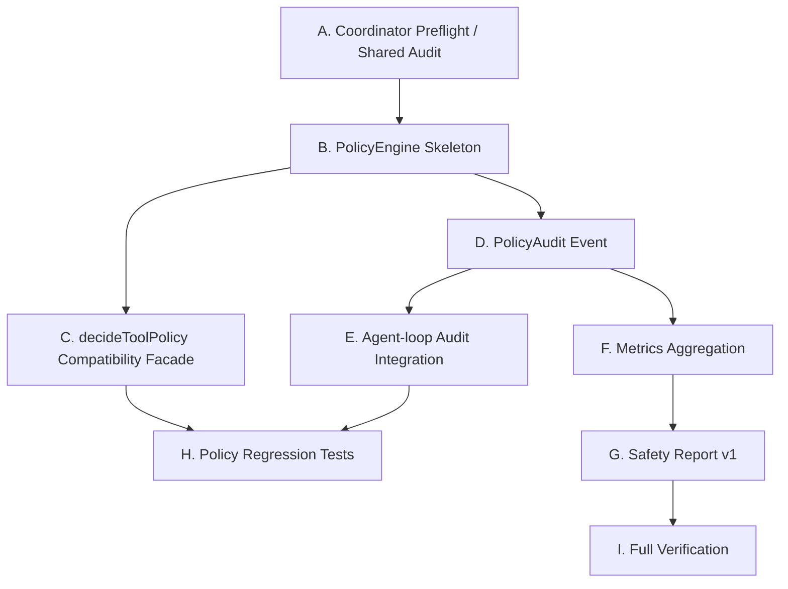

# Next Stage Plan: Policy Engine v1 / Policy Audit Skeleton

日期：2026-06-26

## 1. 阶段定位

阶段名称：

```text
Policy Engine v1 / Policy Audit Skeleton / Phase 5
```

上一阶段已经完成：

```text
Plan1: run identity / trace / metrics / agent-state / benchmark-simple
Plan2: Tool Catalog / local adapter / MCP adapter / PageState / FormState / ObservationManager
Plan3: ContextManager / Prompt Sections / recentActions / prompt budget / trace artifact 解耦
Phase 4A: AgentRuntime facade / PromptAssembler / StopConditionManager
Phase 4B: Context metrics / Freshness metadata / Minimal TaskState / complex local benchmark
Phase 4C: ToolExecutionBoundary / PolicyDecision helper / agent-loop minimal integration
Phase 4D: WorkflowState / WorkflowTransition / WORKFLOW_STATE prompt / workflow-aware policy / runtime workflow result
```

当前阶段目标：

> 把当前 `PolicyDecision helper` 升级成一个轻量、可审计、可扩展的 policy boundary，让 agent 的安全判断不只“能挡住”，还“能解释、能度量、能复盘”。

一句话：

```text
Policy 不只是阻止危险动作。
Policy 要能说明为什么阻止、在哪里阻止、阻止了什么，以及后续如何复盘。
```

本阶段最重要的问题：

```text
tool risk + workflow phase + freshness + safety mode
```

必须一起决定：

```text
allow / gate / block / auto_confirm
```

而不能散落在 agent-loop 的临时 if/else 里。

---

## 2. 第一性原则

Policy 的第一性原理：

> 工具能不能执行，不应该由 prompt 自律决定，而应该由 runtime 在工具执行前做确定性检查。

拆开看：

```text
WorkflowState:
  当前流程位置，例如 job_detail、login_required、ready_for_final_submit。

RiskLevel:
  工具或元素本身的危险程度，例如 L1 / L3 / L4。

Freshness:
  当前 PageState / FormState 是否足够新。

PolicyEngine:
  决定 allow / gate / block / auto_confirm，并给出稳定 reason / ruleId / policyCode。

HumanGate:
  执行确认或 takeover，不负责推理策略。

Trace / Metrics:
  旁路记录，用于审计、debug、benchmark、safety report。
```

关键边界：

```text
Policy 决定动作是否可以进入执行边界。
ToolExecutionBoundary 负责执行工具。
ObservationManager 负责更新页面事实。
Trace / metrics 负责事后复盘。
```

---

## 3. 严格边界

必须遵守：

1. 不引入完整 Policy DSL。
2. 不重写 `runAgentLoop` 主循环。
3. 不改变 `runAgentLoop` 现有必填输入/输出字段；如需新增 policy 信息，只能兼容式 optional。
4. 不改变 `ToolRegistry` 对外接口。
5. 不重写 local adapter / MCP adapter。
6. 不改 `packages/claude-code`。
7. 不做真实自动登录。
8. 不处理验证码，只表达 `captcha_required` / human handoff。
9. 不自动最终提交。
10. Runtime / policy / context / workflow 不允许读取 trace artifacts。
11. Trace artifacts 只能作为 Web UI / benchmark / debug / replay / metrics aggregation / safety report 的旁路输入。

允许：

1. 新增轻量 `PolicyEngine`。
2. 保留 `decideToolPolicy()` 兼容 facade。
3. 新增 `PolicyAuditEvent` 类型。
4. 新增 policy metrics aggregation。
5. 新增 safety report v1。
6. 扩展 agent-loop 的 policy 接入点，但保持主循环形状。
7. 新增 policy engine / safety report / policy metrics tests。

---

## 4. Phase 5 范围

### 4.1 PolicyEngine v1

建议新增：

```text
packages/web-buddy/src/policy/policy-engine.ts
```

建议类型：

```ts
export interface PolicyEngineInput {
  toolName: string
  args: Record<string, unknown>
  risk?: RiskLevel
  safetyMode?: AgentSafetyMode
  currentUrl?: string
  refLabel?: string
  freshness?: PolicyFreshnessSummary
  workflowState?: WorkflowState
}

export interface PolicyEngineDecision extends PolicyDecision {
  schemaVersion: 'policy-decision/v1'
  policyCode: string
  ruleId: string
  workflowPhase?: WorkflowPhase
  auditTags: string[]
}
```

保留兼容：

```text
decideToolPolicy(input)
```

第一版可以内部委托：

```text
policyEngine.evaluate(input)
```

注意：

- 旧 `PolicyDecision` 字段不删除。
- 旧 policy tests 必须继续通过。
- 新字段只做兼容式扩展。

### 4.2 Policy rules v1

第一批规则建议：

```text
policy.low_risk.allow
  L0/L1/L2 默认 allow

policy.high_risk.gate
  L3/L4 默认 gate high_risk_action

policy.workflow.apply_entry
  phase=job_detail/entering_application 且文本为 Apply/投递
  -> gate high_risk_action，不是 final_submit

policy.workflow.final_submit
  phase=reviewing/ready_for_final_submit 且文本为 Submit/Confirm/提交申请
  -> gate final_submit

policy.workflow.login_required
  phase=login_required
  -> gate 或 block login，human handoff

policy.workflow.captcha_required
  phase=captcha_required
  -> gate 或 block captcha，human handoff

policy.raw.auto_confirm
  safetyMode=raw 且 click/click_text
  -> auto_confirm，保持兼容

policy.freshness.high_risk_stale
  high/critical risk 且 page/form stale
  -> requiresFreshContext=true，reason 写清楚，但不自动刷新
```

第一版推荐不做：

```text
user-defined policy DSL
remote policy service
policy persistence
role-based access control
```

### 4.3 PolicyAuditEvent v1

建议新增：

```text
packages/web-buddy/src/policy/policy-audit.ts
```

建议类型：

```ts
export interface PolicyAuditEvent {
  schemaVersion: 'policy-audit/v1'
  at: string
  sessionId: string
  step: number
  toolName: string
  action: 'allow' | 'gate' | 'block' | 'auto_confirm'
  riskLevel: PolicyRiskLevel
  gateKind?: GateKind
  policyCode: string
  ruleId: string
  reason: string
  workflowPhase?: WorkflowPhase
  requiresFreshContext?: boolean
}
```

agent-loop 中每次 policy decision 后写 trace event：

```text
policy_decision
```

注意：

- 只写出，不读取。
- 不把 trace event 作为下一轮上下文来源。
- 可以把 policy metadata 放入 tool span metadata。

### 4.4 Metrics aggregation

修改：

```text
packages/web-buddy/src/metrics/schema.ts
packages/web-buddy/src/metrics/aggregate.ts
packages/web-buddy/scripts/metrics-test.mjs
```

建议增加：

```ts
policy: {
  decisions: number
  allows: number
  gates: number
  blocks: number
  autoConfirms: number
  gateKindCounts: Record<string, number>
  policyCodeCounts: Record<string, number>
  blockedReasonCounts: Record<string, number>
}
```

兼容要求：

- 旧 trace 缺失 `policy_decision` 时默认全 0。
- 不影响已有 metrics 字段。
- benchmark simple / complex 继续通过。

### 4.5 Safety report v1

建议新增：

```text
packages/web-buddy/src/policy/safety-report.ts
packages/web-buddy/scripts/safety-report-test.mjs
```

或先只做脚本级 helper。

输出建议：

```text
output/.../safety-report.json
```

建议结构：

```ts
export interface SafetyReport {
  schemaVersion: 'safety-report/v1'
  runId: string
  finalStatus: 'completed' | 'blocked' | 'incomplete' | 'failed' | 'unknown'
  finalWorkflowPhase?: WorkflowPhase
  finalSubmitAttempted: boolean
  finalSubmitBlocked: boolean
  loginHandoffRequired: boolean
  captchaHandoffRequired: boolean
  highRiskActionCount: number
  gateCount: number
  policyCodes: string[]
  summary: string
}
```

关键边界：

```text
Safety report 可以读取 trace / metrics。
Runtime / PolicyEngine 不读取 safety report。
Runtime / PolicyEngine 不读取 trace artifacts。
```

---

## 5. Agent-loop 接入

修改：

```text
packages/web-buddy/src/runtime/local/agent-loop.ts
```

目标：

- policy decision 改为通过 `PolicyEngine.evaluate()` 或兼容 facade 产生。
- 每次 decision 后记录 `policy_decision` audit event。
- gate message / blockers / recentActions 使用规范化 reason。
- 保持 final-submit gate 行为。
- 保持 login/captcha human handoff 行为。
- 保持主循环形状，不移动大块逻辑。

不要：

- 不把 gate confirm 逻辑塞进 PolicyEngine。
- 不让 PolicyEngine 直接调用工具。
- 不让 PolicyEngine 读取 ObservationManager 之外的状态源。

---

## 6. Tests and scripts

新增建议：

```text
packages/web-buddy/scripts/policy-engine-test.mjs
packages/web-buddy/scripts/safety-report-test.mjs
```

更新：

```text
packages/web-buddy/scripts/policy-decision-test.mjs
packages/web-buddy/scripts/metrics-test.mjs
packages/web-buddy/package.json
```

新增 npm scripts：

```json
{
  "test:policy-engine": "npm run build && node ./scripts/policy-engine-test.mjs",
  "test:safety-report": "npm run build && node ./scripts/safety-report-test.mjs",
  "test:mvp": "npm run build && npm run test:context && npm run test:prompt-sections && npm run test:metrics && npm run test:tool-execution && npm run test:policy && npm run test:policy-engine && npm run test:workflow && npm run test:agent-runtime && npm run test:agent-runtime-workflow && npm run test:agent-loop && npm run benchmark:simple && npm run benchmark:complex"
}
```

必须覆盖：

1. `decideToolPolicy()` 旧接口仍可用。
2. `PolicyEngine.evaluate()` 可用。
3. L1/L2 默认 allow。
4. L3/L4 默认 gate。
5. job_detail / entering_application 下 Apply / 投递不是 final_submit。
6. reviewing / ready_for_final_submit 下 Submit / Confirm 是 final_submit。
7. login_required 不自动越过，产生 login gate 或 handoff cue。
8. captcha_required 不自动越过，产生 captcha gate 或 handoff cue。
9. raw mode auto-confirm 保持兼容。
10. stale high-risk cue 保持兼容。
11. policy audit event 可生成。
12. metrics 可聚合 policy decision / gate kind / policy code。
13. safety report 可表达 finalSubmitAttempted / finalSubmitBlocked / loginHandoffRequired / captchaHandoffRequired。
14. runtime / policy 不读取 trace artifacts。
15. benchmark simple / complex 继续通过。

---

## 7. 串行 / 并行执行图

### 7.1 高层依赖



### 7.2 推荐波次

```text
Wave 0 串行:
  A Coordinator preflight / shared audit

Wave 1 串行:
  B PolicyEngine skeleton
  C decideToolPolicy compatibility facade

Wave 2 可并行:
  D PolicyAudit event
  H policy engine unit tests

Wave 3 串行:
  E agent-loop audit integration

Wave 4 可并行:
  F metrics aggregation
  G safety report v1

Wave 5 串行:
  I full verification / boundary audit
```

---

## 8. 建议 Agent 拆分

### Agent A: PolicyEngine Skeleton

文件范围：

- `packages/web-buddy/src/policy/agent-policy.ts`
- `packages/web-buddy/src/policy/policy-engine.ts`
- `packages/web-buddy/scripts/policy-engine-test.mjs`

职责：

- 新增 `PolicyEngine`。
- 保留 `decideToolPolicy()` 兼容 facade。
- 增加 `policyCode` / `ruleId`。
- 覆盖 apply entry / final submit / raw / freshness。

### Agent B: Policy Audit Integration

文件范围：

- `packages/web-buddy/src/policy/policy-audit.ts`
- `packages/web-buddy/src/runtime/local/agent-loop.ts`
- `packages/web-buddy/scripts/agent-runtime-workflow-test.mjs`

职责：

- 新增 `PolicyAuditEvent`。
- agent-loop 写 `policy_decision` trace event。
- 不改变工具执行行为。

### Agent C: Metrics Aggregation

文件范围：

- `packages/web-buddy/src/metrics/schema.ts`
- `packages/web-buddy/src/metrics/aggregate.ts`
- `packages/web-buddy/scripts/metrics-test.mjs`

职责：

- 聚合 policy decisions / actions / gate kinds / policy codes。
- 旧 trace 缺失 policy event 时默认安全。

### Agent D: Safety Report

文件范围：

- `packages/web-buddy/src/policy/safety-report.ts`
- `packages/web-buddy/scripts/safety-report-test.mjs`

职责：

- 生成 safety report v1。
- 明确 final submit / login / captcha / high-risk summary。
- 只读取 trace / metrics 旁路数据。

### Agent E: Verification / Regression Auditor

职责：

- code review 姿态审核边界。
- 跑完整验证命令。
- 确认 runtime / policy 不读取 trace artifacts。
- 确认 `packages/claude-code` 未改。

---

## 9. Full Verification

必须运行：

```bash
cd packages/web-buddy
npm run build
npm run test:context
npm run test:prompt-sections
npm run test:metrics
npm run test:tool-execution
npm run test:policy
npm run test:policy-engine
npm run test:workflow
npm run test:agent-runtime
npm run test:agent-runtime-workflow
npm run test:agent-loop
npm run benchmark:simple
npm run benchmark:complex
npm run test:tool-catalog
npm run test:observation
npm run test:safety-report
```

必须运行边界检查：

```bash
rg -n "page-state-latest|form-state-latest|output/traces|readFileSync|readFile" \
  packages/web-buddy/src/agent \
  packages/web-buddy/src/context \
  packages/web-buddy/src/runtime/local \
  packages/web-buddy/src/tools \
  packages/web-buddy/src/policy \
  packages/web-buddy/src/workflow \
  --glob '*.ts'
```

期望：

- runtime / policy / context / workflow 无 trace artifact 读取命中。
- 如有命中，必须能证明不是 runtime state read。

---

## 10. 验收标准

Phase 5 完成时，必须满足：

1. `decideToolPolicy()` 旧接口仍可用。
2. `PolicyEngine.evaluate()` 或等价接口可用。
3. Policy decision 有稳定 `policyCode` / `ruleId`。
4. final submit gate 不回退。
5. Apply entry 与 final submit 继续可测地区分。
6. login / captcha 不自动越过。
7. raw auto-confirm 保持兼容。
8. stale high-risk cue 保持兼容。
9. policy audit event 写入 trace。
10. metrics 能统计 policy decisions / gate kinds / policy codes。
11. safety report v1 可生成。
12. Runtime / policy 不读取 trace artifacts。
13. `runAgentLoop` 主循环形状未重写。
14. `ToolRegistry` 对外接口未变。
15. local adapter / MCP adapter 未重写。
16. `packages/claude-code` 未改。
17. benchmark simple / complex 继续通过。

---

## 11. 建议提交拆分

推荐 commit 顺序：

```text
feat(web-buddy): add policy engine skeleton
feat(web-buddy): add policy audit events
feat(web-buddy): aggregate policy metrics
feat(web-buddy): add safety report v1
test(web-buddy): add policy engine regressions
```

如果实现时希望更小：

```text
test(web-buddy): cover workflow-aware policy rules
test(web-buddy): cover safety report fixtures
```

---

## 12. 下一阶段预告

Phase 5 完成后，MVP 会具备：

```text
State-aware context:
  PageState / FormState / TaskState / WorkflowState

Policy boundary:
  PolicyEngine / HumanGate / policy audit

Observability:
  Trace / metrics / benchmark / safety report
```

之后建议进入：

```text
Phase 5B: MVP Packaging
```

重点：

- 新增 `demo-research`，证明项目不是 job-only。
- README / Quickstart 重写。
- Safety Model 文档。
- `test:mvp` 总入口。
- 开源展示 polish。
