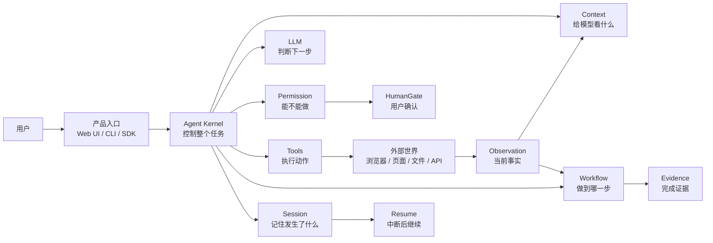
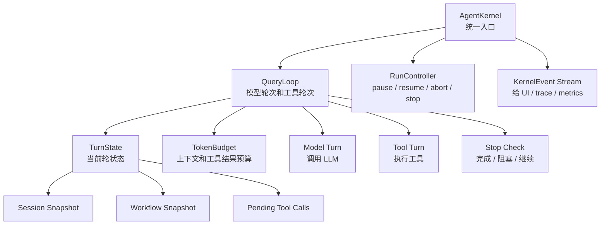
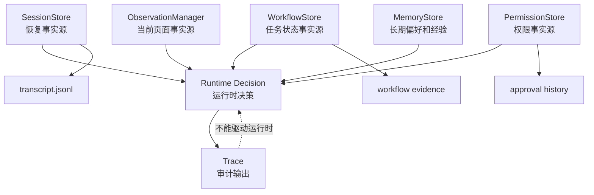
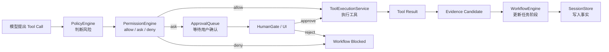
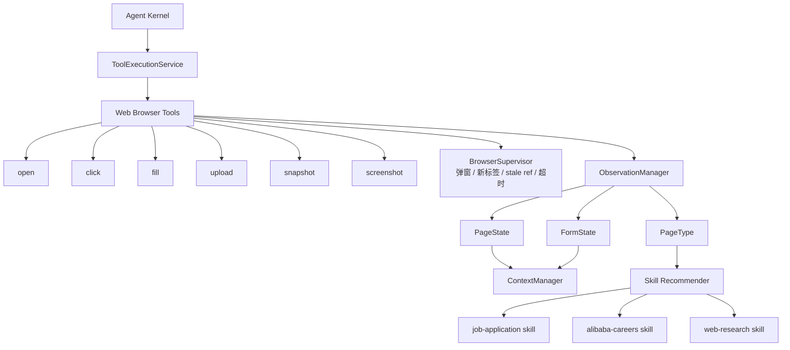
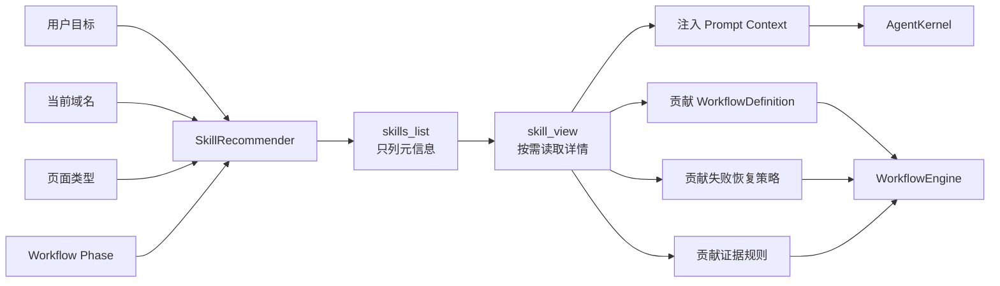
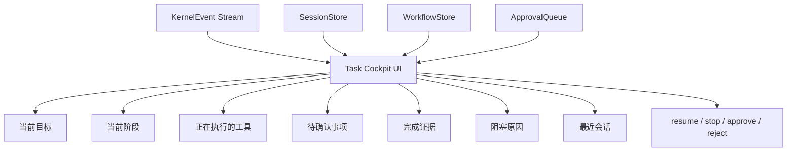
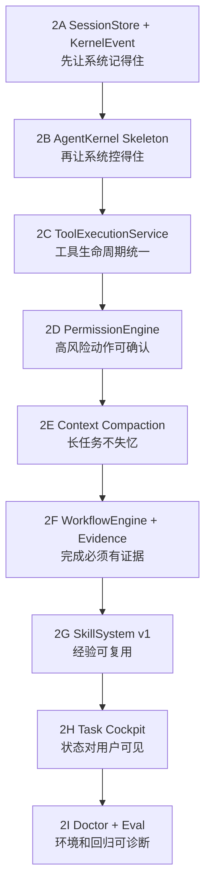

# Phase 2 Agent Kernel 清晰阅读版架构图

这份是 `architecture.md` 的清晰拆分版。原图偏完整，适合总览；这份图把信息拆开，适合真正阅读和讨论。

## 1. 一张图先理解主线

核心理解：

> Kernel 是中枢；LLM 只负责判断下一步；Session、Permission、Workflow、Tool lifecycle 负责让这个判断可控、可恢复、可验证。

## 2. Agent Kernel 内部

当前项目差距：

- 现在主要靠 `runAgentLoop` 串起来。
- Phase 2 要把它拆成 Kernel、QueryLoop、TurnState、RunController。
- 这样 UI、恢复、中断、权限确认才能稳定接入。

## 3. 状态事实源

最重要的边界：

- Trace 是旁路审计，不是数据库。
- SessionStore / WorkflowStore 才是恢复和继续运行的事实源。
- 这条边界守不住，后面一定会越做越乱。

## 4. Permission / Workflow / Tool 的关系

这里的分工：

- PolicyEngine：风险判断。
- PermissionEngine：执行许可。
- HumanGate：把确认权交给人。
- ToolExecutionService：只负责工具生命周期。
- WorkflowEngine：判断任务阶段和完成证据。

## 5. Web Buddy 作为第一个垂直执行域

关键点：

- Web Buddy 不再是整个系统本身。
- Web Buddy 是 Agent Kernel 下面的第一个垂直工具域。
- 后面接文件、API、数据库、消息系统时，不应该重写 Agent 底座。

## 6. SkillSystem 怎么接入

第一批技能：

- `job-application`: 通用招聘投递流程。
- `alibaba-careers`: 阿里招聘站点特例。
- `web-research`: 网页研究和证据收集。

## 7. Task Cockpit 应该展示什么

体验目标：

- 用户知道 Agent 正在做什么。
- 用户知道为什么停了。
- 用户知道是否真的完成。
- 用户能刷新页面后继续。

## 8. Phase 2 落地顺序

一句话：

> 先做 Session 和 Kernel，再做 Tool 和 Permission，然后做 Workflow 和 Skill，最后把状态通过 Cockpit 展示给用户。
