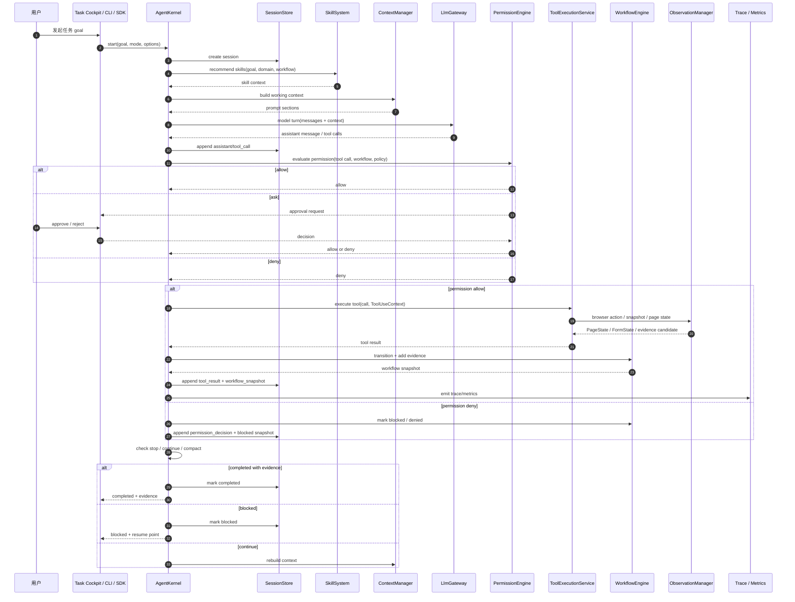
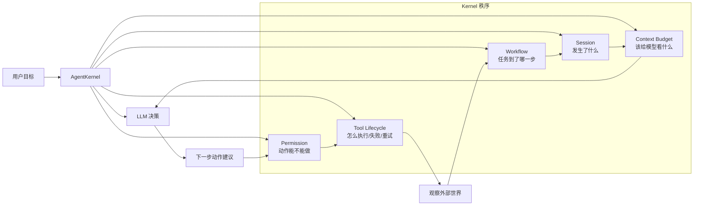
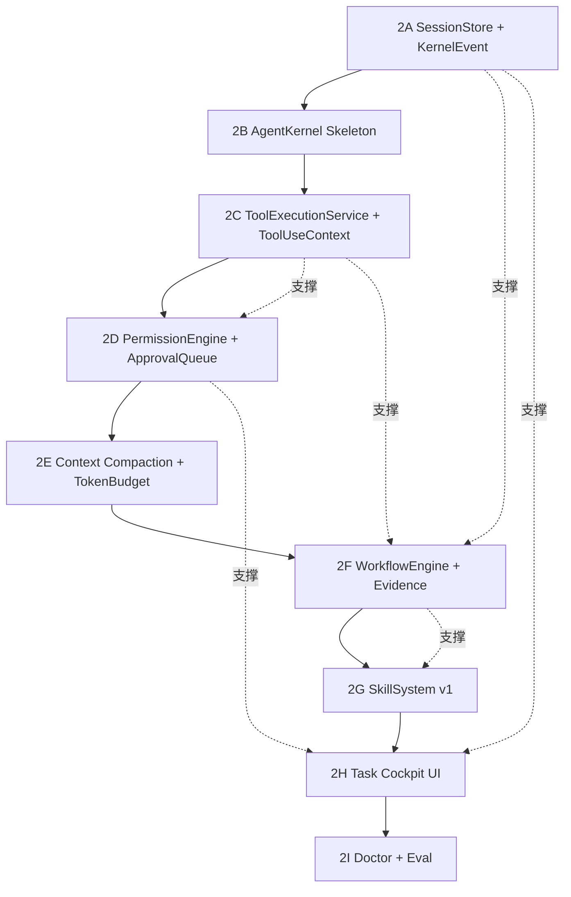
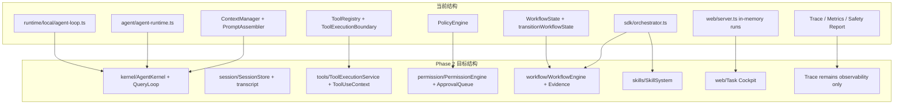
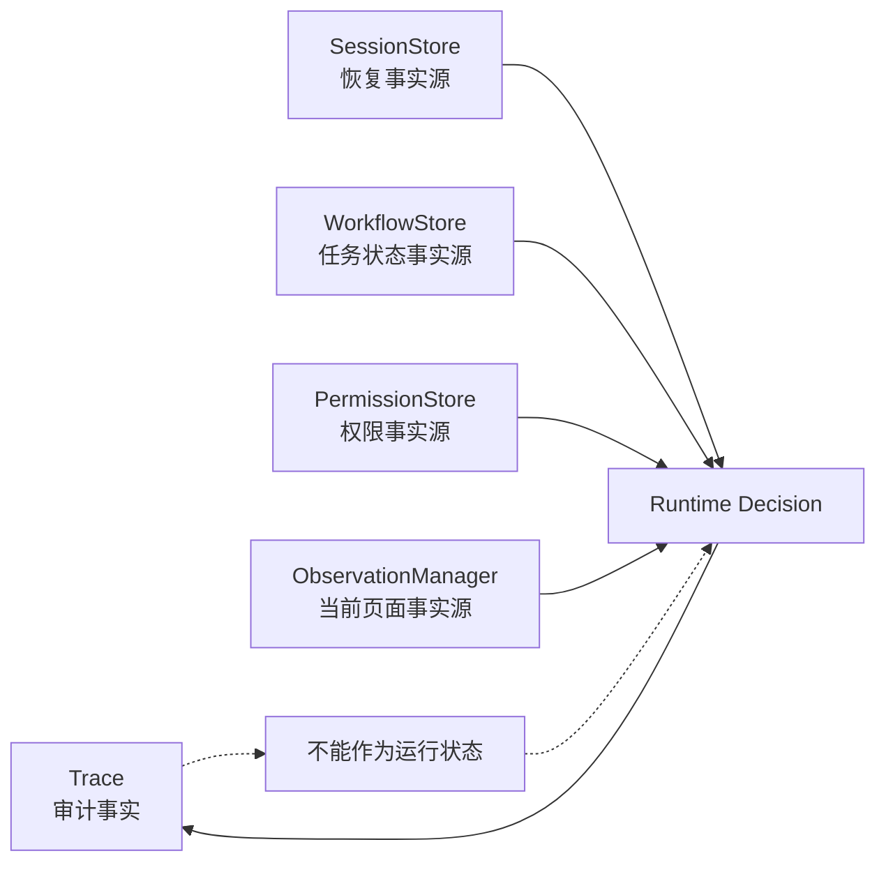

# Phase 2 Agent Kernel 架构图

这份图用于快速理解 Phase 2 的目标结构：先把 Agent 底座做稳，再让 Web Buddy 作为第一个垂直能力接入。

如果这份完整图在 Markdown 预览里太小，优先看 `PLAN/phase2/architecture-clear.md`，里面把大图拆成了多张清晰图。

## 1. 总体架构

```mermaid
flowchart TB
  User[用户]

  subgraph Surface[产品入口层]
    WebUI[Task Cockpit Web UI]
    CLI[CLI / Demo]
    SDK[SDK API]
  end

  User --> WebUI
  User --> CLI
  User --> SDK

  subgraph Kernel[Agent Kernel 核心层]
    AgentKernel[AgentKernel]
    QueryLoop[QueryLoop / Turn Loop]
    RunController[RunController<br/>pause / resume / abort / stop]
    TokenBudget[TokenBudget<br/>context / tool result budget]
    KernelEvents[KernelEvent Stream]
  end

  WebUI --> AgentKernel
  CLI --> AgentKernel
  SDK --> AgentKernel
  AgentKernel --> QueryLoop
  AgentKernel --> RunController
  QueryLoop --> TokenBudget
  QueryLoop --> KernelEvents

  subgraph PromptLayer[上下文与提示层]
    ContextManager[ContextManager<br/>working set]
    PromptAssembler[PromptAssembler]
    Compaction[Context Compaction<br/>long task summary]
    SkillsContext[Skill Context Injection]
    MemoryContext[Memory Context Injection]
  end

  subgraph ModelLayer[模型层]
    LlmGateway[LlmGateway]
    Provider[Model Provider<br/>OpenAI / compatible APIs]
  end

  subgraph ToolLayer[工具执行层]
    ToolRegistry[ToolRegistry]
    ToolExecution[ToolExecutionService]
    ToolContext[ToolUseContext]
    ToolErrors[Tool Error Normalizer]
  end

  subgraph PermissionLayer[权限层]
    PolicyEngine[PolicyEngine<br/>risk evaluation]
    PermissionEngine[PermissionEngine<br/>allow / ask / deny]
    ApprovalQueue[ApprovalQueue]
    HumanGate[HumanGate]
  end

  subgraph WorkflowLayer[工作流层]
    WorkflowEngine[WorkflowEngine]
    WorkflowDefinition[WorkflowDefinition]
    WorkflowInstance[WorkflowInstance Snapshot]
    Evidence[Workflow Evidence]
    Guards[Workflow Guards]
  end

  subgraph StateLayer[状态事实源]
    SessionStore[SessionStore]
    Transcript[transcript.jsonl]
    WorkflowStore[WorkflowStore]
    PermissionStore[PermissionStore]
    MemoryStore[MemoryStore]
  end

  subgraph SkillLayer[技能层]
    SkillRegistry[SkillRegistry]
    SkillLoader[SkillLoader]
    SkillRecommender[SkillRecommender]
    JobSkill[job-application skill]
    AlibabaSkill[alibaba-careers skill]
    ResearchSkill[web-research skill]
  end

  subgraph WebDomain[Web 垂直执行域]
    BrowserTools[Browser Tools<br/>open / click / fill / upload / snapshot]
    Observation[ObservationManager<br/>PageState / FormState]
    Snapshot[Snapshot / Ref Resolver]
    BrowserSupervisor[BrowserSupervisor<br/>dialog / popup / stale ref]
  end

  subgraph Observability[观测与报告层]
    Trace[AgentTrace / TraceRecorder]
    Metrics[Metrics]
    SafetyReport[Safety Report]
    Benchmarks[Benchmarks / Eval]
    Doctor[Doctor]
  end

  QueryLoop --> PromptAssembler
  QueryLoop --> LlmGateway
  QueryLoop --> ToolExecution
  QueryLoop --> WorkflowEngine
  QueryLoop --> PermissionEngine
  QueryLoop --> SessionStore

  ContextManager --> PromptAssembler
  Compaction --> PromptAssembler
  SkillsContext --> PromptAssembler
  MemoryContext --> PromptAssembler
  SkillRegistry --> SkillsContext
  SkillRegistry --> WorkflowDefinition
  MemoryStore --> MemoryContext

  LlmGateway --> Provider

  ToolExecution --> ToolRegistry
  ToolExecution --> ToolContext
  ToolExecution --> ToolErrors
  ToolExecution --> BrowserTools
  BrowserTools --> BrowserSupervisor
  BrowserTools --> Observation
  BrowserTools --> Snapshot
  Observation --> ContextManager
  Observation --> Evidence
  Snapshot --> Observation

  PolicyEngine --> PermissionEngine
  PermissionEngine --> ApprovalQueue
  ApprovalQueue --> HumanGate
  HumanGate --> WebUI

  WorkflowEngine --> WorkflowInstance
  WorkflowEngine --> WorkflowDefinition
  WorkflowEngine --> Evidence
  WorkflowEngine --> Guards
  WorkflowEngine --> WorkflowStore

  SessionStore --> Transcript
  SessionStore --> WorkflowStore
  SessionStore --> PermissionStore
  SessionStore --> MemoryStore

  KernelEvents --> WebUI
  KernelEvents --> CLI
  KernelEvents --> Trace
  KernelEvents --> Metrics
  Trace --> SafetyReport
  Metrics --> SafetyReport
  Doctor --> WebUI
  Benchmarks --> Trace
  Benchmarks --> Metrics
```

## 2. 一次任务的运行流

## 3. 模块边界

## 4. Phase 2 落地顺序

## 5. 和当前项目的迁移关系

## 6. 最重要的理解

一句话：

> Phase 2 要先补 Agent 的“中枢神经系统”：Session 让它记得住，Kernel 让它控得住，Permission 让它不乱动，Workflow 让它知道做到哪了，Skill 让它下次别从零开始。
