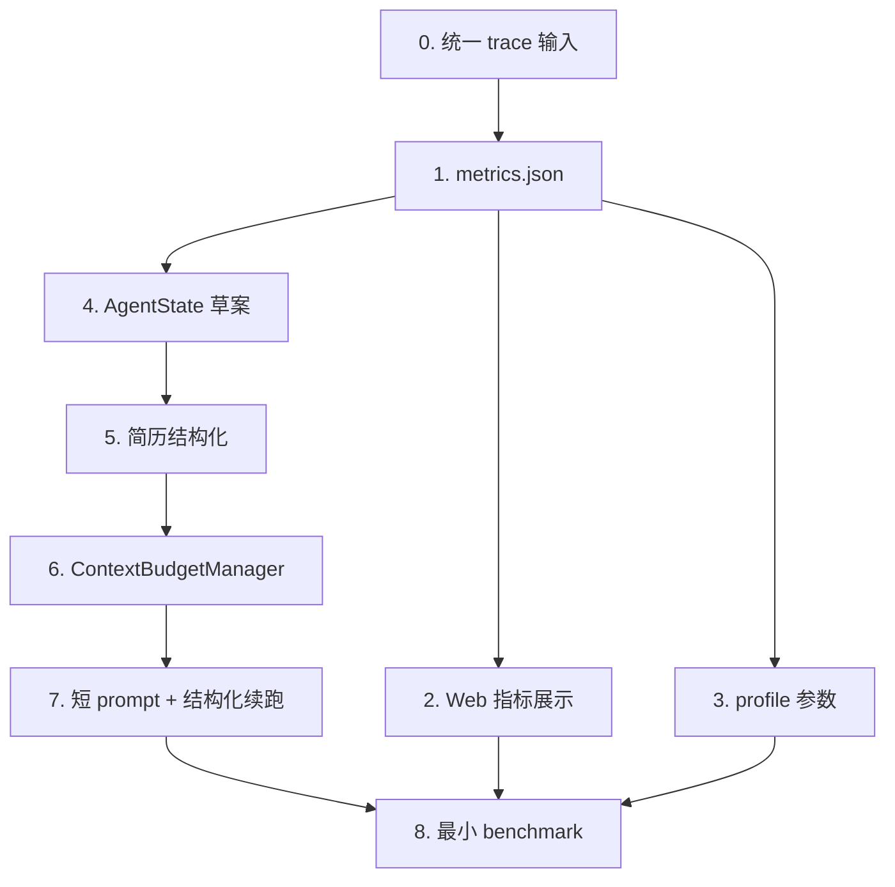
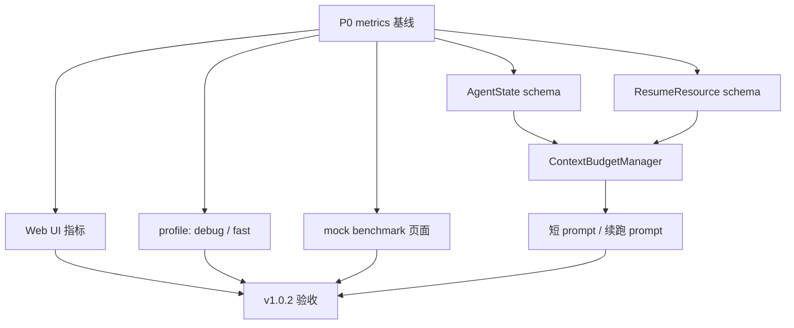

# Web Agent Runtime v1.0.2 实施链路规划

日期：2026-06-22

关联方案：[web-agent-runtime-optimization-v1.0.2.md](./web-agent-runtime-optimization-v1.0.2.md)

## 1. 实施目标

v1.0.2 不优先扩展更多网站或复杂业务能力，而是先建立网页 Agent 的性能工程底座。

本阶段要完成的主闭环：

```text
trace 稳定输入
-> metrics.json
-> Web 控制台可见
-> debug / fast profile
-> AgentState
-> 简历短摘要
-> ContextBudgetManager
-> 短 prompt + 结构化续跑
-> 最小 benchmark 验证
```

核心目标：

- 每次运行都有可比较的指标。
- 默认 prompt 不再携带完整简历原文。
- 续跑不再主要依赖完整 stdout 或完整原始 prompt。
- debug 和 fast 运行模式开始分层。
- 至少有一个本地 mock benchmark 能验证不退化。

## 2. 总依赖链路



读图方式：

- `trace` 是所有优化的输入源，必须先稳定。
- `metrics` 是判断后续改动是否有效的前置条件。
- `AgentState` 和简历结构化是上下文预算的前置条件。
- `ContextBudgetManager` 完成后，才能可靠改造首轮 prompt 和续跑 prompt。
- benchmark 依赖 metrics、profile 和新的 prompt 链路。

## 3. Run Identity Contract

Phase 0 的第一件事是统一运行身份语义。后续 metrics、AgentState、benchmark 都必须基于同一套 ID 关系。

### 3.1 ID 定义

| 字段 | 语义 | 粒度 | 示例 |
| --- | --- | --- | --- |
| `runId` | 一次 Agent 任务运行 ID | 一次完整任务 | `runtime-2026-06-22T10-20-30-000Z` |
| `sessionId` | Agent trace session ID，从 `runId` 派生 | trace 容器 | `claude_runtime-2026-06-22T10-20-30-000Z` |
| `spanId` | 一次 LLM/tool/gate/screenshot 动作 ID | 单个动作 | `span_...` |
| `toolCallId` | 模型请求的一次工具调用 ID | 单个工具请求 | Claude/OpenAI 返回的 tool call id |
| `browserSessionId` | Playwright 浏览器会话 ID | 浏览器上下文 | `default` |

`runId` 不代表一次 LLM 对话，也不代表一次 LLM call。一次 `runId` 下可以包含多次 `llm_call`、多次 MCP/browser tool call、截图、人工接管和最终状态。

### 3.2 目录约定

| 运行路径 | `runId` 来源 | `runDir` | `traceDir` | `sessionId` |
| --- | --- | --- | --- | --- |
| SDK / demo / raw | Web/CLI 传入，缺省时由 `TraceRecorder` 生成 | `output/<runId>/` | `output/traces/run_<runId>/` | `run_<runId>` |
| Claude runtime CLI | `--run-id` 传入，缺省时脚本生成 | `output/claude-runtime/<runId>/` | `output/traces/claude_<runId>/` | `claude_<runId>` |
| Web runtime | Web server 生成 `runtime-...` 并通过 `--run-id` 传给 Claude runtime | `output/claude-runtime/<runId>/` | `output/traces/claude_<runId>/` | `claude_<runId>` |

兼容要求：

- 旧运行如果没有 manifest，resolver 仍按旧目录规则猜测。
- Web runtime 仍保留解析 stdout 中 `Claude runtime run directory:` 和 `Agent trace:` 的旧逻辑。
- 新路径优先使用 manifest，旧路径作为兜底。

### 3.3 Manifest 约定

每次 trace session 应写出：

```text
output/traces/<sessionId>/run-manifest.json
```

建议结构：

```json
{
  "schemaVersion": "run-manifest/v1",
  "runId": "runtime-...",
  "sessionId": "claude_runtime-...",
  "source": "claude-runtime",
  "scenario": "alibaba-apply",
  "runDir": "/abs/path/output/claude-runtime/runtime-...",
  "traceDir": "/abs/path/output/traces/claude_runtime-...",
  "createdAt": "2026-06-22T10:20:30.000Z",
  "files": {
    "sessionJson": "/abs/path/output/traces/claude_runtime-.../session.json",
    "spansJsonl": "/abs/path/output/traces/claude_runtime-.../spans.jsonl",
    "eventsJsonl": "/abs/path/output/traces/claude_runtime-.../events.jsonl",
    "stdoutLog": "/abs/path/output/claude-runtime/runtime-.../stdout.log",
    "stderrLog": "/abs/path/output/claude-runtime/runtime-.../stderr.log",
    "streamJsonl": "/abs/path/output/claude-runtime/runtime-.../stream.jsonl"
  }
}
```

manifest 是增强入口，不是第一版唯一真相。resolver 读取 manifest 失败时必须降级到目录推断。

## 4. 可并行工作



可以并行推进的部分：

- metrics 聚合器完成后，Web UI、profile、mock 页面、AgentState、ResumeResource 可以并行。
- AgentState 和 ResumeResource 可以独立设计，但需要在 ContextBudgetManager 汇合。
- mock 页面可以早做，但 benchmark runner 最好等 metrics 输出稳定后再接。

## 5. 阶段规划

### 阶段 0：统一 trace 输入

目标：确认所有运行路径都能被 metrics 聚合器读取。

输入来源：

- SDK 直接路径：`packages/web-buddy/src/sdk/trace.ts`
- Agent trace：`output/traces/<sessionId>/session.json`
- Agent spans：`output/traces/<sessionId>/spans.jsonl`
- Agent events：`output/traces/<sessionId>/events.jsonl`
- Claude runtime 输出：`output/claude-runtime/<runId>/`

要做：

- 统一约定 `runId`、`traceDir`、`runDir` 的关系。
- 统一 metrics 聚合优先级：
  1. `spans.jsonl`
  2. `trace.jsonl`
  3. runtime stdout / run log 兜底
- 确认 Web runtime 能拿到 `traceDir`。

产物：

- 一套稳定的 trace 读取约定。
- metrics 聚合器的输入路径规则。

验收：

- SDK 路径和 Claude runtime 路径都能定位到 trace 文件。
- trace 缺失时不会导致运行失败。

### 阶段 1：生成 metrics.json

目标：每次运行自动生成 `metrics.json`。

建议新增模块：

```text
packages/web-buddy/src/metrics/
  schema.ts
  aggregate.ts
  writer.ts
```

第一版字段：

```json
{
  "runId": "string",
  "scenario": "alibaba-apply",
  "profile": "debug|fast|benchmark",
  "status": "completed|blocked|incomplete|failed",
  "durationMs": 0,
  "llmCalls": 0,
  "mcpToolCalls": 0,
  "browserSnapshots": 0,
  "browserClicks": 0,
  "browserTypes": 0,
  "browserWaits": 0,
  "manualHandoffs": 0,
  "resumeContextBytes": 0,
  "snapshotBytes": 0,
  "toolResultBytes": 0,
  "failureCategory": "login|captcha|form|navigation|model|tool|unknown"
}
```

第一版先不强求：

- 精确 token 统计。
- 精确 cost 估算。
- 复杂失败归因。

要做：

- 从 `spans.jsonl` 聚合 LLM 调用数、MCP 调用数、工具类型分布。
- 从 `session.json` 或 run log 聚合耗时、状态、场景。
- 从 legacy `trace.jsonl` 兜底统计 snapshot、click、wait 等动作。
- 在运行结束时写出 `metrics.json`。

建议输出位置：

```text
output/traces/<sessionId>/metrics.json
```

如需兼容 legacy run 目录，可后续复制到：

```text
output/<runId>/metrics.json
```

验收：

- 每次运行结束后都有 `metrics.json`。
- metrics 缺少某些字段时使用安全默认值。
- `npm run build` 通过。

### 阶段 2：Web 控制台展示 metrics

目标：Web 控制台能看到核心指标。

建议接口：

```text
GET /api/runtime/metrics?id=<runId>
```

也可以先合并到现有接口：

```text
GET /api/runtime/trace?id=<runId>
```

第一版展示：

- status
- profile
- duration
- LLM calls
- MCP tool calls
- snapshots
- clicks
- waits
- manual handoffs
- failure category

验收：

- 有 metrics 时展示核心指标。
- 没有 metrics 时展示空状态。
- 不影响现有 trace / events 查看。

### 阶段 3：profile 参数

目标：支持 `debug` 和 `fast` 两种基础运行模式，并为 `benchmark` 预留入口。

新增参数：

```bash
--profile debug
--profile fast
--profile benchmark
```

第一版行为：

| profile | 行为 |
| --- | --- |
| debug | headful、slowMo、更多截图、完整 trace、保留浏览器 |
| fast | headless 或低延迟、减少截图、低等待、低 slowMo |
| benchmark | 先等同 fast，固定配置并强制输出 metrics |

要做：

- 在 Claude runtime 参数解析中加入 `--profile`。
- 在 SDK orchestrator 配置中加入 profile。
- 将 profile 写入 trace metadata 和 metrics。
- 保持旧参数兼容，例如显式传 `--headless` 时优先级要明确。

验收：

- `debug` 可见浏览器，方便观察。
- `fast` 可以低延迟运行。
- metrics 中记录 profile。

### 阶段 4：AgentState 草案

目标：让续跑具备结构化状态输入。

建议新增模块：

```text
packages/web-buddy/src/state/
  agent-state.ts
  store.ts
```

第一版结构：

```json
{
  "goal": "string",
  "site": "string",
  "stage": "search|detail|login|form|review|submitted|blocked|unknown",
  "loginStatus": "unknown|logged_in|login_required|captcha_required",
  "currentJob": {
    "title": "string",
    "url": "string",
    "fitReason": "string",
    "risk": "low|medium|high"
  },
  "form": {
    "uploadStatus": "unknown|uploaded|parsed|failed",
    "filledFields": {},
    "missingFields": [],
    "errors": []
  },
  "lastAction": {},
  "lastFailure": {
    "category": "stale_ref|navigation|form|login|captcha|model|tool|unknown",
    "message": "string",
    "recoverable": true
  }
}
```

第一版写入时机：

- run 开始时创建初始状态。
- gate 阻塞时更新 `stage=blocked`。
- agent_done 时更新最终状态。
- 工具失败时更新 `lastFailure`。
- 后续表单工具完成后再细化 `form`。

输出位置：

```text
output/traces/<sessionId>/agent-state.json
```

验收：

- 每次运行能生成 `agent-state.json`。
- 状态写入失败不影响主流程。
- 续跑时可以优先读取 AgentState。

### 阶段 5：简历结构化

目标：默认 prompt 不再塞完整简历原文。

建议新增模块：

```text
packages/web-buddy/src/resume/
  resource.ts
  summary.ts
  fields.ts
```

结构化产物：

```json
{
  "resume_profile": {
    "hasName": true,
    "hasContact": true,
    "education": [],
    "experienceYears": null,
    "skills": []
  },
  "resume_capability_summary": "string",
  "resume_form_fields": {},
  "raw_resume_ref": "artifact path"
}
```

prompt 策略：

- 首轮默认只放 `resume_profile` 和 `resume_capability_summary`。
- 表单阶段才使用 `resume_form_fields`。
- 原始简历全文只落 trace/artifact，不默认进 prompt。

验收：

- prompt 文件不再默认包含完整简历原文。
- metrics 记录 `resumeContextBytes`。
- 阿里投递任务仍可启动，不因简历压缩直接退化。

### 阶段 6：ContextBudgetManager

目标：所有进入模型的上下文都经过预算控制。

建议新增模块：

```text
packages/web-buddy/src/context/
  budget.ts
  sections.ts
```

第一版预算可以用字符数或字节数，不必一开始做 tokenizer 级精确估算。

建议默认预算：

```json
{
  "system": 4000,
  "userGoal": 1000,
  "resume": 3000,
  "pageState": 6000,
  "agentState": 2000,
  "recentHistory": 3000,
  "toolResult": 3000
}
```

接入点：

- 初始 prompt 构造。
- 续跑 prompt 构造。
- 工具结果回填给模型前的摘要裁剪。
- Claude runtime prompt 文件输出。

验收：

- 大内容不会直接进入模型上下文。
- prompt 按 section 组织，便于后续统计。
- metrics 记录各 section 大小。

### 阶段 7：最小 benchmark

目标：至少有一个本地 mock 页面用于验证不退化。

建议新增目录：

```text
packages/web-buddy/benchmarks/
  mock-pages/
    simple-apply.html
  runner.ts
```

第一版 mock 页面包含：

- 职位列表卡片。
- 职位详情按钮。
- 简历上传输入。
- 必填表单字段。
- 提交按钮。
- 一个简单的 DOM 变化场景，用于模拟 ref 失效。

runner 输出：

```text
benchmark-results/<timestamp>/
  metrics.json
  agent-state.json
  report.json
```

验收：

- 一条 npm script 能跑通。
- benchmark 输出 metrics。
- debug 和 fast 至少能跑同一个 mock 页面。

## 6. 建议执行顺序

### 第 1 批：观测闭环

优先级最高。

- 统一 trace 输入。
- 新增 metrics schema。
- 实现 metrics 聚合器。
- 运行结束写 `metrics.json`。
- Web UI 展示核心 metrics。

完成标志：

- 每次运行可见 metrics。
- 后续改动可以比较效果。

### 第 2 批：运行模式和最小回归

可以在第 1 批后并行。

- 增加 `--profile debug|fast|benchmark`。
- 实现 debug / fast 基础差异。
- 新增最小 mock benchmark 页面。
- benchmark runner 接入 metrics。

完成标志：

- 能用同一任务比较 debug 和 fast。

### 第 3 批：上下文瘦身

依赖 metrics 基线。

- 新增 AgentState schema 和落盘。
- 新增 ResumeResource。
- 默认 prompt 改为短简历摘要。
- 续跑 prompt 改为 AgentState + 短摘要。
- 接入 ContextBudgetManager。

完成标志：

- prompt 明显变短。
- metrics 能反映 resume/context 字节变化。
- 阿里主链路行为不退化。

### 第 4 批：后续预留，不建议 v1.0.2 完整做完

以下内容建议进入 v1.0.3 或后续：

- `browser_page_summary`
- `browser_find_text`
- `browser_form_candidates`
- `browser_list_job_candidates`
- `browser_snapshot_delta`
- `browser_click_and_wait`
- `browser_fill_form_batch`
- `browser_upload_resume_and_parse`
- 完整 benchmark 平台和对比报告

原因：

- 这些能力依赖 metrics、AgentState 和 ContextBudget。
- 如果提前做，难以判断是否真的减少轮次、token 和失败率。

## 7. v1.0.2 验收清单

必须满足：

- `npm run build` 通过。
- 每次运行生成 `metrics.json`。
- Web 控制台能展示核心 metrics。
- 支持 `--profile debug|fast`。
- 默认 prompt 不再包含完整简历原文。
- 续跑优先使用 `AgentState + 短摘要`。
- 至少一个本地 mock benchmark 能跑通。
- 阿里投递主链路不出现明显退化。

建议满足：

- metrics 记录 `profile`。
- metrics 记录 `resumeContextBytes`。
- metrics 记录 snapshot / click / wait 次数。
- AgentState 能记录 blocked / failed / completed 等基本终态。

暂不要求：

- 精确 token 成本。
- 完整失败分类。
- 完整语义页面工具。
- 完整复合工具。
- 多网站 benchmark。

## 8. 风险和控制

| 风险 | 影响 | 控制方式 |
| --- | --- | --- |
| metrics 字段一开始不准 | 影响优化判断 | 第一版先统计可靠字段，token/cost 后补 |
| prompt 变短导致模型缺信息 | 任务退化 | 保留 raw resume artifact，必要时可按需注入片段 |
| AgentState 过早设计过重 | 拖慢进度 | 第一版只保留 stage、form、lastFailure 等核心字段 |
| fast profile 影响稳定性 | 操作失败率升高 | debug 仍保留原行为，fast 作为可选模式 |
| benchmark 页面太复杂 | v1.0.2 失焦 | 第一版只做一个 simple apply 页面 |

## 9. 成功判断

v1.0.2 成功不以“任务速度立刻大幅提升”为唯一标准，而以底座是否建立为标准：

- 能稳定看到每次运行的指标。
- 能解释一次运行主要花在 LLM、工具、snapshot 还是人工阻塞。
- 能证明 prompt 变短后主链路没有明显退化。
- 能用 mock benchmark 做最小回归。
- 后续 P2/P3 的语义工具和复合工具有明确依赖入口。
